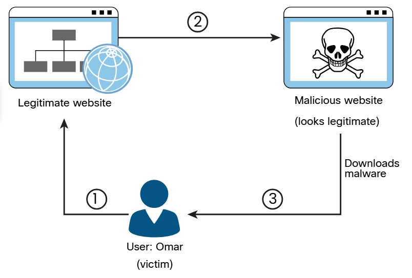

# Pretextos para un acercamiento y suplantación de identidad

La influencia, el interrogatorio y la suplantación son componentes clave de la ingeniería social. La elicitación es el acto de obtener conocimiento o información de las personas. En la mayoría de los casos, un atacante obtiene información de una víctima sin solicitar directamente esa información en particular.

La forma en que un atacante interroga a una víctima e interactúa con ella es crucial para el éxito de una campaña de ingeniería social. Un interrogador puede hacer buenas preguntas abiertas para conocer los puntos de vista, los valores y los objetivos de una persona. El interrogador puede usar cualquier información revelada por el objetivo para continuar reuniendo información adicional u obtener información de otra víctima.

También es posible que un interrogador utilice preguntas cerradas para tener más control de la conversación y dirigirla o detenerla. Hacer demasiadas preguntas puede hacer que la víctima cierre la interacción y hacer muy pocas preguntas puede parecer incómodo. Los interrogadores de ingeniería social exitosos utilizan un enfoque restringido en su interrogatorio para obtener la mayor cantidad de información posible de la víctima.

Los interrogadores prestan mucha atención a lo siguiente:
- La postura o el lenguaje corporal de una persona
- El color de piel de la víctima, como el color de la cara que se pone pálido o rojo
- La dirección de la cabeza y los ojos de la víctima
- Movimiento de manos y pies de la víctima
- Las expresiones de la boca y los labios de la víctima
- El tono y la velocidad de la voz de la víctima, así como los cambios en la voz
- Las palabras de la víctima, incluida su longitud, la cantidad de sílabas, las disfunciones y las pausas

Con *pretexto* o *suplantación*, un atacante se presenta como otra persona para obtener acceso a la información. En algunos casos, puede ser muy simple, como pretender rápidamente ser otra persona dentro de una organización; en otros casos, puede implicar la creación de una identidad completamente nueva y luego usar esa identidad para manipular la recepción de información. Los ingenieros sociales pueden usar pretextos para hacerse pasar por personas en ciertos trabajos y roles, incluso si no tienen experiencia en esos trabajos o roles.

Por ejemplo, un ingeniero social puede hacerse pasar por una persona de entrega de Amazon, UPS o FedEx o incluso un mensajero en bicicleta o mensajería con un mensaje importante para alguien de la organización. Como otro ejemplo, alguien puede hacerse pasar por un trabajador de soporte de TI y proporcionar ayuda no solicitada a un usuario. Hacerse pasar por personal de TI puede ser muy eficaz porque si le preguntas a alguien si tiene un problema técnico, es muy probable que la víctima lo piense y diga algo como: "Sí, de hecho, ayer le sucedió a mi computadora". Hacerse pasar por personal de TI puede otorgar a un atacante acceso físico a los sistemas de una organización. Un atacante que tiene acceso físico puede usar una memoria USB que contiene scripts personalizados para poner en riesgo una computadora en segundos. Pharming o suplantación de DNS es un tipo de ataque de suplantación en el que un actor de amenazas redirige a una víctima de un sitio web o recurso válido a uno malicioso que podría aparecer como un sitio válido para el usuario. A partir de ahí, se intenta extraer información confidencial del usuario o instalar malware en el sistema de la víctima. El pharming se puede realizar modificando el archivo de host en el sistema de la víctima, mediante el envenenamiento del DNS o aprovechando una vulnerabilidad en un servidor DNS.

_Ejemplo de **pharming**_

 

- __Paso 1__: El usuario visita un sitio web legítimo y hace clic en un enlace legítimo
- __Paso 2__: El sistema del usuario se ve comprometido, el archivo de host se modifica y redirige al usuario a un sitio malicioso que parece legítimo (Esto también se puede lograr comprometiendo un servidor DNS o falsificando una respuesta de DNS).
- __Paso 3__: El malware se descarga y se instala en el sistema del usuario.  
Un ataque similar al *pharming* se denomina *publicidad maliciosa*. La publicidad maliciosa implica la incorporación de anuncios maliciosos en sitios web de confianza. Los usuarios que hacen clic en estos anuncios son redirigidos sin darse cuenta a sitios que alojan malware. 
**CONSEJO** Para ayudar a evitar ataques de pharming, es importante mantener el software actualizado y ejecutar comprobaciones antimalware periódicas. También debe cambiar las contraseñas predeterminadas en los dispositivos de infraestructura de red (incluido el enrutador de su hogar). Por supuesto, también debe conocer los sitios web que visita y tener cuidado al abrir correos electrónicos.

