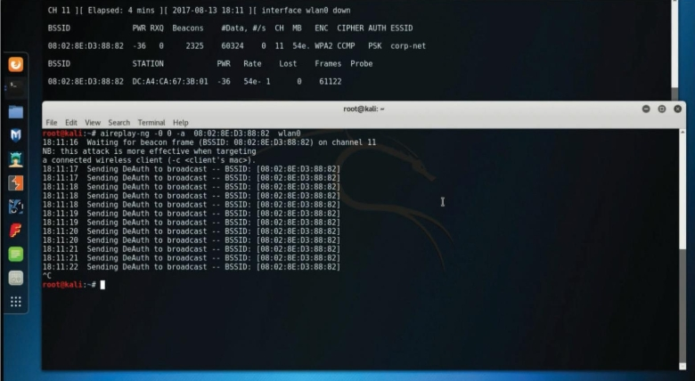

# Puntos de acceso no autorizados
Uno de los ataques inalámbricos mas simplistas implica que un atacante instale un AP falso en una red para engañar a los usuarios para que se conecten a ese AP. Básicamente, el atacante puede usar ese AP dudoso para crear una puerta trasera y obtener acceso a la red y sus sistemas.<br>

_Punto de acceso inalámbrico falso_<br>

<br>

# Ataques de gemelos malvados
En un ataque de __gemelo malvado__, el atacante crea un punto de acceso dudoso y lo configura exactamente igual que la red corporativa existente.<br>

_Ataque de gemelos malvados_<br>

<br>

Por lo general, el atacante utiliza la suplantación de DNS para redirigir a la víctima a un portal cuativo clonado o un sitio web. Cuando los usuarios inician sesión en el gemelo malvado, un hacker puede inyectar fácilmente un registro DNS falsificado en la caché del DNS, cambiando el registro DNS de todos los usuarios en la red falsa. Cualquier usuario que inicie sesión en el gemelo malvado será redirigido por el registro DNS falsificado inyectado en la caché. Un atacante que realiza un ataque de envenenamiento de la caché del DNS desea que la caché del DNS acepte un registro falsificado. Algunas formas de defenderse contra la suplantación de DNS son el uso filtrado de paquetes, protocolos criptográficos y funciones de detección de suplantación proporcionadas por las implementaciones inalámbricas modernas.<br>

__Consejo__: Los portales cautivos son portales web que se utilizan normalmente en redes inalámbricas en lugares públicos, como aeropuertos y cafeterías. Por lo general, se usan para autenticar usuarios o simplemente para mostrar los términos y condiciones que se aplican a los usuarios cuando utilizan la red inalámbrica. El usuario puede simplemente clic en Aceptar para aceptar los términos y condiciones. En algunos casos, se le pide al usuario que vea un anuncio, proporcione una dirección de correo electrónico o realice alguna otra acción requerida. Los atacantes pueden hacerse pasar por portales cautivos para realizar ataques de ingeniería social o robar información confidencial de los usuarios.<br>

# Ataques de disociación (o desautenticación)
Un atacante puede hacer que clientes inalámbricos legítimos se desautentiquen de puntos de acceso inalámbricos legítimos o enrutadores inalámbricos para realizar una condición de denegación de servicio (DoS) o para hacer que esos clientes se conecten a un gemelo malvado. Este tipo de ataque también se conoce como __ataque de disociación__ porque el atacante disocia (intenta desconectar) al usuario del AP inalámbrico de autenticación y luego realizar otro ataque para obtener las credenciales válidas del usuario.<br>
Un identificador de conjunto de servicios (SSID) es el nombre o identificador asociado con una red de área local inalámbrica (WLAN) 802.11. Los nombres de SSID se incluyen en texto sin formato en muchos paquetes inalámbricos y balizas. Un cliente inalámbrico necesita conocer el SSID para asociarse con un AP inalámbrico. Es posible configurar herramientas pasivas inalámbricas como Kismet o KisMAC para escuchar y capturar SSID y cualquier otro tráfico de red inalámbrica. Además, herramientas como _Airmon-ng_ pueden realizar este reconocimiento. El sistema de este ejemplo tiene cinco adaptadores de red inalámbrica diferentes y el adaptador wlan1 se utiliza para el monitoreo.<br>

_Inicio de Airmon-ng_<br>
```bash
|---[root@websploit]--[~]
|--- #airmon-ng start wlan1
PHY      Interface    Driver            Chipset
phy0     wlan0        mac80211_hwsim   Software simulator of 802.11
                                            radio(s) for mac80211
phy1     wlan1        mac80211_hwsim   Software simulator of 802.11
                                            radio(s) for mac80211
                  (mac80211 monitor mode vif enabled for [phy1]wlan1
on [phy1]wlan1mon)
                  (mac80211 station mode vif disabled for [phy1]wlan1)
phy2     wlan2        mac80211_hwsim   Software simulator of 802.11
                                            radio(s) for mac80211
phy3     wlan3        mac80211_hwsim   Software simulator of 802.11
                                            radio(s) for mac80211
phy4     wlan4        mac80211_hwsim   Software simulator of 802.11
                                            radio(s) for mac80211 
```
La salida del comando __airmon-ng__ muestra que la interfaz wlan1 está presente y se usa para monitorear la red. El comando __ip -s -h -c link show wlan1__ se puede utilizar para verificar el estado y la configuración de la interfaz inalámbrica. Cuando pones una interfaz de red inalámbrica en modo de monitoreo, Airmon-ng verifica automáticamente si hay procesos que interfieran. Para detener cualquier proceso que interfiera, puede utilizar el comando __airmon-ng check kill__.<br>
La herramienta _Airodump-ng_ se puede utilizar para detectar y analizar el tráfico de red inalámbrica.<br>

_Uso de la herramienta Airodump-ng_<br>
```bash
|--[root@websploit]--[~]
|--- #airodump-ng wlan1mon
[CH  11 ][ Elapsed: 42 s ][ 2021-06-25 12:57
BSSID         PWR  Beacons     #Data, #/s  CH   MB   ENC CIPHER  AUTH ESSID
06:FD:57:76:39:AE  -28  30           0    0  11   54   WPA  TKIP   PSK
FREE-INTERNET
BSSID              STATION                 PWR   Rate      Lost    Frames
Notes  Probes
(not associated)   02:00:00:00:02:00  -29    0 - 1      19         3
FREE-INTERNET
 (not associated)  F2:E7:9A:BB:8F:F4  -49    0 - 1       0         2
 (not associated)  EA:C8:35:5F:40:52  -49    0 - 1       0         2
 (not associated)  E6:A7:76:32:52:16  -49    0 - 1       0
 ```
 Puede usar la herramienta Airodump-ng para rastrear redes inalámbricas y obtener sus SSID, junto con los canales que operan.<br>
 Muchas corporaciones e individuos configuran sus AP inalámbricos para no anunciar (difundir) sus SSID y para no responder a las solicitudes de sondeo de difusión. Sin embargo, si espías una red inalámbrica durante suficiente tiempo, eventualmente atraparás a un cliente intentando asociarse con el AP y luego podrás obtener el SSID. En el ejemplo se puede ver el identificador de conjunto de servicios básicos (BSSID) y el identificador de conjunto de servicios básicos extendido (ESSID) para cada red inalámbrica disponible. Básicamente, el ESSID identifica la misma red que el SSID. También puede ver el protocolo de cifrado ENC. Los protocolos de cifrado pueden ser Acceso protegido por Wi-Fi (WPA) versión 1, WPA versión 2, WPA versión 3 (WPA3), Privacidad equivalente por cable (WEP) o abierto (OPN).<br>
 Veamos como realizar un ataque de desautenticación. En la imagen puede ver dos ventanas de terminal. La ventana de terminal superior muestra la salida de la utilidad Airodump-ng en un canal específico (__11__) y un ESSID (__corp.net__). En esa misma ventana de terminal, puede ver un cliente inalámbrico (__station__) en la parte inferior, junto con el BSSID al que está conectado (__08:02:8E:D3:88:82__ en este ejemplo).<br>

 _Realización de un ataque de desautenticación con Aireplay-ng_<br>

 <br>

La ventana inferior de la terminal muestra el lanzamiento de un ataque de desautenticación mediante la utilidad Aireplay-ng. La estación víctima tiene la dirección MAC __DC:A4:CA:67:3B:01__ y actualmente está asociada con la red en el canal 11 con el BSSID __08:02:8E:D3:88:82__. Después de usar el comando _aireplay-ng_, el mensaje de desautenticación (DeAuth) se envía al BSSID __08:02:8E:D3:88:82__. El ataque se puede acelerar enviando los paquete de desautenticación al cliente mediante la opción __-c__.<br>
El estándar 802.11w define la función de protección de tramas de administración (MFP). La MFP protege los dispositivos inalámbricos contra tramas de administración falsificadas de otros dispositivos inalámbricos que, de otro modo, podrían anular la autenticación de una sesión de usuario válida. En otras palabras, la MFP ayuda a defenderse  de los ataques de desautenticación. La MFP se negocia entre el cliente inalámbrico (solicitante) y el dispositivo de infraestructura inalámbrica (AP, enrutador inalámbrico, etc.).<br>
__Nota__: Muchos adaptadores inalámbricos no le permiten inyectar paquetes en una red inalámbrica. Para obtener una lista de adapatadores inalámbricos y sus especificaciones que pueden ayudarlo a desarrollar su laboratorio inalámbrico, consulte _https://theartofhacking.org/github_.

# Ataques a la lista de redes preferidas
Los sistemas operativos y los suplicantes (clientes) inalámbricos, en muchos casos, mantienen una lista de redes inalámbricas confiables o preferidas. Esto también se denomina _lista de redes preferidas (PNL)_. Un PNL incluye el SSID de la red inalámbrica, las contraseñas de texto sin formato o las contraseñas WEP o WPA. Los clientes utilizan estas redes preferidas para asociarse automáticamente a redes inalámbricas cuando no están conectados a un AP o un enrutador inalámbrico.<br>
Es posible que los atacantes escuchen estas solicitudes de clientes y se hagan pasar por las redes inalámbricas para que los clientes se conecten a los dispositivos inalámbricos de los atacantes y escuchen su conversación o manipulen su comunicación.<br>

# Interferencia y bloqueo de la señal inalámbrica
El propósito de _interferir_ las señales inalámbricas o causar interferencia en la red inalámbrica es crear una condición de DoS total o parcial en la red inalámbrica. Tal condición, si tiene éxito, es muy perjudicial. La mayoría de las implementaciones inalámbricas modernas proporcionan funciones integradas que pueden ayudar a detectar inmediatamente dichos ataques. Para interferir una señal de Wi-Fi o cualquier otro tipo de comunicación por radio, un atacante básicamente genera ruido aleatorio en las frecuencias que utilizan las redes inalámbricas. Con las herramientas y los adaptadores inalámbricos adecuados que admitan la inyección de paquetes, un atacante puede hacer que los clientes legítimos se desconecten de los dispositivos de la infraestructura inalámbrica.

# Conducción de guerra
_Conducción de guerra_ es un método que utilizan los atacantes para encontrar puntos de acceso inalámbricos donde sea que estén. Con solo conducir (o caminar), un atacante puede obtener una cantidad significativa de información en un periodo muy corto de tiempo. Otro ataque similar es el _vuelo de guerra_, que implica el uso de una computadora portátil u otro dispositivo móvil para buscar redes inalámbricas desde un avión, como un dron u otro vehículo aéreo no tripulado (UAV).<br>
__Consejo__: Un sitio popular entre los conductores de guerra es [WiGLE](https://wigle.net). El sitio permite a los usuarios detectar redes Wi-Fi y cargar información sobre las redes mediante una aplicación móvil.

# Ataques por vector de inicialización (IV) y protocolos inalámbricos no seguros
Un atacante puede causar alguna modificación en el vector de inicialización (IV) de un paquete inalámbrico que se cifra durante la transmisión. El objetivo del atacante es obtener mucha información sobre el texto sin formato de un solo paquete y generar otra clave de cifrado que luego se puede usar para descifrar otros paquetes con el mismo IV. WEP es susceptible a muchos ataques diferentes, incluidos los ataques IV.<br>
### Ataques contra WEP
Dado que WEP es susceptible a muchos ataques diferentes, se considera un protocolo inalámbrico obsoleto. Se debe evitar WEP y muchos dispositivos de red inalámbrica ya no lo admiten. Las claves WEP existen en dos tamaños: claves de 40 bits (5 bytes) y de 104 bits (13 bytes). Además, WEP utiliza un IV de 24 bits, que se antepone a la clave previamente compartida (PSK). Cuando configura un dispositivo de infraestructura inalámbrica con WEP, los IV se envían en texto sin formato.<br>
WEP ha sido derrotado durante décadas. WEP usa RC4 de una manera que permite a un atacante descifrar la PSK con poco esfuerzo. El problema está relacionado con como WEP utiliza los IV en cada paquete. Cuando WEP usa RC4 para cifrar un paquete, antepone el IV a la clave secreta antes de incluir la clave en RC4. Posteriormente, un atacante tiene los primeros 3 bytes de una clave supuestamente "secreta" utilizada en cada paquete. Para recuperar el PSK, el atacante solo necesita recopilar suficientes datos del aire. Un atacante puede acelerar este tipo de ataque inyectando paquetes ARP (porque la longitud es predecible), lo que permite que el atacante recupere el PSK mucho más rápido. Después de recuperar la clave WEP, el atacante puede usarla para acceder a la red inalámbrica.<br>
Un atacante también puede usar el conjunto de herramientas Aircrack-ng para descifrar (recuperar) la WEP PSK. Para realizar este ataque con el paquete Aircrack-ng, un atacante primero inicia Airmon-ng.<br>

_Uso de Airmon-ng para monitorear una red inalámbrica_<br>
```bash
root@kali# airmon-ng start wlan0 11
```
La interfaz inalámbrica es __wlan0__ y el canal inalámbrico seleccionado es __11__. Ahora, el atacante quiere escuchar todas las comunicaciones dirigidas al BSSID __08:02:8E:D3:88:82__. El siguiente comando escribe todo el tráfico en un archivo de captura denominado **wlan_capture.cap**. El atacante solo tiene que especificar el prefijo para el archivo de captura.<br>

_Uso de **Airodump-ng** para escuchar todo el tráfico al BSSIO **08:02:8E:D3:88:82**_<br>
```bash
root@kali# airodump-ng -c 11 --bssid 08:02:8E:D3:88:82 -w wlan_capture wlan0
```
El atacante puede usar Aireplay-ng para escuchar las solicitudes ARP y luego reproducirlas o inyectarlas en la red inalámbrica.<br>


_Uso de Aireplay-ng para inyectar paquetes ARP_<br>
```bash
root@kali# aireplay-ng -3 -b 08:02:8E:D3:88:82 -h 00:0F:B5:88:AC:82 wlan0
```
El atacante puede usar Aircrack-ng para descifrar WEP PSK.<br>

_Uso de **Aircrack-ng** para descifrar la WEP PSK_
```bash
root@kali# aircrack-ng -b 08:02:8E:D3:88:82 wlan_capture.cap
```
Después de que Aircrack-ng descifre (recupere) la WEP PSK, se muestra el resultado.
```bash
    Aircrack-ng 0.9


                                 [00:02:12] Tested 924346 keys (got
99821 IVs)

 KB  depth byte(vote)
 0   0/ 9 12( 15) A9( 25) 47( 22) F7( 12) FE( 22) 1B( 5) 77( 3)
A5( 5) F6( 3) 02( 20)
 1     0/ 8 22( 11) A8( 27) E0( 24) 06( 18) 3B( 26) 4E( 15) E1( 13)
25( 15) 89( 12) E2( 12)
 2     0/ 2 32( 17) A6( 23) 15( 27) 02( 15) 6B( 25) E0( 15) AB( 13)
05( 14) 17( 11) 22( 10)
 3     1/ 5 46( 13) AA( 20) 9B( 20) 4B( 17) 4A( 26) 2B( 15) 4D( 13)
55( 15) 6A( 15) 7A( 15)


                        KEY FOUND! [ 56:7A:15:9E:A8 ]
      Decrypted correctly: 100%
```
### Ataques contra WPA
WPA y WPA2 son susceptibles a diferentes vulnerabilidades. La verssión 3 de WPA (WPA3) aborda todas las vulnerabilidades a las que son susceptibles WPA y WPA2, y muchos profesionales de redes inalámbricas recomiendan WPA3 a organizaciones e individuos.<br>
Todas las versiones de WPA admiten diferentes métodos de autenticación, incluido PSK. WPA no es suscpetible a los ataques IV que afectan a WEP; sin embargo, es posible capturar el protocolo de enlace de cuatro vías WPA entre un cliente y un dispositivo de infraestructura inalámbrica y luego aplicar la fuerza bruta a la PSK de WPA.<br>

_Protocolo de enlace de cuatro direcciones de WPA_<br>

<br>

_Captura del protocolo de enlace de cuatro direcciones de WPA y descifrado de PSK_<br>

<br>

__Paso 1__: Un atacante monitorea la red Wi-Fi y encuentra cliente inalámbricos conectados al SSID de la red corporativa.<br>
__Paso 2__: El atacante envía paquetes DeAuth para desautenticar al cliente inalámbrico.
__Paso 3__: El atacante captura el protocolo de enlace de cuatro vías WPA y descifta la PSK de WPA. (Es posible usar listas de palabras y herramientas como Aircrack-ng para realizar este ataque).

### Ataque con herramientas Aircrack-ng
__Paso 1.__ El atacante usa Airmon-ng para iniciar la interfaz inalámbrica en modo de monitoreo, mediante el comando __airmong-ng start wlan0__. (Este es el mismo proceso que se muestra para descifrar WEP en la sección anterior). La imagen muestra tres ventanas de terminal. La segunda ventana de la terminal desde la parte superior muestra la salida del comando __airodump-ng wlan0__, que muestra todas las redes inalámbricas adyacentes.<br>
__Paso 2.__ Después de localizar la red corp-net, el atacante usa el comando __airodump-ng__, como se muestra en la primera ventana de terminal, para capturar todo el tráfico en un archivo de captura llamado **wpa_capture**, especificando el canal inalámbrico (__11__, en este ejemplo), el BSSID y la interfaz inalámbrica (__wlan0__).<br>

_Uso de Airodump-ng para ver las redes inalámbricas disponibles y luego capturar el tráfico al BSSID de la víctima_<br>

<br>

__Paso 3.__ El atacante utiliza el comando __aireplay-ng__ para realizar un ataque de desautenticación contra la red inalámbrica. El terminal que se muestra en la parte superior, puede ver que el atacante ha recopilado el protocolo de enlace WPA.<br>

_Uso de Aireplay-ng para desconectar a los clientes inalámbricos_<br>

<br>

__Paso 4.__ El atacante utiliza el comando __aircrack-ng__ para descifrar la PSK de WPA mediante una lista de palabras (El nombre del archivo es __words__ en este ejemplo).<br>

_Recopilación del protocolo de enlace WPA con Airodump-ng_<br>


__Paso 5.__ La herramienta tarda un poco en procesarse, según la potencia de la computadora y la complejidad de la PSK. Después de descifrar el WPA PSK, se muestra en la ventana de terminal.<br>

_WPA PSK descifrado con Aircrack-ng_<br>

<br>

### Ataques de KRACK
Mathy Vanhoef y Frank Piessens, de la Universidad de Lovaina, encontraron y revelaron una serie de vulnerabilidades que afectan a WPA y WPA2. Estas vulnerabilidades también denominadas KRACK (_Ataque de reinstalación de claves_), y los detalles sobre ellas se publican en [KRACK Attacks](https://www.krackattacks.com).<br>
El aprovechamiento de estas vulnerabilidades depende de la configuración específica del dispositivo. Una explotación exitosa podría permitir que atacantes no autenticados reinstalen una clave de cifrado o integridad utilizada anteriormente (ya sea a través del cliente o del punto de acceso, según la vulnerabilidad específica).
Cuando una clave utilizada anteriormente se ha reinstalado correctamente (aprovechando las vulnerabilidades divulgadas), un atacante puede proceder a capturar el tráfico con la clave reinstalada e intentar descifrar dicho tráfico. Además, el atacante puede realizr estas actividades manipulando las retransmisiones de mensajes de protocolo de enlace.<br>
__Nota__: Para obtener detalles sobre los ataques KRACK, consulte _https://blogs.cisco.com/security/wpa-vulns_.<br>
La mayoría de los proveedores de redes inalámbricas han proporcionado parches que abordan las vulnerabilidades de KRACK, y WPA3 también aborda estas vulnerabilidades.<br>

### Vulnerabilidades de WPA3
Ninguna tecnología o protocolo es perfecto. En los últimos años se han descubierto varias vulnerabilidades en WPA3. El protocolo WPA3 introdujo un nuevo protocolo de enlace denominado "__protocolo de enlace libélula__" que utiliza el Protocolo de autenticación extensible (EAP) para la autenticación. Varias vulnerabilidades pueden permitir que un atacante realice diferentes ataques de canal lateral, ataques de degradación y condiciones de DoS. Varias de estas vulnerabilidades fueron encontradas por el investigador de seguridad Mathy Vanhoef. (Para obtener más información sobre estos ataques, consulte _https://wpa3.mathyvanhoef.com_).<br>
FragAttacks (_Ataques de fragmentación y agregación_) es otro tipo de vulnerabilidad que puede permitir que un atacante aproveche WPA3. Para obtener detalles y una demostración, consulte [FragAttacks](https://www.fragattacks.com).<br>

# Ataques de PIN de configuración protegida Wi-Fi (WPS)
La configuración protegida de Wi-Fi (WPS) es un protocolo que simplifica la implementación de redes inalámbricas. Está implementado para que los usuarios simplemente puedan generar un WPA PSK con poca interacción con un dispositivo inalámbrico. Por lo general, para aprovisionar el dispositivo inalámbrico se utiliza un PIN impreso en el exterior del dispositivo inalámbrico o en la caja. A la mayoría de las implementaciones no les importa si intenta correctamente millones de combinaciones de PIN seguidas, lo que significa que estos dispositivos son susceptibles a ataques de fuerza bruta.<br>
Una herramienta llamada __Reaver__ hace que los ataques WPS sean muy simples y fáciles de ejecutar. Puede descargar Reaver desde _https://github.com/t6x/reaver-wps-fork-t6x_.

# Ataques de KARMA
KARMA (_el karma ataca a las máquinas de radio automáticamente_) es un ataque en la ruta que implica la creación de un AP falso y permitir que un atacante intercepte el tráfico inalámbrico. Una máquina de radio puede ser un dispositivo móvil, una computadora portátil o cualquier dispositivo habilitado para Wi-Fi.<br>
En un escenario de ataque de KARMA, el atacante escucha las solicitudes de sondeo de dispositivos inalámbricos y las intercepta para generar el mismo SSID para que el dispositivo envíe sondeos. Esto se puede utilizar para atacar la PNL.

# Ataques de fragmentación
Los ataques de fragmentación inalámbrica se pueden utilizar para adquirir 1500 bytes de elementos del algoritmo de generación pseudoaleatoria (PRGA). Se pueden lanzar ataques de fragmentación inalámbrica contra dispositivos configurados para WEP. Estos ataques no recuperan la clave WEP en sí, pero pueden usar PRGA para generar paquetes con herramientas como __Packetforge-ng__ para realizar ataques de inyección inalámbrica.<br>

_Opciones de  la herramienta Packetforge-ng_<br>
```bash
root@kali:~# packetforge-ng
  Packetforge-ng 1.7  - (C) 2006-2022 Thomas d'Otreppe
  Original work: Martin Beck
  https://www.aircrack-ng.org

  Usage: packetforge-ng <mode> <options>

  Forge options:

      -p <fctrl>     : set frame control word (hex)
      -a <bssid>     : set Access Point MAC address
      -c <dmac>      : set Destination  MAC address
      -h <smac>      : set Source    MAC address
      -j             : set FromDS bit
      -o             : clear ToDS bit
      -e             : disables WEP encryption
      -k <ip[:port]> : set Destination IP [Port]
      -l <ip[:port]> : set Source   IP [Port]
      -t ttl         : set Time To Live
      -w <file>      : write packet to this pcap file
      -s <size>      : specify size of null packet
      -n <packets>   : set number of packets to generate

  Source options:

      -r <file>      : read packet from this raw file
      -y <file>      : read PRGA from this file

  Modes:

      --arp          : forge an ARP packet    (-0)
      --udp          : forge an UDP packet    (-1)
      --icmp         : forge an ICMP packet   (-2)
      --null         : build a null packet    (-3)
      --custom       : build a custom packet  (-9)

      --help         : Displays this usage screen

Please specify a mode.
root@kali:~#
```
__Nota__: Puede encontrar un documento que describe y demuestra los ataques de fragmentación en _http://download.aircrack-ng.org/wiki-files/doc/Fragmentation-Attack-in-Practice.pdf_.

# Recopilación de credenciales
La recopilación de credenciales es un ataque que implica la obtención o el compromiso de credenciales de usuario. Los ataques de recolección de credenciales se pueden lanzar mediante ataques comunes de ingeniería social, como los ataques de suplantación de identidad (phishing), y se pueden realizar haciéndose pasar por un AP inalámbrico o un portal cautivo para convencer a un usuario de que ingrese sus credenciales.<br>
Herramientas como Ettercap pueden falsificar las respuestas del DNS y desviar a un usuario que visita un sitio web al sistema local de un atacante. Por ejemplo, un atacante puede falsificar un sitio como Twitter y, cuando el usuario visita el sitio web (que parece el sitio oficial), se le solicita que inicie sesión y el atacante captura las credenciales de usuario. Otra herramienta que permite este tipo de ataque es el kit de herramientas de ingeniería social (SET).

# Bluejacking
_**Bluejacking**_ es un ataque que puede realizarse mediante Bluetooth con dispositivos vulnerables dentro del alcance. Un atacante envía mensajes no solicitados a una víctima a través de Bluetooth, incluida una tarjeta de contacto (vCard) que generalmente contiene un mensaje en el campo del nombre. Esto se realiza mediante el protocolo de intercambio de objetos (OBEX). Una vCard puede contener nombre, dirección, números de teléfono, direcciones de correo electrónico y URL web relacionadas. Este tipo de ataque se ha realizado principalmente como una forma de correo electrónico no deseado a través de conexiones Bluetooth.<br>
__Nota__: Puede encontrar un excelente documento que describe el Bluejacking en _http://acadpubl.eu/jsi/2017-116-8/articles/9/72.pdf_.

# Bluesnarfing
_**Bluesnarfing**_ se realiza para obtener acceso no autorizado a información desde un dispositivo habilitado para Bluetooth. Un atacante puede lanzar ataques de Bluesnarfing para acceder a calendarios, listas de contactos, correos electrónicos y mensajes de texto, imágenes o videos de la víctima.<br>
Se considera más riesgoso que Bluejacking porque, mientras que los ataques de Bluejacking solo transmiten datos al dispositivo de la víctima, los ataques de Bluesnarfing realmente roban información del dispositivo de la víctima.<br>
Los ataques de Bluesnarfing también se pueden utilizar para obtener el número de identidad internacional de equipo móvil (IMEI) de un dispositivo. Los atacantes pueden desviar las llamadas y los mensajes entrantes a otro dispositivo sin que el usuario lo sepa.<br>

_Uso de la herramienta Bluesnarfer para obtener un nombre de dispositivo_<br>
```bash
root@kali:~# bluesnarfer -b DE:AD:BE:EF:12:23 -i
device name: omar_phone
```

# Ataques de Bluetooth de baja energía (BLE)
Numerosos dispositivos de IoT utilizan Bluetooth de baja energía (BLE) para la comunicación. Las comunicaciones de BLE pueden ser susceptibles a ataques en ruta y un atacante podría modificar los mensajes de BLE entre sistemas que pensarían que se están comunicando con sistemas legítimos. Los ataques de DoS también pueden ser problemáticos para las limitaciones de BLE. Varios esfuerzos de investigación han demostrado diferentes ataques de BLE. Por ejemplo, los investigadores de la Universidad Estatal de Ohio han descubierto diferentes ataques de huellas digitales que pueden permitir que un atacante revele fallas de diseño y configuraciones incorrectas de los dispositivos BLE. Los detalles sobre esta investigación se pueden encontrar en _https://dl.acm.org/doi/pdf/10.1145/3319535.3354240_.

# Ataques de identificación por radiofrecuencia (RFID)
La identificación por radiofrecuencia (RFID) es una tecnología que utiliza campos electromagnéticos para identificar y rastrear etiquetas que contienen información almacenada electrónicamente. Hay etiquetas RFID activas y pasivas. Las etiquetas pasivas utilizan energía de lectores RFID (a través de ondas de radio) y las etiquetas activas tienen fuentes de alimentación locales y pueden funcionar desde distancias más largas. Muchas organizaciones usan etiquetas RFID para rastrear el inventario o en tarjetas de identificación para ingresar a edificios o salas. Las etiquetas RFID pueden incluso implementarse en animales o personas para leer información específica que se puede almacenar en las etiquetas.<br>
Las etiquetas y los dispositivos RFID de baja frecuencia (LF) funcionan a frecuencias entre 120kHz y 140kHz e intercambian información a distancias inferiores a 3 pies. Las etiquetas y los dispositivos RFID de alta frecuencia (HF) funcionan a una frecuencia de 13,56 MHz e intercambian información a distancias de entre 3 y 10 pies. Las etiquetas y los dispositvos RFID de frecuencia ultraalta (UHF) funcionan a frecuencias entre 860 MHz y 960 MHz (regional) e intercambian información a distancias de hasta 30 pies.<br>
Algunos ataques que se lanzan comúnmente contra dispositivos RFID:
- Los atacantes pueden robar silenciosamente información de RFID (como una tarjeta de identificación o una etiqueta) con un lector de RFID como [Proxmark3](https://proxmark.com) con solo caminar cerca de una persona o una etiqueta.<br>
- Los atacantes pueden crear y clonar una etiqueta RFID (en un proceso denominado _clonación RFID_). Luego pueden usar las etiquetas RFID clonadas para ingresar a un edificio o una sala específica.<br>
- Los atacantes pueden implantar skimmers detrás de los lectores de tarjetas RFID en un edificio o una habitación.<br>
- Los atacantes pueden utilizar antenas amplificadas para realizar ataques de amplificación NFC. Los atacantes también pueden utilizar antenas amplificadas para exfiltrar pequeñas cantidades de datos, como contraseñas y claves de cifrado, a distancias relativamente largas.<br>

# Difusión de contraseñas
_La propagación de contraseñas_ es un tipo de ataque de credenciales en el que un atacante de fuerza bruta inicia sesión (es decir, intenta autenticarse varias veces) en función de una lista de nombres de usuario con contraseñas predeterminadas de sistemas o aplicaciones comunes. Por ejemplo, un atacante podría intentar iniciar sesión con la palabra _contraseña1_ utilizando numerosos nombres de usuario en una lista de palabras.<br>
Un ataque similar es el relleno de credenciales. En este tipo de ataque, el atacante realiza una inyección automatizada de nombres de usuario y contraseñas que han sido expuestos en infracciones anteriores. Puede obtener más información sobre los ataques de relleno de credenciales en *https://owasp.org/www-community/attacks/Credential_stuffing*.

# Encadenamiento de explotaciones
La mayoría de los ataques sofisticados aprovechan múltiples vulnerabilidades para comprometer los sistemas. Un atacante puede "encadenar" (es decir, utilizar varias) explotaciones contra vulnerabilidades conocidas o de día cero para comprometer sistemas, robar, modificar o corromper datos.<br>