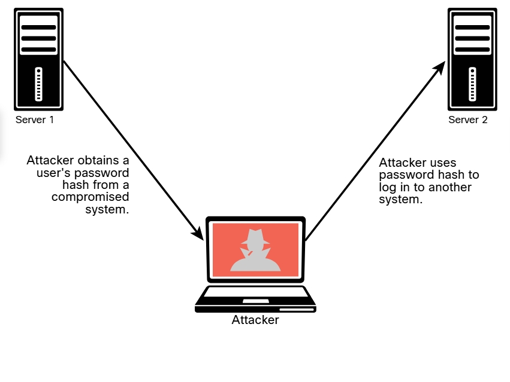
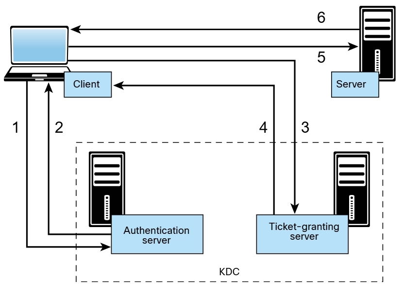
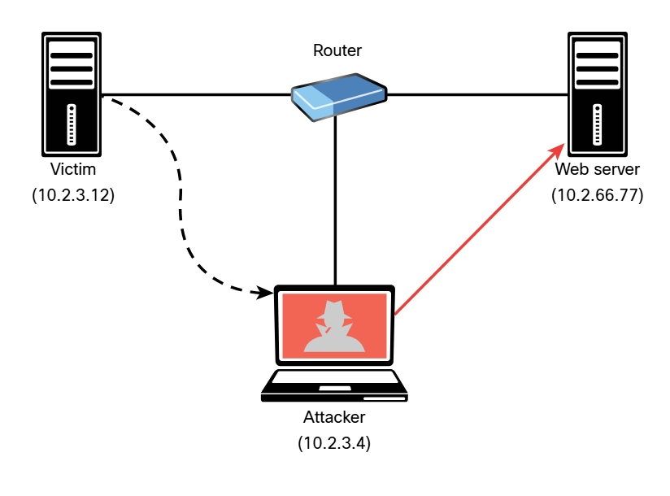

# Explotaciones de SNMP
El protocolo simple de administración de redes (SNMP) es un protocolo que muchas personas y organizaciones utilizan para administrar dispositivos de red. SNMP utiliza el puerto UDP 161. En las implementaciones de SNMP, cada dispositivo de red contiene un agente SNMP que se conecta con un servidor SNMP independiente (también conocido como administrador SNMP). Un administrador puede utilizar SNMP para obtener información sobre el estado y la configuración de un dispositivo de red, para cambiar la configuración y realizar otras tareas administrativas. Como puede imaginar, esto es muy atractivo para los atacantes porque pueden aprovechar las vulnerabilidades de SNMP para realizar acciones similares de manera maliciosa.<br>
Hay varias versiones de SNMP: Las dos versiones más populares en la actualidad son SNMPv2c y SNMPv3. SNMPv2c utiliza cadenas de comunidad, que son contraseñas que se aplican a un dispositivo de red para permitir que un administrador restrinja el acceso al dispositivo de dos maneras: proporcionando acceso de solo lectura o de lectura/escritura.<br>
La información administrada del dispositivo se mantiene en una base de datos denominada _Base de información de administración (MIB)_.<br>
Un ataque SNMP común implica que un atacante enumere los servicios SNMP y luego verifique las contraseñas SNMP predeterminadas configuradas. Desafortunadamente, este es uno de los principales defectos de muchas implementaciones porque muchos usuarios dejan credenciales SNMP débiles o predeterminadas en los dispositivos de red. SNMPv3 utiliza nombres de usuario y contraseñas y es más seguro que todas las versiones anteriores de SNMP. Sin embargo, los atacantes aún pueden realizar ataques de diccionario y de fuerza bruta contra las implementaciones de SNMPv3. Una implementación más moderna y de seguridad implica el uso de NETCONF con dispositivos de infraestructura más nuevos (como enrutadores y conmutadores).<br>
Puede aprovechar los scripts del motor de scripts de Nmap (NSE) para recopilar información de dispositivos habilitados para SNMP y forzar credenciales débiles. En Kali Linux, los scripts de NSE se encuentran en _/usr/share/nmap/scripts_ de manera predeterminada.
<!-- cd /usr/share/nmap/scripts -->
<!--  ls -l snmp* -->
```bash
┌──(kali㉿Kali)-[/usr/share/nmap/scripts]
└─$ ls -l snmp*
-rw-r--r-- 1 root root  7816 Jun  1  2023 snmp-brute.nse
-rw-r--r-- 1 root root  4388 Jun  1  2023 snmp-hh3c-logins.nse
-rw-r--r-- 1 root root  5216 Jun  1  2023 snmp-info.nse
-rw-r--r-- 1 root root 28644 Jun  1  2023 snmp-interfaces.nse
-rw-r--r-- 1 root root  5978 Jun  1  2023 snmp-ios-config.nse
-rw-r--r-- 1 root root  4156 Jun  1  2023 snmp-netstat.nse
-rw-r--r-- 1 root root  4431 Jun  1  2023 snmp-processes.nse
-rw-r--r-- 1 root root  1857 Jun  1  2023 snmp-sysdescr.nse
-rw-r--r-- 1 root root  2570 Jun  1  2023 snmp-win32-services.nse
-rw-r--r-- 1 root root  2739 Jun  1  2023 snmp-win32-shares.nse
-rw-r--r-- 1 root root  4713 Jun  1  2023 snmp-win32-software.nse
-rw-r--r-- 1 root root  2016 Jun  1  2023 snmp-win32-users.nse
 ```
 Además de los scripts de NSE, puede utilizar la herramienta __snmp-check__ para realizar un _SNMP walk_ a fin de recopilar información sobre los dispositivos configurados para SNMP.

 # Explotaciones de SMTP
 Los atacantes pueden aprovechar servidores SMTP inseguros para enviar correo electrónico no deseado y realizar suplantación de identidad (_phishing_) y otros ataques basados en el correo electrónico. SMTP es un protocolo de servidor a servidor, que es diferente de los protocolos de cliente/servidor, como POP3 o IMAP.<br>
 ## Relés abiertos SMTP
 _SMTP retransmisión abierta_ es el término utilizado para un servidor de correo electrónico que acepta y retransmite correos electrónicos de cualquier usuario. Es posible abusar de estas configuraciones para enviar correos electrónicos falsificados, correo electrónico no deseado, phishing y otras estafas relacionadas con el correo electrónico. Nmap tiene un script NSE para probar las configuraciones de retransmisiones abiertas.<br>
 _Secuencia de comandos de NSE de retransmisión abierta de SMTP_<br>
 <!-- cd /usr/share/nmap/scripts -->
 <!-- nmap --script smtp-open-relay.nse 10.1.2.14 -->
 ```bash
┌──(root㉿Kali)-[/usr/share/nmap/scripts]
└─# nmap --script smtp-open-relay.nse 10.1.2.4
Starting Nmap 7.94 ( https://nmap.org ) at 2025-12-02 23:12 UTC
Nmap scan report for 10.1.2.4
Host is up (0.00065s latency).
Not shown: 999 filtered tcp ports (no-response)
PORT   STATE SERVICE
53/tcp open  domain

Nmap done: 1 IP address (1 host up) scanned in 4.67 seconds
 ```
 ## Comandos SMTP útiles
 Varios comandos SMTP pueden ser útiles para realizar una evaluación de seguridad de un servidor de correo electrónico. Los siguientes son algunos ejemplos:
 - __HELO__: Se utiliza para iniciar una conversación SMTP con un servidor de correo electrónico. El comando va seguido de una dirección IP o un nombre de dominio, por ejemplo _HELO 10.1.2.14_.
 - __EHLO__: Se utiliza para iniciar una conversación con un servidor SMTP extendido (ESMTP). Este comando se utiliza de la misma manera que _HELO_.
 - __STARTTLS__: Se utiliza para iniciar una conexión de seguridad de la capa de transporte (TLS) a un servidor de correo electrónico.
 - __RCPT__: Se utiliza para indicar la dirección de correo electrónico del destinatario.
 - __DATA__: Se utiliza para iniciar la transferencia del contenido de un mensaje de correo electrónico.
 - __RSET__: Se utiliza para restablecer (cancelar) una transacción de correo electrónico.
 - __MAIL__: Se utiliza para indicar la dirección de correo electrónico del remitente.
 - __QUIT__: Se utiliza para cerrar una conexión.
 - __HELP__: Se utiliza para mostrar un menú de ayuda (si está disponible).
 - __AUTH__: Se utiliza para autenticar un cliente en el servidor.
 - __VRFY__: Se usa para verificar si existe la casilla de correo de un usuario.
 - __EXPN__: Se utiliza para solicitar o expandir una lista de correo en el servidor remoto.
<!-- telnet 192.168.78.8 25 -->
_El comando SMTP **VRFY**_<br>
```bash
┌──(root㉿Kali)-[~]
└─# telnet 192.168.78.8 53
Trying 192.168.78.8...
Connected to 192.168.78.8.
Escape character is '^]'.
220 dionysus.theartofhacking.org ESMTP Postfix (Ubuntu)
VRFY sys
252 2.0.0 sys
VRFY admin
550 5.1.1 <admin>: Recipient address rejected: User unknown in local
recipient table
VRFY root
252 2.0.0 root
VRFY kali
252 2.0.0 kali
```
La herramienta __smtp-user-enum__ le permite automatizar estos pasos de recopilación de información.
_Uso de la herramienta smtp-user-enum_
```bash
┌──(root㉿Kali)-[~]
└─# smtp-user-enum
smtp-user-enum v1.2 ( http://pentestmonkey.net/tools/smtp-user-enum )

Usage: smtp-user-enum [options] ( -u username | -U file-of-usernames ) ( -t host | -T file-of-targets )

options are:
        -m n     Maximum number of processes (default: 5)
        -M mode  Method to use for username guessing EXPN, VRFY or RCPT (default: VRFY)
        -u user  Check if user exists on remote system
        -f addr  MAIL FROM email address.  Used only in "RCPT TO" mode (default: user@example.com)
        -D dom   Domain to append to supplied user list to make email addresses (Default: none)
                 Use this option when you want to guess valid email addresses instead of just usernames
                 e.g. "-D example.com" would guess foo@example.com, bar@example.com, etc.  Instead of 
                      simply the usernames foo and bar.
        -U file  File of usernames to check via smtp service
        -t host  Server host running smtp service
        -T file  File of hostnames running the smtp service
        -p port  TCP port on which smtp service runs (default: 25)
        -d       Debugging output
        -w n     Wait a maximum of n seconds for reply (default: 5)
        -v       Verbose
        -h       This help message

Also see smtp-user-enum-user-docs.pdf from the smtp-user-enum tar ball.

Examples:

$ smtp-user-enum -M VRFY -U users.txt -t 10.0.0.1
$ smtp-user-enum -M EXPN -u admin1 -t 10.0.0.1
$ smtp-user-enum -M RCPT -U users.txt -T mail-server-ips.txt
$ smtp-user-enum -M EXPN -D example.com -U users.txt -t 10.0.0.1
```
La mayoría de los servidores de correo electrónico modernos deshabilitan los comandos __VRFY__ y __EXPN__. Se recomienda que desactive estos comandos SMTP. Los cortafuegos modernos también ayudan a proteger y bloquear cualquier intento de conexión SMTP con estos comandos.<br>
_Enumeración de un usuario con la herramienta **smtp-user-enum**_<br>
<!-- smtp-user-enum -M VRFY -u [usuario] -t 192.168.78.8 -->
```bash
┌──(root㉿Kali)-[~]
└─# smtp-user-enum -M VRFY -u kali -t 192.168.78.8
Starting smtp-user-enum v1.2 ( http://pentestmonkey.net/tools/smtp-user-enum )

 ----------------------------------------------------------
|                   Scan Information                       |
 ----------------------------------------------------------

Mode ..................... VRFY
Worker Processes ......... 5
Target count ............. 1
Username count ........... 1
Target TCP port .......... 25
Query timeout ............ 5 secs
Target domain ............ 

######## Scan started at Tue Dec  2 23:38:53 2025 #########
######## Scan completed at Tue Dec  2 23:38:58 2025 #########
0 results.

1 queries in 5 seconds (0.2 queries / sec)
```
## Explotaciones conocidas del servidor SMTP
Es posible aprovechar las explotaciones que se han creado para aprovechar las vulnerabilidades conocidas relacionadas con SMTP.<br>
_Uso de **searchsploit** para encontrar explotaciones SMTP conocidas_
<!-- searchsploit smtp -->
```bash
┌──(root㉿Kali)-[~]
└─# searchsploit smtp
---------------------------------------------------------------------------------------------------------------------------------------------------------------------------------------------------------- ---------------------------------
 Exploit Title                                                                                                                                                                                            |  Path
---------------------------------------------------------------------------------------------------------------------------------------------------------------------------------------------------------- ---------------------------------
AA SMTP Server 1.1 - Crash (PoC)                                                                                                                                                                          | windows/dos/14990.txt
Alt-N MDaemon 6.5.1 - IMAP/SMTP Remote Buffer Overflow                                                                                                                                                    | windows/remote/473.c
Alt-N MDaemon 6.5.1 SMTP Server - Multiple Command Remote Overflows                                                                                                                                       | windows/remote/24624.c
Alt-N MDaemon Server 2.71 SP1 - SMTP HELO Argument Buffer Overflow                                                                                                                                        | windows/dos/23146.c
Apache James Server 2.2 - SMTP Denial of Service                                                                                                                                                          | multiple/dos/27915.pl
BaSoMail 1.24 - SMTP Server Command Buffer Overflow                                                                                                                                                       | windows/dos/22668.txt
BaSoMail Server 1.24 - POP3/SMTP Remote Denial of Service                                                                                                                                                 | windows/dos/594.pl
BL4 SMTP Server < 0.1.5 - Remote Buffer Overflow (PoC)                                                                                                                                                    | windows/dos/1721.pl
Blat 2.7.6 SMTP / NNTP Mailer - Local Buffer Overflow                                                                                                                                                     | windows/local/38472.py
BulletProof FTP Server 2019.0.0.50 - 'SMTP Server' Denial of Service (PoC)                                                                                                                                | windows/dos/46422.py
Cisco PIX Firewall 4.x/5.x - SMTP Content Filtering Evasion                                                                                                                                               | hardware/remote/20231.txt
Citadel SMTP 7.10 - Remote Overflow                                                                                                                                                                       | windows/remote/4949.txt
Cobalt Raq3 PopRelayD - Arbitrary SMTP Relay                                                                                                                                                              | linux/remote/20994.txt
CodeBlue 5.1 - SMTP Response Buffer Overflow                                                                                                                                                              | windows/remote/21643.c
CommuniCrypt Mail 1.16 - 'ANSMTP.dll/AOSMTP.dll' ActiveX                                                                                                                                                  | windows/remote/12663.html
CommuniCrypt Mail 1.16 - SMTP ActiveX Stack Buffer Overflow (Metasploit)                                                                                                                                  | windows/remote/16566.rb
Computalynx CMail 2.3 SP2/2.4 - SMTP Buffer Overflow                                                                                                                                                      | windows/remote/19495.c
DeepOfix SMTP Server 3.3 - Authentication Bypass                                                                                                                                                          | linux/remote/29706.txt
dSMTP Mail Server 3.1b (Linux) - Format String                                                                                                                                                            | linux/remote/981.c
EasyMail Objects 'EMSMTP.DLL 6.0.1' - ActiveX Control Remote Buffer Overflow                                                                                                                              | windows/remote/10007.html
EType EServ 2.9x - SMTP Remote Denial of Service                                                                                                                                                          | windows/dos/22123.pl
Eudora 7.1 - SMTP ResponseRemote Remote Buffer Overflow                                                                                                                                                   | windows/remote/3934.py
Exim ESMTP 4.80 - glibc gethostbyname Denial of Service                                                                                                                                                   | linux/dos/35951.py
FloosieTek FTGate PRO 1.22 - SMTP MAIL FROM Buffer Overflow                                                                                                                                               | windows/dos/22568.pl
FloosieTek FTGate PRO 1.22 - SMTP RCPT TO Buffer Overflow                                                                                                                                                 | windows/dos/22569.pl
Free SMTP Server 2.2 - Spam Filter                                                                                                                                                                        | windows/remote/1193.pl
Free SMTP Server 2.5 - Denial of Service (PoC)                                                                                                                                                            | windows/dos/46937.py
GetSimple CMS My SMTP Contact Plugin 1.1.1 - Cross-Site Request Forgery                                                                                                                                   | php/webapps/49774.py
GetSimple CMS My SMTP Contact Plugin 1.1.2 - Persistent Cross-Site Scripting                                                                                                                              | php/webapps/49798.py
GoodTech SMTP Server 5.14 - Denial of Service                                                                                                                                                             | windows/dos/1162.pl
Hastymail 1.x - IMAP SMTP Command Injection                                                                                                                                                               | php/webapps/28777.txt
i.Scribe SMTP Client 2.00b - 'wscanf' Remote Format String (PoC)                                                                                                                                          | windows/dos/7249.php
Inetserv 3.23 - SMTP Denial of Service                                                                                                                                                                    | windows/dos/16035.py
Inframail Advantage Server Edition 6.0 < 6.37 - 'SMTP' Buffer Overflow                                                                                                                                    | windows/dos/1165.pl
Ipswitch Imail Server 5.0 - SMTP HELO Argument Buffer Overflow                                                                                                                                            | windows/dos/23145.c
iScripts AutoHoster - 'main_smtp.php' Traversal                                                                                                                                                           | php/webapps/38889.txt
Jack De Winter WinSMTP 1.6 f/2.0 - Buffer Overflow                                                                                                                                                        | windows/dos/20221.pl
LeadTools Imaging LEADSmtp - ActiveX Control 'SaveMessage()' Insecure Method                                                                                                                              | windows/remote/35880.html
Lotus Domino 4.6.1/4.6.4 Notes - SMTPA MTA Mail Relay                                                                                                                                                     | multiple/dos/19368.sh
Lotus Domino SMTP Router & Email Server and Client - Denial of Service                                                                                                                                    | multiple/dos/17549.txt
MailEnable 1.x - SMTP 'HELO' Remote Denial of Service                                                                                                                                                     | windows/dos/28103.pl
MailEnable 2.x - SMTP NTLM Multiple Authentication Vulnerabilities                                                                                                                                        | windows/dos/28735.pl
MailEnable 3.13 SMTP Service - 'VRFY/EXPN' Denial of Service                                                                                                                                              | windows/dos/5235.py
MailEnable Enterprise 1.x - SMTP Remote Denial of Service                                                                                                                                                 | windows/dos/916.pl
MAILsweeper SMTP 4.2.1 + F-Secure Anti-Virus 5.0.2/5.2.1 - File Scanner Malicious Archive Denial of Service                                                                                               | windows/dos/21006.txt
Mailtraq 2.1.0.1302 - Remote Format String SMTP Resource Consumption                                                                                                                                      | windows/dos/22780.txt
Majordomo2 - 'SMTP/HTTP' Directory Traversal                                                                                                                                                              | multiple/remote/16103.txt
MDaemon SMTP Server 5.0.5 - Null Password Authentication                                                                                                                                                  | windows/remote/23002.txt
Mercury/32 Mail Server 3.32 < 4.51 - SMTP EIP Overwrite                                                                                                                                                   | windows/remote/4316.cpp
Mercury/32 Mail SMTPD - AUTH CRAM-MD5 Buffer Overflow (Metasploit)                                                                                                                                        | windows/remote/16821.rb
Mercury/32 Mail SMTPD - Remote Stack Overrun (PoC)                                                                                                                                                        | windows/dos/4294.pl
Mercury/32 Mail SMTPD 4.51 - SMTPD CRAM-MD5 Remote Overflow                                                                                                                                               | windows/remote/4301.cpp
Microsoft Exchange Server 4.0/5.0 - SMTP HELO Argument Buffer Overflow                                                                                                                                    | windows/remote/23113.c
Microsoft IIS 4.0/5.0 - SMTP Service Encapsulated SMTP Address (MS99-027)                                                                                                                                 | windows/remote/21613.txt
Microsoft Windows - ANI LoadAniIcon() Chunk Size Stack Buffer Overflow (SMTP) (MS07-017) (Metasploit)                                                                                                     | windows/remote/16698.rb
MIMEsweeper For SMTP - Multiple Cross-Site Scripting Vulnerabilities                                                                                                                                      | asp/webapps/38318.txt
Mock SMTP Server 1.0 - Remote Crash (PoC)                                                                                                                                                                 | windows/dos/37954.py
nbSMTP 0.99 - 'util.c' Client-Side Command Execution                                                                                                                                                      | linux/remote/1138.c
NetcPlus SmartServer 3.5.1 - SMTP Buffer Overflow                                                                                                                                                         | windows/remote/19494.c
Network Associates Webshield SMTP 4.5 - Invalid Outgoing Recipient Field Denial of Service                                                                                                                | windows/dos/20432.txt
NJStar Communicator 3.00 - MiniSMTP Server Remote (Metasploit)                                                                                                                                            | windows/remote/18057.rb
NJStar Communicator MiniSmtp - Buffer Overflow (ASLR Bypass)                                                                                                                                              | windows/dos/18196.py
OpenSMTPD - MAIL FROM Remote Code Execution (Metasploit)                                                                                                                                                  | linux/remote/48038.rb
OpenSMTPD - OOB Read Local Privilege Escalation (Metasploit)                                                                                                                                              | linux/local/48185.rb
OpenSMTPD 6.4.0 < 6.6.1 - Local Privilege Escalation + Remote Code Execution                                                                                                                              | openbsd/remote/48051.pl
OpenSMTPD 6.6.1 - Remote Code Execution                                                                                                                                                                   | linux/remote/47984.py
OpenSMTPD 6.6.3 - Arbitrary File Read                                                                                                                                                                     | linux/remote/48139.c
OpenSMTPD < 6.6.3p1 - Local Privilege Escalation + Remote Code Execution                                                                                                                                  | openbsd/remote/48140.c
Postcast Server Pro 3.0.61 / Quiksoft EasyMail - 'emsmtp.dll 6.0.1' Remote Buffer Overflow                                                                                                                | windows/remote/4328.html
Postfix SMTP 4.2.x < 4.2.48 - 'Shellshock' Remote Command Injection                                                                                                                                       | linux/remote/34896.py
Python smtplib 2.7.11 / 3.4.4 / 3.5.1 - Man In The Middle StartTLS Stripping                                                                                                                              | multiple/local/43500.txt
QK SMTP 3.01 - 'RCPT TO' Remote Buffer Overflow (1)                                                                                                                                                       | windows/remote/2649.c
QK SMTP 3.01 - 'RCPT TO' Remote Buffer Overflow (2)                                                                                                                                                       | windows/remote/3067.py
QK SMTP 3.01 - 'RCPT TO' Remote Denial of Service                                                                                                                                                         | windows/dos/2625.c
QK SMTP Server - Malformed Commands Multiple Remote Denial of Service Vulnerabilities                                                                                                                     | multiple/dos/30885.txt
Qmail SMTP - Bash Environment Variable Injection (Metasploit)                                                                                                                                             | linux/remote/42938.rb
Qmail SMTP 1.03 - Bash Environment Variable Injection                                                                                                                                                     | multiple/remote/48651.txt
Qwik SMTP 0.3 - Format String                                                                                                                                                                             | linux/remote/620.c
Sitemagic CMS - 'SMTpl' Directory Traversal                                                                                                                                                               | php/webapps/35877.txt
SmartMax MailMax 1.0 - SMTP Buffer Overflow                                                                                                                                                               | windows/remote/20600.c
Softek MailMarshal 4 / Trend Micro ScanMail 1.0 - SMTP Attachment Protection Bypass                                                                                                                       | multiple/remote/21029.pl
SoftiaCom wMailServer 1.0 - SMTP Remote Buffer Overflow (Metasploit)                                                                                                                                      | windows/remote/1463.pm
SPECTral Personal SMTP Server 0.4.2 - Denial of Service                                                                                                                                                   | windows/dos/899.pl
SquirrelMail PGP Plugin - Command Execution (SMTP) (Metasploit)                                                                                                                                           | linux/remote/16888.rb
sSMTP 2.62 - 'standardize()' Buffer Overflow                                                                                                                                                              | linux/dos/34375.txt
SynaMan 4.0 build 1488 - SMTP Credential Disclosure                                                                                                                                                       | windows/webapps/45387.txt
SysGauge 1.5.18 - SMTP Validation Buffer Overflow (Metasploit)                                                                                                                                            | windows/remote/41672.rb
TABS MailCarrier 2.51 - SMTP 'EHLO' / 'HELO' Remote Buffer Overflow                                                                                                                                       | windows/remote/598.py
TABS MailCarrier 2.51 - SMTP EHLO Overflow (Metasploit)                                                                                                                                                   | windows/remote/16822.rb
YahooPOPs 1.6 - SMTP Port Buffer Overflow                                                                                                                                                                 | windows/remote/577.c
YahooPOPs 1.6 - SMTP Remote Buffer Overflow                                                                                                                                                               | windows/remote/582.c
---------------------------------------------------------------------------------------------------------------------------------------------------------------------------------------------------------- ---------------------------------
Shellcodes: No Results
```
# Explotaciones de FTP
Los atacantes suelen abusar de los servidores FTP para robar información. El protocolo FTP heredado no utiliza cifrado ni realiza ningún tipo de validación de integridad. La práctica recomendada dicta que implemente una alternativa más segura, como SFTP o FTPS.<br>
Los protocolos SFTP y FTPS utilizan cifrado para proteger los datos; sin embargo, algunas implementaciones, como _Blowfish_ y _DES_, ofrecen cifrados débiles (algoritmos de cifrado). Debe utilizar algoritmos más sólidos, como _AES_. De manera similar, los servidores SFTP y FTPS utilizan algoritmos de hash para verificar la integridad de la transmisión de archivos. SFTP usa SSH y FTPS sobr TLS. Las mejores prácticas exigen deshabilitar los protocolos de hash débiles, como MD5 o SHA-1, y usar algoritmos más solidos en la familia SHA-2 (como SHA-2 o SHA-512).<br>
Además los servidores FTP a menudo permiten la autenticación de usuarios anónimos, de la que un atacante puede abusar para almacenar archivos no deseados en su servidor, potencialmente para la exfiltración. Por ejemplo, un atacante pone en riesgo un sistema y extrae información confidencial, puede almacenar esa información en cualquier servidor FTP que pueda estar disponible y permitir que cualquier usuario se conecte mediante una cuenta anónima.<br>
_Uso de Nmap para escanear un servidor FTP_<br>
<!-- nmap -sV 172.16.20.136 -->
```bash
┌──(root㉿Kali)-[~]
└─# nmap -sV 172.16.20.136
Starting Nmap 7.80 ( https://nmap.org ) at 2021-08-05 22:37 EDT
Nmap scan report for 172.16.20.136
Host is up (0.00081s latency).
Not shown: 997 closed ports
PORT STATE SERVICE VERSION
21/tcp open ftp    vsftpd 3.0.3
22/tcp open ssh    OpenSSH 7.2p2 Ubuntu 4ubuntu2.4 (Ubuntu Linux;
protocol 2.0)
```
_Verificación de inicio de sesión anónimo de FTP con Metasploit_<br>
<!-- metasploit > use auxiliary/scanner/ftp/anonymous -->
<!-- set RHOSTS 172.16.20.136 > exploit -->
```bash
msf6 > use auxiliary/scanner/ftp/anonymous
msf6 auxiliary(scanner/ftp/anonymous) > set RHOSTS 172.16.20.136
RHOSTS => 172.16.20.136
msf6 auxiliary(scanner/ftp/anonymous) > exploit

[*] 172.16.20.136:21      - Scanned 1 of 1 hosts (100% complete)
[*] Auxiliary module execution completed
```
La mitigación de este ejemplo es editar el archivo de configuración del servidor FTP para deshabilitar el inicio de sesión anónimo. En este ejemplo, el servidor está usando vsFTPd y, por lo tanto, el archivo de configuración se encuentra en _/etc/vsftpd.conf_. Los siguientes son varios procedimientos recomendados adicionales para mitigar el abuso y los ataques al servidor FTP:

- Utilice contraseñas seguras y autenticación multifactor. Una buena práctica es utilizar una buena administración de credenciales y contraseñas seguras. Cuando sea posible, utilice la autenticación de dos factores para cualquier servicio o servidor crítico.
- Implemente la seguridad de archivos y carpetas, asegurándose que los usuarios tengan acceso a solo los archivos a los que tienen derecho.
- Utilizar el cifrado en reposo, es decir, cifrar todos los archivos almacenados en el servidor FTP.
- Bloquear cuentas de administración. Debe restringir los privilegios de administrador a una cantidad limitada de usuarios y exigirles que utilicen la autenticación de varios factores. Además, no utilice nombres de usuario de administrador comunes como _root_ o _admin_.
- Mantenga actualizado el software del servidor FTPS o SFTP.
- Utilice los cifrados validados FIPS 140-2 del gobierno de EE. UU. para obtener orientación general sobre qué algoritmos de cifrado utilizar.
- Mantenga la base de datos back-end en un servidor diferente al servidor FTP.
- Requerir la reautenticación de las sesiones inactivas.

# Ataques de tipo _Pass-the-Hash_
Todas las versiones de Windows almacenan las contraseñas como hashes en un archivo denominado _Administrador de cuentas de seguridad (SAM)_. El sistema operativo no sabe cuál es la contraseña real porque almacena solo un hash de la contraseña. En lugar de utilizar un algoritmo de hash conocido. Microsoft creó su propia implementación que se ha desarrollado a lo largo de los años.<br>
Microsoft también tiene un conjunto de protocolos de seguridad para la autenticación, denominado New Technology LAN Manager (NTLM). NTLM tenía dos versiones: NTLMv1 y NTLMv2. Desde Windows 2000, Microsoft ha utilizado Kerberos en dominios de Windows. Sin embargo, NTLM aún se puede usar cuando el cliente se autentica en un servidor a través de una dirección IP o si un cliente se autentica en un servidor en un bosque de Active Directory (AD) diferente configurado para la confianza  de NTLM en lugar de una confianza transitiva entre bosques. Además, es posible que NTLM se siga usando si el cliente se autentica en un servidor que no pertenece a un dominio o si la comunicación Kerberos está bloqueada por un cortafuego.<br>
Entonces, __¿Qué es un ataque de transferencia de hash?__ Debido a que los hash de contraseña no se pueden revertir, en lugar de intentar averiguar cuál es la contraseña del usuario, un atacante puede usar un hash de contraseña recopilado de un sistema comprometido y luego usar el mismo hash para iniciar sesión en otro sistema cliente o servidor.<br>
_Ataque de transferencia de hash_<br>

<br>

El sistema operativo Windows y las aplicaciones de Windows piden a los usuarios que ingresen sus contraseñas cuando inician sesión. Luego, el sistema convierte las contraseñas en hashes (en la mayoría de los casos, mediante una API llamada LsaLogonUser). Un ataque de transferencia de hash evita este proceso y simplemente envía el hash al sistema para la autenticación.<br>
__CONSEJO__: _Mimikatz_ es una herramienta utilizada por muchos evaluadores de penetración, atacantes e incluso malware que puede ser útil para recuperar hashes de contraseñas de la memoria; es una herramienta posterior a la explotación muy útil. Puede descargar la herramienta desde el [Repositorio Mimikatz](https://github.com/gentilkiwi/mimikatz). Metasploit también incluye Mimikatz como un script de Meterpreter para facilitar la explotación sin la necesidad de cargar ningún archivo al disco del host comprometido. Puede encontrar más información en [Integración de Mimikatz / Metasploit](https://www.offensive-security.com/metasploit-unleashed/mimikatz/).

# Ataques basados en _Kerberos_ y _LDAP_
Kerberos es un protocolo de autenticación definido en RFC 4120 que Windows ha utilizado durante varios años. Kerberos también se utiliza en numerosas aplicaciones y otros sistemas operativos. El sitio web del Consorcio de Kerberos proporciona información detallada en [Kerberos](https://kerberos.org). Una implementación de Kerberos contiene tres elementos básicos:
- Cliente
- Servidor
- Centro de distribución de claves (KDC), que incluye el servidor de autenticación y el servidor de concesión de tiquetes.<br>
_Pasos de la autenticación Kerberos_<br>


__Paso 1__. El cliente envía una solicitud al servidor de autenticación dentro del KDC.
__Paso 2__. El servidor de autenticación envía una clave de sesión y un tiquete de concesión de tiquetes (TGT) que se utiliza para verificar la identidad del cliente.
__Paso 3__. El cliente envía el TGT al servidor de concesión de tiquetes.
__Paso 4__. El servidor de concesión de tiquetes genera y envía un tiquete al cliente.
__Paso 5__. El cliente presenta el tiquete al servidor.
__Paso 6__. El servidor concede acceso al cliente.

Active Directory utiliza el Protocolo ligero de acceso a directorios (LDAP) como protocolo de acceso. La implementación de LDAP de Windows admite la autenticación Kerberos. LDAP utiliza una estructura jerárquica de árbol invertido denominada árbol de información de directorio (DIT). En LDAP, cada entrada tiene una posición definida. El nombre distinguido (DN) representa la ruta completa de la entrada.<br>
Uno de los ataques más comunes es el ataque del tiquete de oro de Kerberos. Un atacante puede manipular los tiquetes Kerberos basándose en los hashes disponibles comprometiendo un sistema vulnerable y obteniendo las credenciales de usuario local y los hashes de contraseña. Si el sistema está conectado a un dominio, el atacante puede identificar un hash de contraseña de Kerberos (KRBTGT) para obtener el tiquete dorado.<br>
__CONSEJO__: _Empire_ es una herramienta popular que se puede usar para realizar tiquetes de oro y muchos otros tipos de ataques. Empire es básicamente un marco de trabajo posterior a la explotación que incluye un agente de Windows puro de PowerShell y un agente de Python. Puede descargar Empire y acceder a demostraciones, presentaciones y documentación en [Repositorio Empire](https://github.com/BC-SECURITY/Empire).<br>
_La herramienta Empire_<br>
<!-- Empire -->
<!--(Empire) > use module powershell/credentials/mimikatz/golden_ticket -->
```bash
(Empire) > use module powershell/credentials/mimikatz/golden_ticket
(Empire: powershell/credentials/mimikatz/golden_ticket) > options
                Name: Invoke-Mimikatz Golden Ticket
              Module:  powershell/credentials/mimikatz/golden_ticket
          NeedsAdmin: False
           OpsecSafe: True
            Language: powershell
  MinLanguageVersion: 2
          Background: True
     OutputExtension: None

Authors:
  @JosephBialek
  @gentilkiwi
Description:
  Runs PowerSploit's Invoke-Mimikatz function to generate a
  golden ticket and inject it into memory.

Comments:
 http://clymb3r.wordpress.com/ http://blog.gentilkiwi.com htt
 ps://github.com/gentilkiwi/mimikatz/wiki/module-~-kerberos
Options:

 Name   Required Value  Description
 ----   -------- ------ -----------
 CredID False           CredID from the store to use for ticket
                           creation.
 domain False           The fully qualified domain name.
 user   True             Username to impersonate.
 groups False           Optional comma separated group IDs for the
                          ticket.
 sid    False            The SID of the specified domain.
 krbtgt False           krbtgt NTLM hash for the specified domain.
 sids   False           External SIDs to add as sidhistory to the
                          ticket.
 id     False            id to impersonate, defaults to 500.
 Agent  True     None   Agent to run module on.
 endin  False           Lifetime of the ticket (in minutes).
                          Default to 10 years.
(Empire: powershell/credentials/mimikatz/golden_ticket) > 
```
Un ataque similar es el ataque del _tiquete de plata de Kerberos_. Los tiquetes plateados son tiquetes de servicio falsificados para un servicio determinado en un servidor en particular. El sistema de archivos de Internet común (CIFS) de Windows le permite acceder a archivos en un servidor en particular y el servicio HOST le permite ejecutar __schtasks.exe__ o Instrumentación de administración de Windows (WMI) en un servidor determinado. Para crear un tiquete plateado, necesita la cuenta del sistema (que termina en __$__), el identificador de seguridad (SID) para el dominio, el nombre de dominio completo y el servicio proporcionado (por ejemplo, CIFS, HOST). También puede utilizar herramientas como Empire para obtener la información relevante de un volcado de Mimikatz para un sistema comprometido.
Otra debilidad en las implementaciones de Kerberos es el uso de la delegación de Kerberos sin restricciones. La delegación de Kerberos es una función que permite que una aplicación reutilice las credenciales del usuario final para acceder a los recursos alojados en un servidor diferente. Por lo general, debe permitir la delegación de Kerberos solo si el servidor de aplicaciones es de confianza; sin embargo, permitirlo podría tener consecuencias de seguridad negativas si se abusa y, por lo tanto, la delegación de Kerberos no está habilitada de manera predeterminada en Active Directory.

# _Kerberoasting_
Otro ataque contra las implementaciones basadas en Kerberos es Kerberoasting. Es una actividad posterior a la explotación que un atacante utiliza para extraer hashes de credenciales de cuentas de servicio de Active Directory para el descifrado fuera de línea. Es un ataque generalizado que explota una combinación de implementaciones de cifrado débiles y prácticas de uso de contraseñas inadecuadas. El kerberoasting puede ser un ataque eficaz porque el actor de la amenaza puede extraer los hashes de las credenciales de la cuenta de servicio sin enviar ningún paquete IP a la víctima y sin tener credenciales de administrador de dominio.

# Ataques en ruta
En un _ataque en ruta_ (anteriormente conocido como Man-in-the-Middle [MITM]), el atacante se coloca entre la línea entre dos dispositivos o personas que se comunican para escuchar a escondidas (es decir, robar datos confidenciales) o manipular los datos que se transfieren (por ejemplo, mediante la corrupción o la modificación de datos). Los ataques en ruta pueden ocurrir en la capa 2 o en la capa 3.<br>
_Ataque en ruta_<br>



## Suplantación de ARP y envenenamiento de caché ARP
Es un ejemplo de ataque que conduce a un escenario de ataque en ruta. Un ataque de suplantación de ARP puede apuntar a hosts, conmutadores y enrutadores conectados a una red de capa 2 enevenenando los cachés ARP de los sistemas conectados a la subred e interceptando el tráfico destinado a otros hosts en la subred. El atacante falsifica las direccipnes MAC de la capa 2 para que la víctima crea que la dirección de la capa 2 del atacante es la dirección de la capa 2 de su puerta de enlace predeterminada (10.2.3.4). Los paquetes que se supone que van a la puerta de enlace predeterminada son reenviados por el conmutador a la dirección de capa 2 del atacante en la misma red. El atacante puede reenviar los paquetes IP al destino correcto para permitir que el cliente acceda al servidor web (10.2.66.77).

## Suplantación de control de acceso a medios (MAC)
Es un ataque en el que un actor de amenazas suplanta la dirección MAC de otro dispositivo (generalmente un dispositivo de infraestructura, como un enrutador). La dirección MAC suele ser una dirección codificada en un controlador de interfaz de red. En entornos virtuales, la dirección MAC podría ser una dirección virtual (es decir, no asignada a un adaptador físico). Un atacante podría falsificar la dirección MAC de los sistemas físicos o virtuales para eludir las medidas de control de acceso o realizar un ataque en la ruta.

__NOTA__: Una mitigación común para los ataques de envenenamiento de caché ARP es utilizar la inspección del protocolo de resolución dinámica de direcciones (DAI) en los conmutadores para evitar la suplantación de las direcciones de la capa 2.<br>
Otro ejemplo de ataque en ruta de capa 2 implica colocar un conmutador en la red y manipular el protocolo de árbol de expansión (STP) para convertirlo en el conmutador raíz. Este tipo de ataque puede permitir que un atacante vea cualquier tráfico que deba enviarse a través del conmutador raíz.<br>
Un atacante puede llevar a cabo un ataque en ruta en la capa 3 colocando un enrutador dudoso en la red y luego engañando a los otros enrutadores para que crean que este nuevo enrutador tiene una mejor ruta que otros enrutadores. También es posible realizar un ataque en ruta comprometiendo el sistema de la víctima e instalando malware que pueda interceptar los paquetes enviados por la víctima. El malware puede capturar paquetes antes de cifrarlos si la víctima utiliza SSL/TLS/HTTPS o cualquier otro mecanismo. Una herramienta de ataque llamada _SSLStrip_ utiliza la funcionalidad en ruta para ver de manera transparente el tráfico HTTPS, secuestrarlo y devolver enlaces HTTP no cifrados al usuario en respuesta. Esta herramienta fue creada por un investigador de seguridad llamado Moxie Marlinspike. Puede descargar la herramienta desde el [Repositorio SSLStrip](https://github.com/moxie0/sslstrip).<br>

Las siguientes son algunas recomendaciones de seguridad adicionales de capa 2 para proteger su infraestructura:

- Seleccione una VLAN no utilizada (que no sea VLAN1) y utilícela como VLAN nativa para todos sus enlaces troncales. No use esta VLAN nativa para ninguno de sus puertos de acceso habilitados. Evite el uso de la VLAN1 en cualquier lugar porque es la predeterminada.
- Configurar administrativamente puertos de conmutador como puertos de acceso para que los usuarios no puedan negociar un enlace troncal; también deshabilita la negociación de enlaces troncales (es decir, no permite el protocolo de enlace troncal dinámico [DTP]).
- Limite la cantidad de direcciones MAC aprendidas en un puerto determinado mediante la función de seguridad de puertos.
- Controle el árbol de expansión para evitar que los usuarios o dispositivos desconocidos lo manipulen. Puede hacerlo mediante las funciones BPDU Guard y Root Guard.
- Desactive el Protocolo de Detección de Cisco (CDP) en los puertos que enfrentan redes desconocidas o no confiables que no requieren CDP para nada positivo. (CDP opera en la capa 2 y puede proporcionar a los atacantes inforamción que preferiría no divulgar).
- En un conmutador nuevo, apaque todos los puertos y asígnelos a una VLAN que no se use para nada más que un punto muerto. Luego, abra los puertos y asigne las VLAN correctas a medida que los puertos se asignan y se necesitan.
- Utilice __Root Guard__ para controlar qué puertos no pueden convertirse en puertos raíz para conmutadores remotos.
- Utilice DAI.
- Utilice IP Source Guard para evitar la suplantación de información de capa 3 por parte de los hosts.
- Implemente 802.1X cuando sea posible para autenticar y autorizar a los usuarios antes de permitirles comunicarse con el resto de la red.
- Utilice la detección del Protocolo de configuración dinámica de host (DHCP Snooping) para evitar que los servidores DHCP dudosos afecten la red.
- Utilice el control de tormentas para limitar la cantidad de tráfico de difusión o multidifusión que fluye a través de un conmutador. Un atacante podría realizar un ataque de _paquete de tormenta_ (o _tormenta de difusión_) para causar una condición DoS. El atacante hace esto enviando transmisiones excesivas de paquetes IP (a menudo tráfico de difusión) en una red.
- Implemente listas de control de acceso (ACL), como las ACL de capa 3 y capa 2, para el control del tráfico y la aplicación de políticas.

## Ataques de degradación
En un ataque de degradación, un atacante obliga al sistema a favorecer un protocolo de cifrado débil o un algoritmo de hash que puede ser susceptible a otras vulnerabilidades. Un ejemplo de vulnerabilidad y ataque de degradación es la vulnerabilidad de relleno de Oracle en cifrado heredado degradado (POODLE) en OpenSSL, que permitió al atacante negociar el uso de una versión inferior de TLS entre el cliente y el servidor. Puede encontrar más información en [Vulnerabilidad POODLE](https://www.cisa.gov/news-events/alerts/2014/10/17/ssl-30-protocol-vulnerability-and-poodle-attack).
POODLE era una vulnerabilidad específica de OpenSSL y ha sido parcheada desde 2014. Sin embargo, en la práctica, la eliminación de la compatibilidad con versiones anteriores suele ser la única forma de evitar otros ataques o fallas de degradación.

