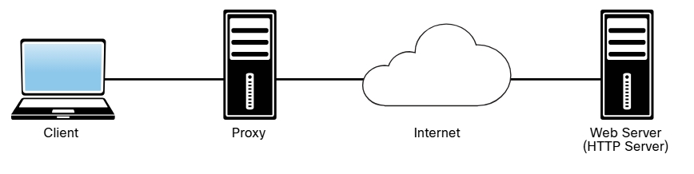
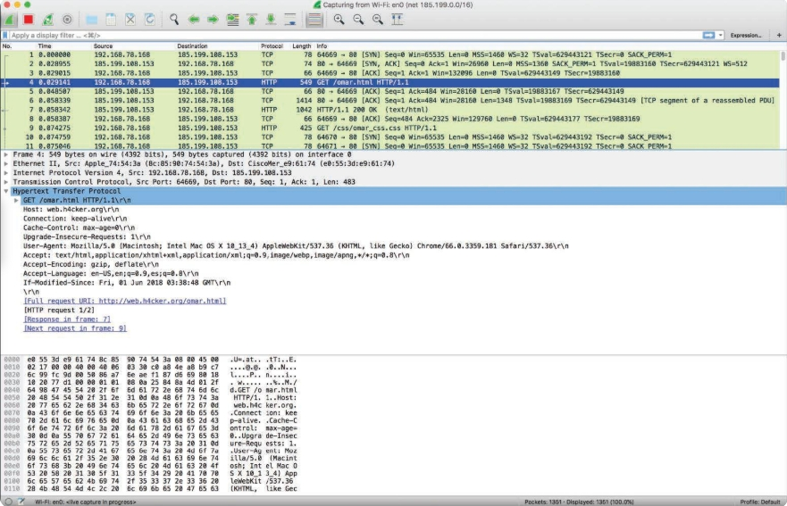
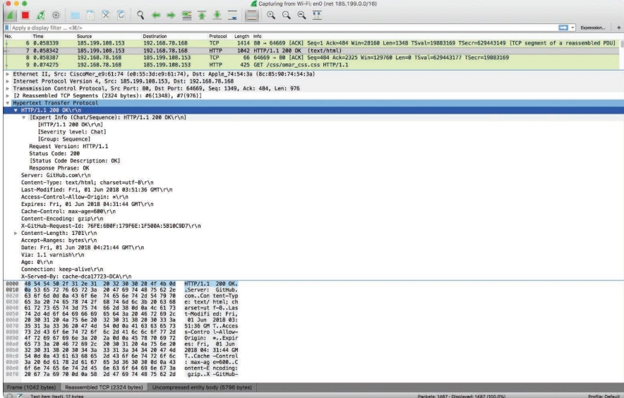
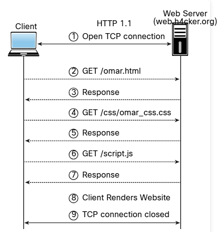

# El protocolo HTTP
Veamos algunos hechos y definiciones antes de pasar a los detalles sobre HTTP:
- El protocolo HTTP 1.1 se define en las RFC 7230-7235.
- En los ejemplos de este módulo, cuando hacemos referencia a un _servidor HTTP_, básicamente nos referimos a un servidor web.
- Cuando nos referimos a _clientes HTTP_, estamos hablando de navegadores, proxies, clientes de API y otros programas de clientes HTTP personalizados.
- HTTP es un protocolo muy simple, lo cual es bueno y malo.
- En la mayoría de los casos, HTTP se clasifica como un protocolo sin estado que no depende de una conexión persistente para la lógica de comunicación. 
- Una transacción HTTP consiste en una única solicitud de un cliente a un servidor, seguida de una única respuesta del servidor al cliente.
- HTTP es diferente de los protocolos con estado, como FTP, SMTP, IMAP y POP. Cuando un protocolo tiene estado, las secuencias de comandos relacionados se tratan como una única interacción.
- Un servidor debe mantener el estado de su interacción con el cliente durante la transmisión de comandos sucesivos hasta que finalice la interacción.
- Una secuencia de comandos transmitidos y ejecutados a menudo se denomina _sesión_.<br>

_Un cliente web, un proxy y un servidor web (HTTP)_<br>

<br>

Los proxies HTTP actúan como servidores y clientes. Los proxies realizan solicitudes a los servidores web en nombre de otros clientes. Permiten las transferencias HTTP a través de firewalls y también pueden proporcionar soporte para el almacenamiento en caché de mensajes HTTP. Los proxies pueden realizar otros roles en entornos complejos, incluida la traducción de direcciones de red (NAT) y el filtrado de solicitudes HTTP.<br>
HTTP es un protocolo de nivel de aplicación en el conjunto de protocolos TCP/IP y utiliza TCP como protocolo de capa de transporte subyacente para transmitir mensajes. HTTP utiliza un modelo de solicitud/respuesta, lo que básicamente significa que un programa cliente HTTP envía un mensaje de solicitud HTTP a un servidor y, a continuación, el servidor devuelve un mensaje de respuesta HTTP.<br>

_Modelo de Solicitud/Respuesta HTTP_<br>

<br>

La utilidad (comando) de Linux __tcpdump__ se utiliza para capturar los paquetes del cliente (192.168.78.6) al servidor web para acceder al sitio web _http://web.h4cker.org/omar.html_.<br>

_Captura de paquetes de una Solicitud y Respuesta HTTP mediante **tcpdump**_<br>
```bash
omar@jorel:~$ sudo tcpdump net 185.199.0.0/16
tcpdump: verbose output suppressed, use -v or -vv for full protocol
decode
listening on enp9s0, link-type EN10MB (Ethernet), capture size 262144
bytes

23:55:13.076301 IP 192.168.78.6.37328 > 185.199.109.153.http: Flags
[S], seq 3575866614, win 29200, options [mss 1460,sackOK,TS val
462864607 ecr 0,nop,wscale 7], length 0

23:55:13.091262 IP 185.199.109.153.http > 192.168.78.6.37328: Flags
[S.], seq 3039448681, ack 3575866615, win 26960, options [mss
1360,sackOK,TS val 491992242 ecr 462864607,nop,wscale 9], length 0

23:55:13.091322 IP 192.168.78.6.37328 > 185.199.109.153.http: Flags
[.], ack 1, win 229, options [nop,nop,TS val 462864611 ecr 491992242],
length 0

23:55:13.091409 IP 192.168.78.6.37328 > 185.199.109.153.http: Flags
[P.], seq 1:79, ack 1, win 229, options [nop,nop,TS val 462864611 ecr
491992242], length 78: HTTP: GET / HTTP/1.1

23:55:13.105791 IP 185.199.109.153.http > 192.168.78.6.37328: Flags
[.], ack 79, win 53, options [nop,nop,TS val 491992246 ecr 462864611],
length 0

23:55:13.106727 IP 185.199.109.153.http > 192.168.78.6.37328: Flags
[P.], seq 1:6404, ack 79, win 53, options [nop,nop,TS val 491992246
ecr 462864611], length 6403: HTTP: HTTP/1.1 200 OK

23:55:13.106776 IP 192.168.78.6.37328 > 185.199.109.153.http: Flags
[.], ack 6404, win 329, options [nop,nop,TS val 462864615 ecr
491992246], length 0
```
El cliente y el servidor primero completan el protocolo de enlace de tres vías de TCP (SYN, SYN ACK, ACK). Luego el cliente envía un HTTP GET (solicitud) y el servidor responde con un TCP ACK y el contenido de la página (con una respuesta HTTP 200 OK). Cada uno de estos mensajes de solicitud y respuesta contiene un encabezado y un cuerpo del mensaje. Un mensaje HTTP (una solicitud o una respuesta) tiene una estructura que consta de un bloque de líneas que comprende el encabezado del mensaje, seguido del cuerpo del mensaje.<br>

_Detalles de la solicitud HTTP_<br>

<br>

Cuando los navegadores y servidores HTTP se comunican entre sí, realizan interacciones basadas en los encabezados y en el contenido del cuerpo. La solicitud HTTP mostrada tiene la siguiente estructura:
- __El método__: El método es HTTP GET, aunque podría ser cualquiera de los siguientes:
  - __GET__: Recupera información del servidor.
  - __HEAD__: Básicamente lo mismo que __GET__ pero devuelve solo los encabezados HTTP y no el cuerpo del documento.
  - __POST__: Envía datos al servidor (normalmente mediante formularios HTML, solicitudes de API, etc.).
  - __TRACE__: Realiza una prueba de bucle invertido del mensaje a lo largo de la ruta al recurso de destino.
  - __PUT__: Carga una representación del URL especificado.
  - __DELETE__: Elimina el recurso especificado.
  - __OPTIONS__: Devuelve los métodos HTTP que admite el servidor.
  - __CONNECT__: Convierte la conexión de solicitud en un túnel TCP/IP transparente.
- __El URL y el campo de ruta al recurso__: Esto representa la parte de la ruta de la URL solicitada.
- __El campo de número de versión de la solicitud__: Esto especifica la versión de HTTP utilizada por el cliente.
- __El user agent__: En este ejemplo, se utilizó Chrome para acceder al sitio web. En la captura de paquetes, verá lo siguiente<br>
```
User-Agent: Mozilla/5.0 (Macintosh; Intel Mac OS X 10_13_4) AppleWebKit/537.36 (KHTML, like Gecko)
Chrome/66.0.3359.181 Safari/537.36
```
- __También aparecen varios otros campos: accept, accept-language, accept encoding__ y otros campos.<br>

El servidor después de recibir esta solicitud, genera una respuesta.<br>

_Detalles de la Respuesta HTTP_<br>

<br>

La respuesta del servidor incluye un código de estado de tres dígitos y una breve explicación legible del código de estado. Debajo puede ver los datos de texto (que es el código HTML que proviene del servidor y muestra el contenido del sitio web).<br>

Los mensajes de código de estado HTTP pueden estar en los siguientes rangos:
  -  Los mensajes en el rango 100 son informativos.
  -  Los mensajes en el rango 200 están relacionados con transacciones exitosas.
  -  Los mensajes en el rango 300 están relacionados con las redirecciones HTTP.
  -  Los mensajes en el rango 400 están relacionados con errores del cliente.
  -  Los mensajes en el rango 500 están relacionados con errores del servidor.

### Estructura de URL HTTP
Considere la URL _https://theartofhacking.org:8123/dir/test;id=89?name=omar&x=true_. Desglosemos esta URL en sus partes:
  - __Esquema__: Es la parte de la URL que designa el protoclo subyacente que se utilizará (por ejemplo, HTTP, FTP); le siguen dos puntos y dos barras diagonales (//). En este ejemplo, el esquema es __http__.
  - __Host__: Es la dirección IP (numérica o basada en DNS) del servidor web al que se accede; generalmente sigue a los dos puntos y dos barras diagonales. En este caso, el host es __theartofhacking.org__.
  - __Port__: Esta parte opcional de la URL designa el número de puerto que escucha el servidor web de destino. (El número de puerto predeterminado para los servidores HTTP es 80, pero algunas configuraciones están configuradas para usar un número de puerto alternativo). En este caso, el servidor está configurado para utilizar el puerto __8123__.
  - __Ruta (Path)__: Es la ruta desde el directorio "raíz" del servidor al recurso deseado. En este caso, puede ver que hay un directorio llamado __dir__. (Tenga en cuenta que los servidores web pueden usar alias para apuntar a documentos, puertas de enlace y servicios a los que no se puede acceder explícitamente desde el directorio raíz del servidor).
  - __Path-segment-params__: Esta es la parte la URL que incluye pares de nombre/valor opcionales (es decir, parámetros de segmento de ruta). Un parámetro de segmento de ruta suele estar precedido por un punto y coma (según el lenguaje de programación utilizado) e inmediatamente después de la información de la ruta. Además, vale la pena mencionar que estos parámetros son diferentes de los parámetros de query-string.
  - __query string__: Esta parte opcional de la URL contiene pares de nombre/valor oue representan los parámetros dinámicos asociados con la solicitud. Estos parámetros se incluyen comúnmente en enlaces con fines de seguimiento y configuración de contexto. También pueden producirse a partir de variables en formularios HTML. Por lo general, el query string está precedido por un signo de interrogación. Los signos de igual (=) separan los nombres y los valores, y los símbolos de unión (&) marcan los límites entre los pares de nombre/valor.<br>

Además, otros protocolos, como HTML y CSS, se utilizan en cosas como el Protocolo Simple de Acceso a Objetos (SOAP) y las API de RESTful. Los ejemplos incluyen JSON, XML y el Servicio de Procesamiento Web (WPS).<br>
Las versiones HTTP actuales son 1.1 y 2.0<br>

_Intercambio HTTP 1.1_<br>

<br>

_Multiplexación HTTP 2.0_<br>

<br>

# Sesiones Web
Una _sesión web_ es una secuencia de transacciones de solicitud y respuesta HTTP entre un cliente web y un servidor. Estas transacciones incluyen tareas previas de autenticación, el proceso de autenticación, administración de sesiones, control de acceso y finalización de sesiones. Numerosas aplicaciones web realizan un seguimiento de la información sobre cada usuario durante una transacción web. Varias aplicaciones web tienen la capacidad de establecer variables como derechos de acceso y configuraciones de localización. Estas variables, se aplican a todas y cada una de las interacciones que tiene un usuario con la aplicación web durante la sesión.<br>
Las aplicaciones web pueden crear sesiones para realizar un seguimiento de los usuarios anónimos después de la primera solicitud de usuario. Por ejemplo, una aplicación puede recordar la preferencia de idioma del usuario cada vez que visita el sitio o la interfaz de la aplicación. Además, una aplicación web utiliza una sesión después de que el usuario se ha autenticado. Esto permite que la aplicación identifique al usuario en cualquier solicitud posterior y pueda aplicar controles de acceso de seguridad y aumentar la facilidad de uso de la aplicación. En resumen, las aplicaciones web pueden proporcionar capacidades de sesión antes y después de la autenticación.<br>
Después de establecer una sesión autenticada, el ID de la sesión (o token) equivale temporalmente al método de autenticación más seguro utilizado por la aplicación, como los nombres de usuario y las contraseñas, las contraseñas de un solo uso y los certificados digitales basados en el cliente.<br>

__Nota__: Un buen recurso que proporciona mucha información sobre la autenticación de aplicaciones es la _Hoja de Referencia para la Autenticación de OWASP_, disponible en *https://www.owasp.org/index.php/Authentication_Cheat_Sheet*.<br>

Para mantener el estado de autenticación y realizar un seguimiento del progreso del usuario, las aplicaciones proporcionan a los usuarios ID de sesión o tokens. Se asigna un token en el momento de la creación de la sesión, y el usuario y la aplicación web lo comparten e intercambian durante la sesión. El ID de la sesión es un par de nombre/valor.<br>
Los nombres de ID de sesión utilizados por los marcos de desarrollo de aplicaciones web más comunes pueden identificarse fácilmente. Por ejemplo, puede usar huellas digitales de __PHPSESSID (PHP)__, __JSESSIONID (J2EE)__, y __CFTOKEN (ColdFusion)__, **ASP.NET_SessionId (ASP.NET)** y muchos otros. Además el nombre del ID de la sesión puede indicar qué marco y qué lenguajes de programación utiliza la aplicación web.<br>
Se recomienda cambiar el nombre de ID de sesión predeterminado del marco de desarrollo web a un nombre genérico como __id__.<br>
La ID de la sesión debe ser lo suficientemente larga para evitar ataques de fuerza bruta. A veces, los desarrolladores lo establecen en unos pocos bits, aunque debe ser de al menos 128 bits (16 bytes).<br>

__Nota__: Es muy importante que la ID de una sesión sea única e impredecible. Debe usar un buen generador de bits aleatorios deterministas (DRBG) para crear un valor de ID de sesión que proporcione al menos 256 bits de entropía.<br>

Hay varios mecanismos disponibles en HTTP para mantener el estado de la sesión dentro de las aplicaciones web, incluidas las cookies (en el encabezado HTTP estándar), los parámetros de URL y la reescritura definidos en RFC 3986 y los argumentos de URL en las solicitudes __GET__. Además, los desarrolladores utilizan argumentos del cuerpo en las solicitudes __POST__, como campos de formulario ocultos (formularios HTML) o encabezados HTTP exclusivos. Sin embargo, uno de los mecanismos de intercambio de ID de sesión más utilizados son las cookies, que ofrecen capacidades avanzadas que no están disponibles en otros métodos.<br>
Incluir el ID de la sesión en la URL puede provocar la manipulación del ID o ataques de fijación de la sesión. Por lo tanto, es importante mantener el ID de la sesión fuera de la URL.<br>

__Consejo__: Los marcos de desarrollo web, como _ASP.NET_, _PHP_ y _Ruby on Rails_, proporcionan sus propias funciones de administración de sesiones e implementaciones asociadas. Se recomienda utilizar estos marcos integrados en lugar de crear los propios suyos desde cero, ya que han sido probados por muchas personas. Cuando realiza pruebas de penetración, es probable que encuentre personas que intentan crear sus propios marcos. Además, __JSON Web Token (JWT)__ se puede utilizar para la autenticación en aplicaciones modernas.<br>

Esto puede parecer bastante obvio, pero debe recordar cifrar una sesión web completa, no solo para el proceso de autenticación donde se intercambian las credenciales de usuario, sino también para garantizar que la ID de la sesión se intercambie solo a través de un canal cifrado. El uso de un canal de comunicación cifrado también protege la sesión contra algunos ataques de _fijación de sesión_, en los que el atacante puede interceptar y manipular el tráfico web para inyectar (o fijar) la ID de sesión en el navegador web de la víctima.<br>
Los mecanismos de administración de sesiones basados en cookies pueden hacer uso de dos tipos de cookies: cookies no persistentes (o de sesión) y cookies persistentes. Si una cookie tiene un atributo __Max-Age__ o __Expires__, se considera una cookie persistente y el navegador web la almacena en un disco hasta la fecha de vencimiento. Las aplicaciones web y los clientes comunes priorizan el atributo __Max-Age__ sobre el atributo __Expires__.<br>
Las aplicaciones modernas suelen realizar un seguimiento de los usuarios después de la autenticación mediante cookies no persistentes. Esto fuerza la eliminación de la información de la sesión del cliente si se cierra la instancia del navegador web actual. Por eso es importante utilizar cookies no persistentes: para que el ID de sesión no permanezca en la caché del cliente web durante largos periodos de tiempo.<br>
Una aplicación debe validar y verificar cuidadosamente los ID de sesión. Según el mecanismo de administración de sesiones utilizado, el ID de la sesión se recibirá en un parámetro __GET__ o __POST__, en la URL o en un encabezado HTTP mediante cookies.<br>
Si las aplicaciones web no validan y filtran los valores de ID de sesión no válidos, pueden utilizarse para explotar otras vulnerabilidades web, como la inyección SQL si los ID de sesión se almacenan en una base de datos relacional o secuencias de comandos entre sitios (XSS) persistentes, si las ID de sesión se almacenan y reflejan posteriormente en la aplicación web.<br>

# Los Top 10 de OWASP
El _Proyecto Abierto de Seguridad en Aplicaciones Web (Open Web Application Security Project) (OWASP)_ es una organización internacional dedicada a educar a los profesionales del sector, crear herramientas y difundir los procedimientos recomendados para proteger las aplicaciones web y los sistemas subyacentes. Hay docenas de capítulos de OWASP en todo el mundo. Se recomienda que se familiarice con el sitio web de [OWASP](https://www.owasp.org) y su orientación.<br>
OWASP publica y actualiza periódicamente una lista de los 10 riesgos principales (top 10) de seguridad de las aplicaciones. El _**Top 10 de OWASP**_ es un documento de concientización y un esfuerzo de la comunidad (visite _https://owasp.org/www-project-top-ten/_). También puede contribuir y revisar a través del [repositorio de GitHub de OWASP](https://github.com/OWASP/Top10). La mejor manera de mantenerse al día con las actualizaciones de OWASP es navegando directamente a su sitio web.<br>
