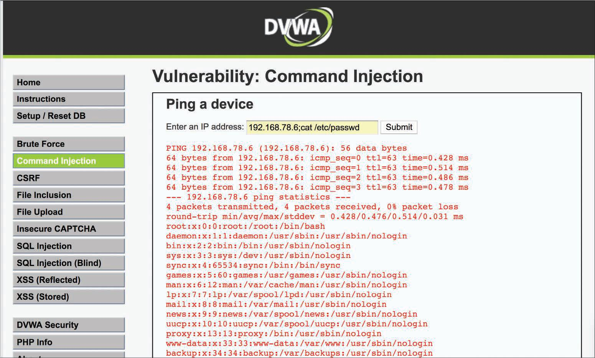

# Vulnerabilidades de Inyección de Comandos
Una **_inyección de comandos_** es un ataque en el que un atacante intenta ejecutar comandos que se supone que no puede ejecutar en un sistema a través de una aplicación vulnerable. Los ataques de inyección de comandos son posibles cuando una aplicación no valida los datos proporcionados por el usuario (por ejemplo, datos ingresados en formularios web, cookies, encabezados HTTP y otros elementos). El sistema vulnerable pasa esos datos a un shell del sistema. 
Con la inyección de comandos, un atacante intenta enviar comandos del sistema operativo para que la aplicación pueda ejecutarlos con los privilegios de la aplicación vulnerable. 
La inyección de comandos contra aplicaciones web no es tan popular como solía ser porque los marcos de aplicaciones modernos tienen mejores defensas contra estos ataques. La siguiente imagen muestra un ejemplo de inyección de comandos con la aplicación intencionalmente vulnerable DVWA. 

_Ejemplo de una Vulnerabilidad de Inyección de Comandos_ 

 

En la imagen, el sitio web permite a un usuario ingresar una dirección IP para realizar una prueba de ping a esa dirección IP, pero el atacante ingresa la cadena __192.168.78.6;cat /etc/passwd__ para hacer que la aplicación muestre el contenido del archivo __/etc/passwd__. 
