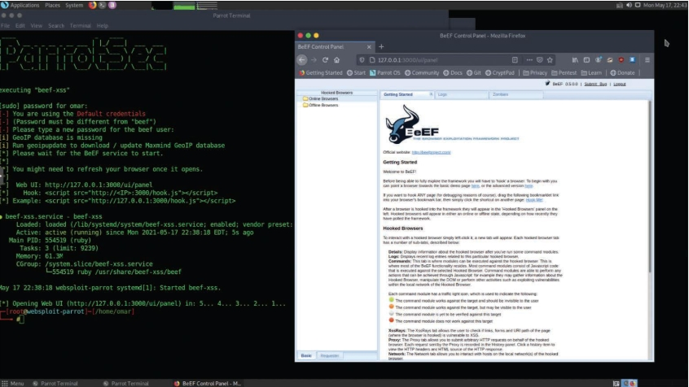
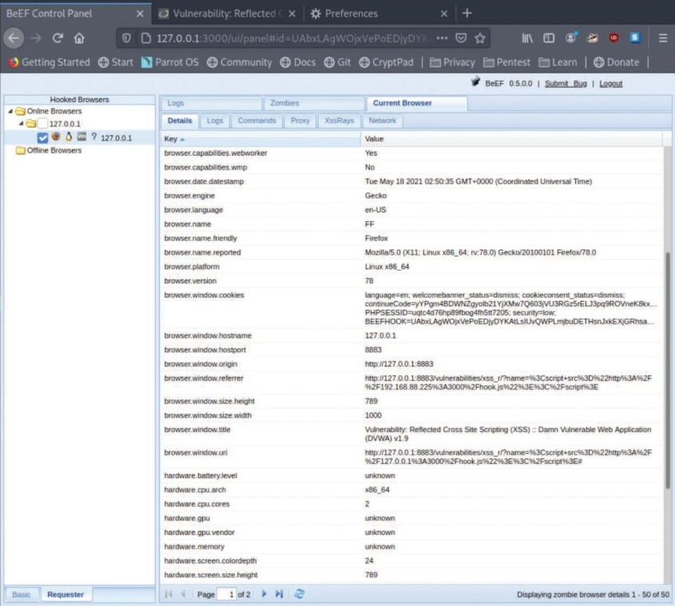

# Marco de explotación del navegador (BeEF)
Las vulnerabilidades de XSS aprovechan las debilidades de validación de entrada en una aplicación web. Estas vulnerabilidades se utilizan a menudo para redirigir a los usuarios a sitios web maliciosos para robar cookies (tokens de sesión) y otra información confidencial. _BeEF_ es una herramienta que puede utilizarse para manipular a los usuarios aprovechando las vulnerabilidades de XSS. Puede descargar BeEF desde [BeEf Project](https://beefproject.com) o desde [BeEf Project en GitHub](https://github.com/beefproject/beef).

## Inicio de BeEF
La herramienta inicia un servicio web en el puerto 3000 de forma predeterminada. Desde allí, el atacante puede iniciar sesión en una consola web y manipular a los usuarios que son víctimas de ataques XSS. 

_Inicio de BeEF_ 
 

## Robar una cookie del navegador
La imagen muestra un compromiso exitoso en el que el atacante ha robado el token de sesión del usuario. 
_Robo de una cookie con XSS y BeEF_ 
 

## Enviar una notificación falsa
Una vez que el sistema está comprometido, el atacante puede utilizar BeEF para realizar numerosos ataques. Por ejemplo, el atacante puede enviar notificaciones falsas al navegador de la víctima. 
_Envío de una notificación falsa_ 
 

_Notificación de BeEF falsa en el navegador de la víctima_ 
 