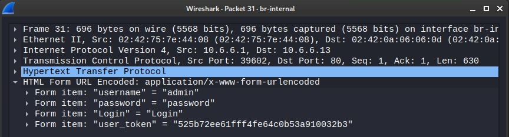

# Práctica de laboratorio - Rastreo de redes con Wireshark

## Objetivos
En esta práctica de laboratorio, utilizará la utilidad de Linux tcpdump para capturar y guardar el tráfico de red. Luego utilizará Wireshark para investigar la captura de tráfico.

- Prepare el host para capturar el tráfico de red.
- Capture y guarde el tráfico de red.
- Ver y analizar la captura de paquetes.
##Trasfondo / Escenario
Wireshark es una utilidad de captura de paquetes de red que pueden utilizar los administradores de red para solucionar problemas de red. También se puede utilizar para espiar las comunicaciones de red para recopilar pasivamente información sobre usuarios y servicios. Wireshark se considera una herramienta pasiva porque no crea tráfico en la red.

## Recursos necesarios
- Kali VM personalizada para el curso de Ethical Hacker
- Acceso a Internet

## Parte 1: Preparar el host para capturar el tráfico de red

__Paso 1: Iniciar la máquina virtual e iniciar sesión__
- Inicie la máquina virtual de la estación de trabajo Kali. Utilicen las siguientes credenciales de usuario:
```
    Username: kali
    Password: kali
```
- Inicie una sesión de terminal haciendo clic en el icono de terminal en la barra de menús.

__Paso 2: Verificar el entorno__
- Verifique el directorio de usuarios que se usará para almacenar el tráfico capturado. Para mostrar el directorio actual, use el comando pwd para mostrar la ruta completa al directorio de trabajo actual.
```bash
┌──(kali㉿Kali)-[~]
└─$ pwd
```
Determine la dirección IP de la interfaz Ethernet de Kali con el comando  *ifconfig*. La interfaz ethernet generalmente se denomina eth0.
```bash
┌──(kali㉿Kali)-[~]
└─$  ifconfig
```
Determine la puerta de enlace predeterminada asignada al host Kali mediante el comando ip route.
```bash
┌──(kali㉿Kali)-[~]
└─$ ip route
```
__Nota__: La dirección IP de la puerta de enlace predeterminada debe estar en la misma subred IP que la dirección de la interfaz Ethernet.
Determine la dirección del servidor DNS predeterminado configurado mostrando el contenido del archivo /etc/resolv.conf. Puede ver el archivo con el comando cat.
```bash
┌──(kali㉿Kali)-[~]
└─$ cat /etc/resolv.conf
# Generated by NetworkManager
nameserver 10.0.2.3
nameserver fd17:625c:f037:2::3
```
## Parte 2: Capturar y guardar el tráfico de red
En esta parte utilizarán tcpdump para capturar el contenido del tráfico HTTP. Utilizarán opciones de comandos para guardar el tráfico en un archivo de captura de paquetes (pcap). Estos registros se pueden analizar posteriormente con diferentes aplicaciones que leen archivos pcap, incluida Wireshark.

__Paso 1: Abrir un terminal e iniciar tcpdump__

Abra una aplicación del terminal e introduzca el comando ifconfig.
```bash
┌──(kali㉿Kali)-[~]
└─$ ifconfig
```
En la salida ifconfig, busque el nombre de la interfaz que corresponde al adaptador Ethernet (generalmente eth0). Haga clic con el botón derecho en el nombre de la interfaz y seleccione Copy Selection (Copiar selección).
Ingrese el comando sudo tcpdump como se muestra. Reemplace el texto <interface> con el nombre de la interfaz que copió en el paso anterior. Este comando requiere acceso de usuario root, así que introduzca kali como contraseña si se le solicita.
```bash
┌──(kali㉿Kali)-[~]
└─$ sudo tcpdump -i eth0 -s 0 -w packetdump.pcap
```
- La opción de comando -i le permite especificar la interfaz. Si no se la especifica, tcpdump capturará todo el tráfico en todas las interfaces.
- La opción de comando -s especifica la longitud de la instantánea correspondiente a cada paquete. Al establecer esta opción en 0, se establece el valor predeterminado de 262144.
- La opción de comando -w se utiliza para escribir el resultado del comando tcpdump en un archivo. Si se agrega la extensión .pcap, se garantiza que los sistemas operativos y las aplicaciones podrán leer el archivo. Todo el tráfico registrado se imprimirá al archivo httpsdump.pcap, en el directorio de inicio del usuario.

__Paso 2: Generar tráfico de red mediante un navegador web__

Para capturar una solicitud y una respuesta HTTP, abra un navegador web en el escritorio de Kali. Vaya a Google.com. No inicie sesión ni busque.
Abra una segunda pestaña en el navegador, ingrese netacad.com en la barra de inicio. Una vez que aparezca la página, haga clic en el icono de usuario en la parte superior derecha de la página. Inicie sesión con su información de inicio de sesión de netacad.
- Regrese a la ventana de terminal que ejecuta la utilidad tcpdump e ingrese CTRL-C para completar la captura de paquetes.
- La utilidad tcpdump guardó la salida en un archivo denominado packetdump.pcap. Este archivo debe guardarse en el directorio de inicio predeterminado. Verifique que el archivo exista en el directorio mediante el comando ls.
```bash
┌──(kali㉿Kali)-[~]
└─$ ls packetdump.pcap
packetdump.pcap
```
## Parte 3: Ver y analizar la captura de paquetes
En esta parte, usará Wireshark para analizar el archivo de captura de paquetes que creó en la parte 2 de esta práctica de laboratorio.

__Paso 1: Abra la aplicación Wireshark para ver la captura de paquetes__

Utilice Wireshark para ver los paquetes capturados. Inicie la aplicación gráfica Wireshark escribiendo wireshark en el indicador de la CLI.
```bash
┌──(kali㉿Kali)-[~]
└─$ wireshark
```
La aplicación Wireshark debería abrirse en una ventana diferente. Expanda la ventana de Wireshark a pantalla completa.

- Utilice la opción de menú File -> Open e introduzca packetdump.pcap en el campo Nombre de archivo. Haga clic en Open (Abrir). Debe abrirse una pantalla que muestre el contenido del archivo packetdump.pcap.
__Paso 2: Analizar el tráfico DNS__

Cuando se escribe la URL de un sitio web en el navegador, la PC realiza una consulta de DNS a la dirección IP del servidor DNS. La observación de las consultas y respuestas del DNS proporciona los nombres (URL) y las direcciones IP de los sitios que visita un usuario. Conocer los sitios web que los usuarios visitan comúnmente puede ser valioso al formular ataques de ingeniería social.

- Haga clic en el icono de búsqueda y busque el nombre de host netacad.com. Seleccione String en el cuadro desplegable e ingrese netacad en el cuadro de búsqueda.
- Seleccione la primera consulta estándar para el sitio web netacad.com. Expanda el panel de detalles de la consulta debajo de la lista de paquetes para ver el contenido del paquete de consulta.
- Expanda la información de Ethernet II para mostrar los datos del encabezado de capa 2 contenidos en el paquete. La dirección MAC de origen es la MAC de la interfaz del dispositivo de envío, en este caso la VM Kali, y la dirección MAC de destino es la MAC de la puerta de enlace predeterminada, ya que el servidor DNS no está en la misma red de capa 2.
- Expanda la sección Domain Name System (query) para ver los detalles de lo que se envía al servidor DNS. También indica la línea que contiene el paquete de respuesta que se recibió en respuesta a la consulta. Haga doble clic en el enlace a la respuesta. Se muestran los detalles del paquete de respuesta a la consulta estándar.

- Abra Wireshark escribiendo wireshark en la línea de comandos. Wireshark se abrirá en una nueva ventana, expandirá la ventana a pantalla completa. En el centro de la pantalla principal de Wireshark habrá una lista de nombres de interfaz para capturar el tráfico. Haga doble clic en el nombre de la interfaz que coincida con el nombre de la interfaz que descubrió en el paso 2a.
- Abra una ventana del navegador e ingrese la dirección IP 10.6.6.13 en la barra de inicio. Aparece una pantalla de inicio de sesión para el servidor web DVWA. Escriba admin tanto como nombre de usuario y la contraseña.
```
Username: admin
Password: password
```
- Cuando aparezca la página principal de DVWA, haga clic en el botón Instructions en la parte superior del menú en el lado izquierdo de la pantalla. Cuando aparezca la página de instrucciones, cierre la ventana del navegador.
- Regrese a la ventana de Wireshark. Detenga la captura con el icono cuadrado rojo en la barra de menús. El servidor web DVWA utiliza HTTP, no HTTPs. Utilice el icono de búsqueda para encontrar la cadena POST en los paquetes capturados. Los mensajes POST transfieren datos del formulario del cliente al servidor, en este caso la información de inicio de sesión.
- Haga doble clic en el primer paquete POST para ver los detalles en una ventana separada. Expanda la sección titulada HTML Form URL Encoded: <br>


 <br>

Las cookies se utilizan para diversos fines. Con mayor frecuencia, se utilizan para guardar información sobre la sesión de un usuario. Las cookies pueden ser secuestradas y utilizadas en ataques de secuestro de sesiones. La cookie inicial para una sesión se envía desde el servidor web al cliente con el valor Set-Cookie en una respuesta HTTP. Utilice el icono de búsqueda para encontrar la cadena 302 Found en el panel de paquetes. Haga doble clic en el primer paquete encontrado y expanda la sección Hypertext Transport Protocol.
