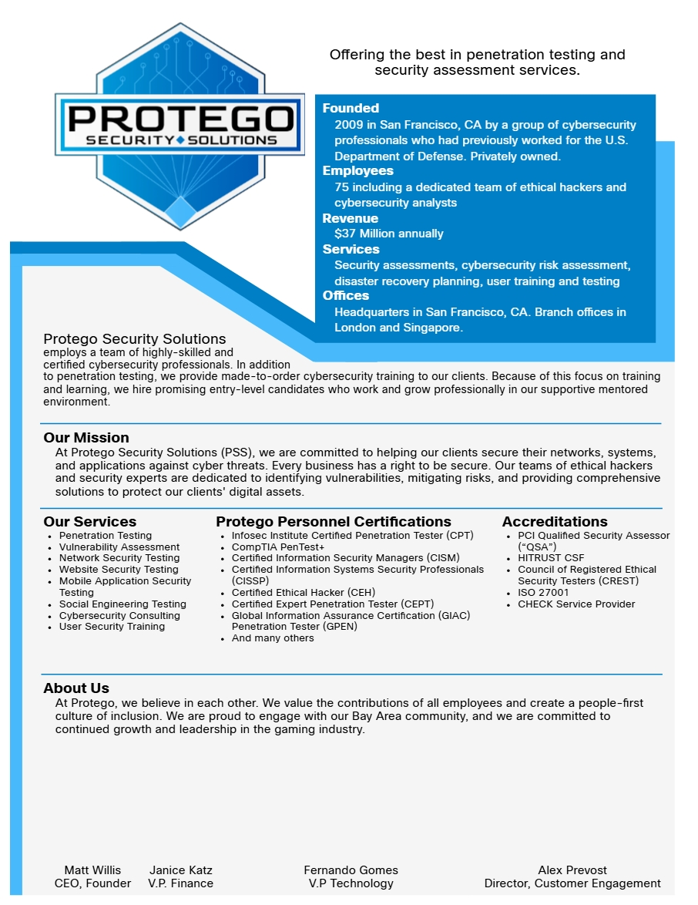
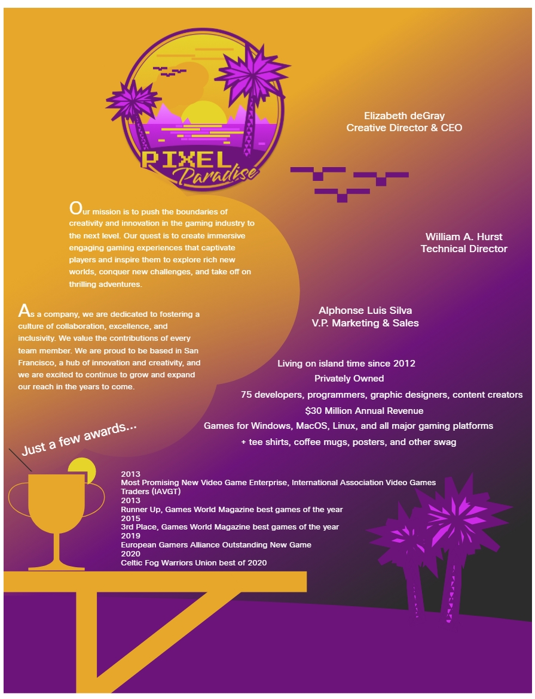

# Las Compañías Ficticias en el Curso de Hacker Ético
A lo largo del contenido del curso, sigue una narrativa ludificada atractiva y obtiene mucha práctica con prácticas de laboratorio inspiradas en escenarios del mundo real. En este recorrido, será guiado por su mentor virtual “Alex” en nuestra empresa ficticia de seguridad ofensiva, __Soluciones de Seguridad Protego__. Dentro de su rol como evaluador de penetración junior en Protego, aprenderá todas las fases de pruebas de penetración de la interacción con el cliente. __Pixel Paradise__, una empresa de videojuegos, es la empresa ficticia que será su cliente durante el curso. 

A continuación se presentan folletos informativos para cada empresa ficticia. 

## Su empleador: Soluciones de Seguridad Protego

 

## Su cliente: Pixel Paradise

 

# ¿Qué Aprenderé en este Curso?
El panorama digital está evolucionando a un ritmo sin precedentes y las amenazas cibernéticas acechan en cada esquina. La resiliencia de la ciberseguridad en el mundo moderno no puede ser solo un complemento, es una necesidad. 
Los profesionales de seguridad ofensivos, como los hackers éticos y evaluadores de penetración, pueden ayudar a descubrir amenazas desconocidas de manera proactiva y abordarlas antes de que lo hagan los delincuentes. 
Este curso está diseñado para prepararlo con un conjunto de habilidades de Hacker Ético y brindarle una sólida comprensión de la seguridad ofensiva. Se convertirá en experto en el arte de definir el alcance, la ejecución y la elaboración de informes sobre evaluaciones de vulnerabilidades, al tiempo que recomienda estrategias de mitigación. 
Después de completar este curso, continúe su carrera de ciberseguridad en seguridad ofensiva (Red Team) como Hacker Ético o evaluador de penetración. O utilice este curso para fortalecer sus conocimientos sobre seguridad defensiva (Blue Team). Al comprender la mentalidad de los actores de amenazas, podrá implementar controles de seguridad y monitorear, analizar y responder a las amenazas de seguridad actuales de manera más eficaz. 
A continuación, se muestran los módulos y sus objetivos. 
#
__Módulo 1: Introducción al Hacking Ético y las Pruebas de Penetración.__ Explicar la importancia del hacking ético metodológico y de las pruebas de penetración. 
#
__Módulo 2: Planificación y Alcance de una Evaluación de Pruebas de Penetración.__ Crear los documentos preliminares de una prueba de penetración. 
#
__Módulo 3: Recopilación de Información y Análisis de Vulnerabilidades.__ Realizar actividades de recopilación de información y escaneo de vulnerabilidades. 
#
__Módulo 4: Ataques de Ingeniería Social.__ Explicar cómo tienen éxito los ataques de ingeniería social. 
#
__Módulo 5: Explotando Redes Cableadas e Inalámbricas.__ Explicar cómo explotar las vulnerabilidades de las redes cableadas e inalámbricas. 
#
__Módulo 6: Explotando Vulnerabilidades Basadas en Aplicaciones.__ Explique cómo explotar vulnerabilidades basadas en aplicaciones. 
#
__Módulo 7: Seguridad en la Nube, Dispositivos Móviles e IoT.__ Explique como explotar las vulnerabilidades de seguridad en la nube, dispositivos móviles e IoT. 
#
__Módulo 8: Realización de Técnicas Posteriores a la Explotación.__ Explicar como realizar actividades post-explotación. 
#
__Módulo 9: Informes y Comunicación.__ Crear un informe de prueba de penetración. 
#
__Módulo 10: Herramientas y Análisis de Código.__ Clasificar las herramientas de pentesting según el caso de uso. 
#
 

## Declaración de Hacking Ético
En este curso, explorará y aplicará varias herramientas y técnicas dentro de un entorno de máquina virtual Kali Linux de Hacker Ético controlada y "aislada" para simular ataques cibernéticos y descubrir, evaluar y aprovechar las vulnerabilidades integradas. Es fundamental reconocer que las prácticas de laboratorio están diseñadas únicamente con fines educativos, con el objetivo de equiparlo con las habilidades para identificar y protegerse contra amenazas del mundo real. Las vulnerabilidades y debilidades demostradas aquí deben utilizarse de manera responsable y ética, exclusivamente dentro de este entorno designado como "sandboxing". 

La interacción con estas herramientas, técnicas o recursos más allá del entorno virtual "sandboxed" proporcionado o fuera del alcance autorizado puede dar lugar a violaciones de las leyes y regulaciones locales. Hacemos hincapié en la __importancia__ de buscar una aclaración por parte de su administrador o instructor antes de intentar cualquier experimentación. 

Es imperativo comprender que el __acceso no autorizado a datos__, __sistemas informáticos__ y __redes es ilegal__ en numerosas jurisdicciones, __independientemente de las intenciones o motivaciones__. Hacemos hincapié en la importancia de utilizar sus conocimientos recién adquiridos de manera responsable y garantizar el cumplimiento de todas las leyes y regulaciones aplicables. 

__Al aceptar esta "Declaración de Pirata Ético", usted reconoce la importancia fundamental de utilizar las habilidades adquiridas en este curso solo con fines éticos y legales, y se compromete a respetar los principios de las prácticas responsables de ciberseguridad. Recuerde, un gran poder conlleva una gran responsabilidad.__ 