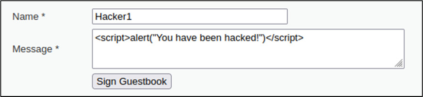

# 10.1.14 - Práctica de Laboratorio: Analizar el Código de Explotación
#### Tarea de soluciones de seguridad de Protego
En esta práctica de laboratorio, interpretará algunos scripts y comandos ingresados en el shell. Esto ayudará a desarrollar su profundo conocimiento sobre el software y las herramientas de pruebas de penetración.<br>
Es importante que pueda interpretar los comandos y los scripts que encuentre como parte de nuestros acuerdos de pruebas de penetración de nuestros clientes.<br>

## Objetivos
En esta práctica de laboratorio, investigará y analizará ejemplos de código de vulnerabilidad.<br>
+ Realice investigaciones y analice ejemplos de código.<br>

## Trasfondo / Escenario
En esta práctica de laboratorio, interpretará instrucciones de la línea de comandos y ejemplos de código.<br>

## Recursos necesarios
+ PC o dispositivo móvil
+ Acceso a Internet

## Parte 1: Investigue y analice ejemplos de códigos de explotaciones
1. Consulte el siguiente comando:
    ```bash
        nmap -sV --script vulners --script-args mincvss=4 10.6.6.23
    ```
   + Este comando mostrará las vulnerabilidades conocidas y su CVE correspondiente. El argumento mincvss limitará la salida solo a las CVE con puntuaciones de CVSS superiores a 4.<br>
2. Consulte la línea de código que se muestra en el cuadro de mensaje:<br><br><br>
   + Esta es una explotación de XSS almacenado. La explotación se almacena en el lado del servidor. El lenguaje utilizado es JavaScript.
   + En una explotación real, esta vulnerabilidad podría enviar a los usuarios a sitios web maliciosos.<br>
3. Consulte el siguiente comando:<br>
    ```bash
        nmap --script smb-enum-users.nse -p139,445 10.6.6.23
    ```
   + Este comando mostrará nombres de usuario del bloque de mensajes del servidor (SMB) en el equipo de destino (10.6.6.23).<br>
4. Consulte el siguiente comando:<br>
    ```bash
        1' OR 1=1 UNION SELECT user, password FROM users #
    ```
   + Esta es una explotación de inyección SQL. El propósito de este comando es recuperar nombres de usuario y contraseñas de una tabla de base de datos llamada "users".<br>
5. Consulte los siguientes comandos:<br>
    ```bash
        smbclient //172.17.0.2/tmp
        smb: > put malicious_file.txt malicious_file.txt
    ```
   + La transferencia de archivos entre sistemas mediante la utilidad `smbclient`.<br>
