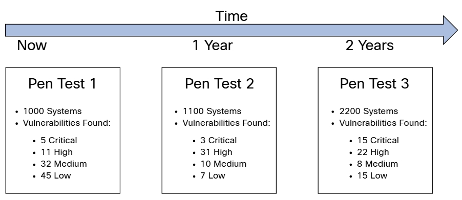

# 2.2.4 - Validación del Alcance del Compromiso
El primer paso para validar el alcance de una evaluación es cuestionar al cliente y revisar los contratos. También debe comprender quién es la audiencia objetivo para su informe de pruebas de penetración. Debe comprender los sujetos, las unidades de negocios y cualquier otra entidad que se evaluará mediante dicho compromiso de pruebas de penetración. 
__PISTA__: La administración del tiempo es muy importante en un compromiso de pruebas de penetración. La administración del tiempo es el proceso de planificación y organización de cómo se divide y asigna su tiempo para completar diferentes tareas durante la participación de las pruebas de penetración. No administrar su tiempo y aprender a priorizar tareas importantes puede dañar su eficacia y causar un estrés innecesario. Los beneficios de la administración del tiempo durante una prueba de penetración son enormes e incluyen una mayor productividad y una mayor oportunidad para encontrar vulnerabilidades adicionales en los sistemas objetivo. 
El Módulo 9, “Informes y comunicación”, abarca los informes de pruebas de penetración en detalle; aquí presentamos algunos puntos clave generales que debe tener en cuenta durante la fase de preparación de su compromiso. 
__Responder las siguientes preguntas le ayudará a descubrir diferentes características de su audiencia objetivo:__ 
- ¿Cuál es la necesidad de la entidad o el individuo del informe?
- ¿Cuál es la posición de la persona que será el destinatario principal del informe dentro de la organización?
- ¿Cuál es el propósito y el objetivo principal del compromiso de pruebas de penetración y, en última instancia, el propósito del informe?
- ¿Cuál es la responsabilidad y la autoridad del individuo o la unidad de negocios para tomar decisiones basadas en sus hallazgos?
- ¿A quién se dirigirá el informe, por ejemplo, el gerente de seguridad de la información (ISM), el director de seguridad de la información (CISO), el director de información (CIO), el director técnico (CTO), los equipos técnicos, etc.?
- ¿Quién tendrá acceso al informe, que puede contener información confidencial que debe protegerse, y si se proporcionará acceso cuando sea necesario? 

Siempre debe tener buenas líneas abiertas de comunicación con los clientes y las partes interesadas que lo contratan. 
Debe tener la documentación adecuada de las respuestas a las siguientes preguntas. 
- ¿Cuál es la información de contacto de todas las partes interesadas pertinentes?
- ¿Cómo se comunicará con las partes interesadas?
- ¿Con qué frecuencia necesita interactuar con las partes interesadas?
- ¿Quiénes son las personas con las que puede comunicarse en cualquier momento si surge una emergencia? 

La siguiente imagen proporciona un ejemplo simple de una tarjeta de contacto para su referencia. 

 

Debe solicitar una forma segura de transferencia o almacenamiento masivo de datos, como el Protocolo de copia segura (SCP) o el Protocolo de transferencia de archivos segura (SFTP). También debe intercambiar las claves de Pretty Good Privacy (PGP) o las claves de Extensiones de correo de Internet seguras / multipropósito (S / MIME) para intercambios de correo electrónico cifrado.

Las preguntas sobre el presupuesto y el retorno de la inversión (ROI) pueden surgir tanto del lado del cliente como del examinador en las pruebas de penetración. 
__Los clientes pueden hacer preguntas como estas:__ 
- ¿Cómo le explico el costo total de las pruebas de penetración a mi jefe?
- ¿Por qué necesitamos pruebas de penetración si contamos con todos estos controles técnicos y no técnicos de seguridad?
- ¿Cómo puedo incorporar las pruebas de penetración como factor de éxito?
- ¿Puedo hacerlo yo mismo?
- ¿Cómo calculo el ROI para el compromiso de las pruebas de penetración? 

__Al mismo tiempo, el evaluador debe responder preguntas como estas:__ 
- ¿Cómo contabilizo todos los elementos del compromiso de pruebas de penetración para evitar exceder el presupuesto?
- ¿Cómo hago los precios?
- ¿Cómo puedo mostrarle claramente el ROI a mi cliente? 

Las respuestas a estas preguntas dependen de cuán eficaz sea para determinar el alcance y comunicar y comprender claramente todos los elementos del compromiso de las pruebas de penetración. Otro factor es comprender que las pruebas de penetración son una evaluación en un momento determinado. Considere, por ejemplo, la línea de tiempo ilustrada en la imagen. 

 

En la imagen, se realizaron un total de tres compromisos de pruebas de penetración en un período de dos años en la misma empresa. En la primera interacción, se evaluaron 1000 sistemas; Se descubrieron 5 vulnerabilidades críticas, 11 de gravedad alta, 32 de gravedad media y 45 de gravedad baja. Un año después, se evaluaron 1100 sistemas; Se descubrieron 3 vulnerabilidades críticas, 31 de gravedad alta, 10 de gravedad media y 7 de gravedad baja. Luego, dos años más tarde, se evaluaron 2200 sistemas; Se descubrieron 15 vulnerabilidades críticas, 22 de gravedad alta, 8 de gravedad media y 15 de gravedad baja. ¿A la empresa le está yendo mejor o peor? ¿Las pruebas de penetración se realizan solo por un requisito de cumplimiento? ¿Cómo puede justificar las pruebas de penetración si continúa encontrando vulnerabilidades una y otra vez después de cada interacción?

Como puede ver, es importante que tanto el cliente como el evaluador de la penetración comprendan que las pruebas de penetración por sí solas no pueden garantizar la seguridad general de la empresa. El evaluador de penetración también debe incorporar estrategias de mitigación claras y viables para las vulnerabilidades encontradas. Además, se debe realizar un análisis de impacto adecuado y los plazos de corrección con las respectivas partes interesadas.