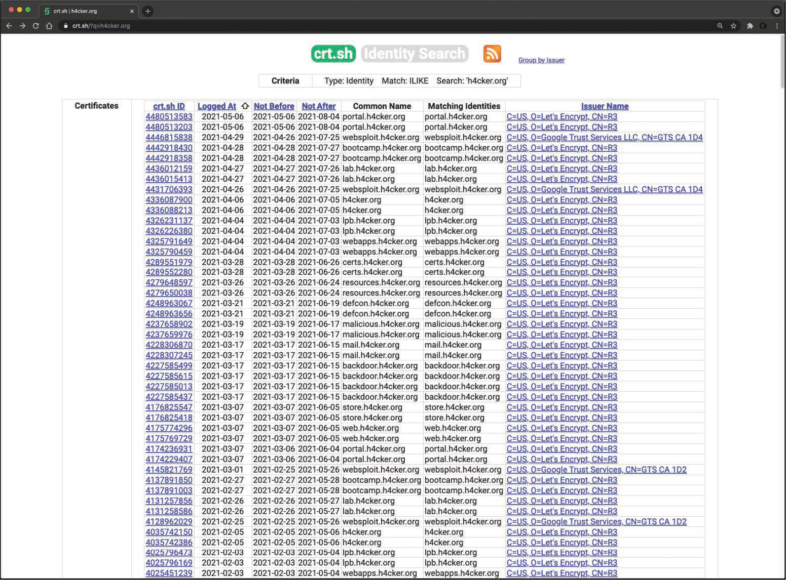

# 3.1.10 - Fallas Criptográficas
Durante la fase de reconocimiento, los atacantes a menudo pueden inspeccionar los certificados de Capa de Sockets Seguros (SSL) para obtener información sobre la organización, posibles fallas criptográficas e implementaciones débiles. Puede encontrar mucho dentro de los certificados digitales: el número de serie del certificado, el nombre común del sujeto, el identificador uniforme de recursos (URI) del servidor al que se asignó, el nombre de la organización, la información del Protocolo de Estado de Certificados en Línea (OCSP), la lista de revocación de certificados (CRL), etc. 
__CONSEJO__: Revocación de certificados es el acto de invalidar un certificado digital. Por ejemplo, si se ha dado de baja una aplicación o el certificado asignado a dicha aplicación está en riesgo, debe revocar el certificado y agregar su número de serie a una CRL. OSCP y CRL se utilizan para verificar si la autoridad emisora ha revocado un certificado. 
La siguiente imagen muestra el certificado digital asignado a h4cker.org. El certificado muestra la organización que lo emitió, en este caso Let's Encrypt (letsencrypt.org), el número de serie, el periodo de valides y la información de la clave pública, incluidos el algoritmo, el tamaño de la clave, etc. Los atacantes pueden utilizar esta información para revelar cualquier configuración o implementación criptográfica débil. 

 

Los atacantes también pueden aprovechar la transparencia de los certificados para revelar información adicional y enumerar subdominios. ¿Qué es la **_transparencia de los certificados?_** Hace más de una década, hubo un ataque importante contra __DigiNotar__ (una organización que crea, mantiene y autoriza certificados digitales para muchas empresas e instituciones gubernamentales). Este ataque (junto con otros ataques similares) planteó inquietudes en torno a las organizaciones que generan y administran certificados digitales. Posteriormente, se creó la transparencia de certificados para detectar mejor la emisión de certificados maliciosos. El objetivo de la transparencia de los certificados es que cualquier organización o individuo pueda verificar de manera "transparente" la emisión de un certificado digital. La transparencia de certificados permite que las autoridades de certificación (CA) proporcionen detalles sobre todos los certificados que se han emitido para un dominio y una organización determinados. Los atacantes también pueden usar esta información para revelar qué otros subdominios y sistemas puede tener una organización. 
__NOTA__: Puede obtener información detallada sobre la transparencia de los certificados en _https://certificate.transparency.dev/_. 

Herramientas como __crt.sh__ le permiten obtener información detallada de transparencia de certificados sobre cualquier dominio. La siguiente imagen muestra el resultado de la consulta _https://crt.sh/?q=h4cker.org_ en crt.sh para el dominio h4cker.org. Puede ver en los resultados de búsqueda varios subdominios que el atacante no conocía antes. 

 
