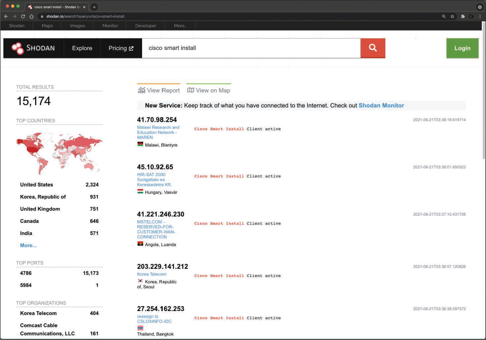

# Shodan
Shodan es una organización que analiza Internet las 24 horas del día, los 365 días del año. Los resultados de esos escaneos se almacenan en una base de datos que se puede consultar en shodan.io o mediante una API. Puede utilizar Shodan para consultar hosts vulnerables, dispositivos de Internet de las cosas (IoT) y muchos otros sistemas que no deben estar expuestos o conectados a la Internet pública. En la figura 3-5, se muestran diferentes categorías de sistemas detectados por los escaneos de Shodan, incluidos los sistemas de control industrial (ICS), las bases de datos, los dispositivos de infraestructura de red y los videojuegos.

#### Exploración de la base de datos de Shodan

 

La imagen muestra una consulta realizada para encontrar dispositivos de infraestructura de red que ejecutan un protocolo roto llamado *Cisco Smart Install*. Los atacantes han aprovechado este protocolo durante años para comprometer diferentes infraestructuras. Cisco eliminó este protocolo de sus sistemas hace muchos años. Sin embargo, muchas personas aún lo usan en dispositivos conectados a la Internet pública. 

### Revelación de sistemas vulnerables con Shodan

 

__CONSEJO__: Tenga en cuenta que, aunque se trata de información pública, no debe interactuar con ningún sistema que se muestre en los resultados de Shodan sin el permiso del propietario. Si el propietario tiene un programa de recompensa por errores, puede obtener un reconocimiento y una recompensa por encontrar el sistema afectado. Una recompensa por errores es un programa diseñado para recompensar a los investigadores de seguridad y a los hackers éticos por encontrar vulnerabilidades en un producto, una aplicación o un sistema. En la mayoría de los casos, la compensación es monetaria. Omar Santos ha incluido varios recursos en su repositorio de GitHub sobre cómo comenzar con las recompensas por errores; consulte _https://github.com/The-Art-of-Hacking/h4cker/tree/master/bug-bounties_. 