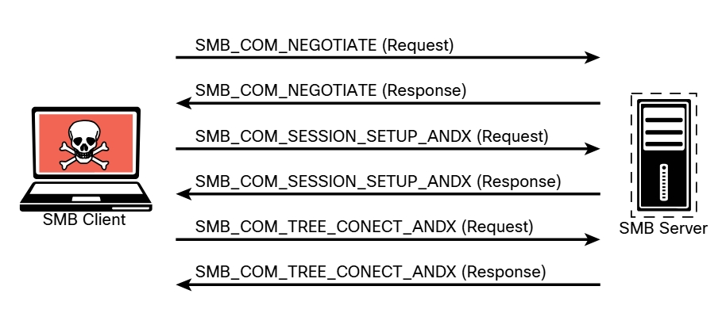

# 3.2.3 - Tipos de Enumeración
Esta sección abarca las técnicas de enumeración que deben realizarse en la fase de recopilación de información de una prueba de penetración. Esta sección también incluye ejemplos de cómo realizar estos tipos de enumeración mediante Nmap, así como un escaneo profundo de la elaboración de paquetes con Scapy.<br>
- Enumeración de host
- Enumeración de usuarios
- Enumeración de grupos
- Enumeración de recursos compartidos en red
- Ejemplos de enumeración de SMB adicionales
- Enumeración de páginas web / Enumeración de aplicaciones web
- Enumeración de servicios
- Exploración de la enumeración a través de la elaboración de paquetes
<hr>

### Enumeración de host
La enumeración de hosts es una de las primeras tareas que debe realizar en la fase de recopilación de información de una prueba de penetración. La enumeración de hosts se realiza interna y externamente. Cuando se realiza de manera externa, generalmente desea limitar las direcciones IP que está escaneando solo a las que forman parte del alcance de la prueba. Esto reduce la posibilidad de escanear inadvertidamente una dirección IP que no está autorizado a probar. Al realizar una enumeración de host interna, normalmente se escanea la subred o subredes completas de direcciones IP utilizadas por el destino. La enumeración de hosts generalmente se realiza mediante una herramienta como Nmap o Masscan; sin embargo, los escáneres de vulnerabilidades también realizan esta tarea como parte de sus pruebas automatizadas.<br>
<hr>

### Enumeración de usuarios
Recopilar una lista válida de usuarios es el primer paso para descifrar un conjunto de credenciales. Cuando tenga el nombre de usuario, puede iniciar intentos de fuerza bruta para obtener la contraseña de la cuenta. La enumeración de usuarios se realiza cuando se obtiene acceso a la red interna. En una red de Windows, puede hacerlo mediante la manipulación del protocolo Server Message Block (SMB), que utiliza el puerto TCP 445.<br>

#### _Ilustración de mensaje SMB_
<br>

La información contenida en las respuestas a estos mensajes le permite revelar información sobre el servidor:<br>

+ __SMB_COM_NEGOTIATE__: Este mensaje permite al cliente indicarle al servidor qué protocolos, indicadores y opciones le gustaría usar. La respuesta del servidor también es un mensaje SMB_COM_NEGOTIATE. Esta respuesta se transmite al cliente sobre qué protocolos, indicadores y opciones prefiere. Esta información se puede configurar en el propio servidor. Una configuración incorrecta a veces revela información que puede utilizar en las pruebas de penetración. Por ejemplo, el servidor puede estar configurado para permitir mensajes sin firmas. Puede determinar si el servidor utiliza mecanismos de autenticación a nivel de recurso compartido o de usuario y si el servidor permite contraseñas de texto sin formato. La respuesta del servidor también proporciona información adicional, como la hora y la zona horaria que utiliza el servidor. Esta es información necesaria para muchas tareas de pruebas de penetración.
+ __SMB_COM_SESSION_SETUP_ANDX__: Después de que el cliente y el servidor hayan negociado los protocolos, los indicadores y las opciones que usarán para la comunicación, comienza el proceso de autenticación. La autenticación es la función principal del mensaje SMB_COM_SESSION_SETUP_ANDX. La información enviada en este mensaje incluye el nombre de usuario, la contraseña y el dominio del cliente. Si esta información no está cifrada, es fácil detectarla directamente fuera de la red. Incluso si está cifrada, si el mecanismo utilizado no es suficiente, la información puede revelarse mediante herramientas con Lanman y NTLM en el caso de las implementaciones de Microsoft Windows. En el siguiente ejemplo se muestra el uso de este mensaje con el script `smb-enum-users.nse`:<br>

```bash
    nmap --script smb-enum-users.nse [host]
```

El siguiente ejemplo muestra los resultados del script __`smb-enum-users`__ ejecutado contra el destino 192.168.88.251. Como puede ver, los resultados indican que el script pudo enumerar los usuarios configurados en este destino de Windows.

```bash
    ┌──(root㉿Kali)-[~]
    └─# nmap  --script smb-enum-users.nse 192.168.88.251
    Starting Nmap 7.91 ( https://nmap.org ) at 2021-06-22 11:14 EDT
    Nmap scan report for 192.168.88.251 
    Host is up (0.012s latency).
    Not shown: 992 closed ports
    PORT     STATE SERVICE
    22/tcp   open  ssh
    80/tcp   open  http
    139/tcp  open  netbios-ssn
    445/tcp  open  microsoft-ds
    3306/tcp open  mysql
    8888/tcp open  sun-answerbook
    9000/tcp open  cslistener
    9090/tcp open  zeus-admin
    Host script results:
    | smb-enum-users:
    |    VULNHOST-1\derek (RID: 1000)
    |      Full name:
    |      Description:
    |_     Flags:          Normal user account
    Nmap done: 1 IP address (1 host up) scanned in 0.81 seconds 
```
<hr>

### Enumeración de grupos
Para un evaluador de penetración, la enumeración de gurpo es útil para determinar los roles de autorización que se utilizan en el entorno de destino. El script de Nmap para enumerar grupos SMB es `smb-enum-groups`. Este script intenta extraer una lista de grupos de una máquina Windows remota. También puede revelar la lista de usuarios que son miembros de esos grupos. La sintaxis de los comandos es la siguiente:<br>

```bash
    nmap --script smb-enum-groups.nse -p445 [host]
```

El siguiente ejemplo muestra el resultado de muestra de este comando que se ejecuta en el servidor de Windows en 192.168.56.3. Este ejemplo utiliza credenciales conocidas para recopilar información.<br>

#### _Enumeración de grupos_

```bash
    ┌──(root㉿Kali)-[~]
    └─# nmap --script smb-enum-groups.nse --script-args smbusername=vagrant,smbpass=vagrant 192.168.56.3
    Starting Nmap 7.91 ( https://nmap.org )
    Nmap scan report for 192.168.56.3
    Host is up (0.0062s latency).
    Not shown: 979 closed ports
    PORT      STATE SERVICE
    22/tcp    open  ssh
    135/tcp   open  msrpc
    139/tcp   open  netbios-ssn
    445/tcp   open  microsoft-ds
    3306/tcp  open  mysql
    3389/tcp  open  ms-wbt-server
    MAC Address: 08:00:27:1B:A4:60 (Oracle VirtualBox virtual NIC)
    Host script results:
    | smb-enum-groups:
    |   Builtin\Administrators (RID: 544): Administrator, vagrant, sshd_server
    |   Builtin\Users (RID: 545): vagrant, sshd, sshd_server, leia_organa,
    luke_skywalker, han_solo, artoo_detoo, c_three_pio, ben_kenobi, darth_
    vader, anakin_skywalker, jarjar_binks, lando_calrissian, boba_fett,
    jabba_hutt, greedo, chewbacca, kylo_ren
    |    Builtin\Guests (RID: 546): Guest, ben_kenobi
    |    Builtin\Power Users (RID: 547): boba_fett
    |    Builtin\Print Operators (RID: 550): jabba_hutt
    |    Builtin\Backup Operators (RID: 551): leia_organa
    |    Builtin\Replicator (RID: 552): chewbacca
    |    Builtin\Remote Desktop Users (RID: 555): greedo
    |    Builtin\Network Configuration Operators (RID: 556): anakin_skywalker
    |    Builtin\Performance Monitor Users (RID: 558): lando_calrissian
    |    Builtin\Performance Log Users (RID: 559): jarjar_binks
    |    Builtin\Distributed COM Users (RID: 562): artoo_detoo
    |    Builtin\IIS_IUSRS (RID: 568): darth_vader
    |    Builtin\Cryptographic Operators (RID: 569): han_solo
    |    Builtin\Event Log Readers (RID: 573): c_three_pio
    |    Builtin\Certificate Service DCOM Access (RID: 574): luke_skywalker
    |_   VAGRANT-2008R2\WinRMRemoteWMIUsers__ (RID: 1003): <empty>
    Nmap done: 1 IP address (1 host up) scanned in 0.81 seconds
```

En Windows, el identificador relativo (RID) es un número de longitud variable asignado a objetos y se convierte en parte del identificador de seguridad (SID) del objeto que identifica de forma exclusiva una cuenta o un grupo de un dominio. Para obtener más información sobre los diferentes números de RID, consulte *https://docs.microsoft.com/en-us/troubleshoot/windows-server/identity/security-identifiers-in-windows*.<br>
<hr>

### Enumeración de recursos compartidos en red
Identificar los sistemas en una red que comparten archivos, carpetas e impresoras es útil para desarrollar una superficie de ataque de una red interna. El script `smb-enum-shares` utiliza la llamada a procedimiento remoto de Microsoft (MSRPC) para la enumeración de recursos compartidos de red. La sintaxis del script es la siguiente:<br>

```bash
    nmap --script smb-enum-shares.nse -p 445 [host]
```

#### _Enumeración de recursos compartidos_
```bash
    ┌──(root㉿Kali)-[~]
    └─# nmap --script smb-enum-shares.nse -p 445 192.168.88.251
    Starting Nmap 7.91 ( https://nmap.org ) at 2021-06-22 11:27 EDT
    Nmap scan report for 192.168.88.251
    Host is up (0.0011s latency).

    PORT    STATE SERVICE
    445/tcp open  microsoft-ds

    Host script results:
    | smb-enum-shares:
    |   account_used: guest
    |   \\192.168.88.251\IPC$:
    |     Type: STYPE_IPC_HIDDEN
    |     Comment: IPC Service (Samba 4.9.5-Debian)
    |     Users: 1
    |     Max Users: <unlimited>
    |     Path: C:\tmp
    |     Anonymous access: READ/WRITE
    |     Current user access: READ/WRITE
    |   \\192.168.88.251\print$:
    |     Type: STYPE_DISKTREE
    |     Comment: Printer Drivers
    |     Users: 0
    |     Max Users: <unlimited>
    |     Path: C:\var\lib\samba\printers
    |     Anonymous access: <none>
    |     Current user access: <none>
    |   \\192.168.88.251\secret_folder:
    |     Type: STYPE_DISKTREE
    |     Comment: Extremely sensitive information
    |     Users: 0
    |     Max Users: <unlimited>
    |     Path: C:\secret_folder
    |     Anonymous access: <none>
    |_    Current user access: <none>}
    
    Nmap done: 1 IP address (1 host up) scanned in 0.39 seconds
```
<hr>

### Ejemplos de enumeración adicionales
El sistema utilizado en los ejemplos anteriores ejecuta Linux y Samba. Sin embargo, no es fácil determinar que se trata de un sistema Linux a partir de los resultados de escaneos anteriores. Una manera fácil de realizar enumeraciones y huellas digitales adicionales de las aplicaciones y el sistema operativo que se ejecutan en un host es mediante el comando `nmap -sC`. La opción `-sC` ejecuta los scripts NSE más comunes según los puertos abiertos en el sistema de destino.<br>
__NOTA__: Puede localizar los scripts NSE instalados en Kali Linux y Parrot OS simplemente con el comando `locate * .nse`. El sitio _https://nmap.org/book/man-nse.html_ incluye una explicación detallada de NSE y cómo crear nuevos scripts con el lenguaje de programación Lua.<br>

#### _Ejecución de los scripts NSE predeterminados de Nmap_
```bash
    ┌──(root㉿Kali)-[~]
    └─# nmap -sC 192.168.88.251
    Starting Nmap 7.80 ( https://nmap.org ) at 2021-06-21 17:38 EDT
    Nmap scan report for 192.168.88.251
    Host is up (0.00011s latency).
    Not shown: 992 closed ports
    PORT     STATE SERVICE
    22/tcp   open  ssh
    | ssh-hostkey:
    |   2048 d0:0c:83:4d:7f:84:2c:60:96:9f:df:26:da:d2:11:9a (RSA)
    |   256 e2:aa:69:ab:a3:e6:0f:13:c5:5a:65:f2:d5:16:8c:3e (ECDSA)
    |_  256 21:4b:27:7b:6e:a6:d4:33:86:60:cb:39:3b:48:9c:0b (ED25519)
    80/tcp   open  http
    |_http-title: WebSploit Mayhem
    139/tcp  open  netbios-ssn
    445/tcp  open  microsoft-ds
    3306/tcp open  mysql
    | mysql-info:
    |   Protocol: 10
    |   Version: 5.5.47-0ubuntu0.14.04.1
    |   Thread ID: 3
    |   Capabilities flags: 63487
    |   Some Capabilities: InteractiveClient,
    DontAllowDatabaseTableColumn, FoundRows, IgnoreSigpipes,
    Support41Auth, ODBCClient, ConnectWithDatabase, LongPassword,
    SupportsTransactions, IgnoreSpaceBeforeParenthesis,
    Speaks41ProtocolOld, Speaks41ProtocolNew, SupportsCompression,
    SupportsLoadDataLocal, LongColumnFlag, SupportsMultipleResults,
    SupportsMultipleStatments, SupportsAuthPlugins
    |   Status: Autocommit
    |   Salt: b_60.4ZH=52:l5ajmhBP
    |_  Auth Plugin Name: mysql_native_password
    8888/tcp open  sun-answerbook
    9000/tcp open  cslistener
    9090/tcp open  zeus-admin
    MAC Address: 1E:BD:4F:AA:C6:BA (Unknown)
    Host script results:
    |_clock-skew: mean: 17s, deviation: 0s, median: 17s
    |_nbstat: NetBIOS name: VULNHOST-1, NetBIOS user: <unknown>, NetBIOS
    MAC: <unknown> (unknown)
    | smb-os-discovery:
    |   OS: Windows 6.1 (Samba 4.9.5-Debian)
    |   Computer name: vulnhost-1
    |   NetBIOS computer name: VULNHOST-1\x00
    |   Domain name: ohmr.org
    |   FQDN: vulnhost-1.ohmr.org
    |_  System time: 2022-06-21T21:38:40+00:00
    | smb-security-mode:
    |   account_used: guest
    |   authentication_level: user
    |   challenge_response: supported
    |_  message_signing: disabled (dangerous, but default)
    | smb2-security-mode:
    |   2.02:
    |_    Message signing enabled but not required
    | smb2-time:
    |   date: 2021-06-21T21:38:40
    |_  start_date: N/A
    Nmap done: 1 IP address (1 host up) scanned in 28.77 seconds
```
Observe estas líneas del ejemplo anterior:<br>
```bash
    | smb-os-discovery:
    |   OS: Windows 6.1 (Samba 4.9.5-Debian)
    |   Computer name: vulnhost-1
    |   NetBIOS computer name: VULNHOST-1\x00
    |   Domain name: ohmr.org
    |   FQDN: vulnhost-1.ohmr.org
```
Estas líneas muestran detalles sobre la versión de Samba que se ejecuta en el sistema (Samba versión 4.9.5). También se puede ver que aunque el SO está marcado como Windows 6.1, el sistema operativo correcto es Debian. El siguiente ejemplo muestra la salida del comando `samba -V` en el sistema de destino (vulnhost-1), que confirma que el analizador pudo determinar la versión correcta de Samba.<br>

#### _Confirmación de resultados del escaneo en el sistema de destino_
```bash
    ┌──(root㉿Kali)-[~]
    └─# sudo samba -V
    Version 4.9.5-Debian
```
También puede utilizar herramientas como enum4linux para enumerar los recursos compartidos de Samba, incluidas las cuentas de usuario, los recursos compartidos y otras configuraciones.<br>

#### _Enumeración de información adicional con enum4linux_
```bash
    ┌──(root㉿Kali)-[~]
    └─# enum4linux 192.168.88.251
    Starting enum4linux v0.8.9 ( http://labs.portcullis.co.uk/application/enum4linux/ )
    ==========================
    |    Target Information    |
    ==========================
    Target ........... 192.168.88.251
    RID Range ........ 500-550,1000-1050

    Username ......... ''
    Password ......... ''
    Known Usernames .. administrator, guest, krbtgt, domain admins, root, bin, none
    ======================================================
    |    Enumerating Workgroup/Domain on 192.168.88.251    |
    ======================================================
    [+] Got domain/workgroup name: WORKGROUP
    ==============================================
    |    Nbtstat Information for 192.168.88.251    |
    ==============================================
    Looking up status of 192.168.88.251
      VULNHOST-1       <00> -         B <ACTIVE>  Workstation Service
      VULNHOST-1       <03> -         B <ACTIVE>  Messenger Service
      VULNHOST-1       <20> -         B <ACTIVE>  File Server Service
    ..__MSBROWSE__. <01> - <GROUP> B <ACTIVE>  Master Browser
      WORKGROUP        <00> - <GROUP> B <ACTIVE>  Domain/Workgroup Name
      WORKGROUP        <1d> -         B <ACTIVE>  Master Browser
      WORKGROUP        <1e> - <GROUP> B <ACTIVE>  Browser Service
    Elections
    MAC Address = 00-00-00-00-00-00
    =======================================
    |    Session Check on 192.168.88.251    |
    =======================================
    [+] Server 192.168.88.251 allows sessions using username '', password ''
    =============================================
    |    Getting domain SID for 192.168.88.251    |
    =============================================
    Domain Name: WORKGROUP
    Domain Sid: (NULL SID)
    [+] Can't determine if host is part of domain or part of a workgroup
    ========================================
    |     OS information on 192.168.88.251    |
    ========================================
    Use of uninitialized value $os_info in concatenation (.) or string at ./enum4linux.pl line 464.
    [+] Got OS info for 192.168.88.251 from smbclient:
    [+] Got OS info for 192.168.88.251 from srvinfo:
        VULNHOST-1     Wk Sv PrQ Unx NT SNT Samba 4.9.5-Debian
        platform_id     : 500
        os version      : 6.1
        server type     : 0x809a03
    ===============================
    |    Users on 192.168.88.251    |
    ===============================
    index: 0x1 RID: 0x3e8 acb: 0x00000010 Account: derek Name:  Desc:
    user:[derek] rid:[0x3e8]
    ===========================================
    |    Share Enumeration on 192.168.88.251    |
    ===========================================
        Sharename       Type      Comment
        ---------       ----      -------
        print$          Disk      Printer Drivers
    secret_folder   Disk      Extremely sensitive information
        IPC$            IPC       IPC Service (Samba 4.9.5-Debian)
    SMB1 disabled -- no workgroup available
    [+] Attempting to map shares on 192.168.88.251
    //192.168.88.251/print$ Mapping: DENIED, Listing: N/A
    //192.168.88.251/secret_folder Mapping: DENIED, Listing: N/A
    ======================================================
    |    Password Policy Information for 192.168.88.251    |
    ======================================================
    [+] Attaching to 192.168.88.251 using a NULL share
    [+] Trying protocol 139/SMB...
    [+] Found domain(s):
        [+] VULNHOST-1
        [+] Builtin
    [+] Password Info for Domain: VULNHOST-1
        [+] Minimum password length: 5
        [+] Password history length: None
        [+] Maximum password age: 37 days 6 hours 21 minutes
        [+] Password Complexity Flags: 000000
            [+] Domain Refuse Password Change: 0
            [+] Domain Password Store Cleartext: 0
            [+] Domain Password Lockout Admins: 0
            [+] Domain Password No Clear Change: 0
            [+] Domain Password No Anon Change: 0
            [+] Domain Password Complex: 0
        [+] Minimum password age: None
        [+] Reset Account Lockout Counter: 30 minutes
        [+] Locked Account Duration: 30 minutes
        [+] Account Lockout Threshold: None
        [+] Forced Log off Time: 37 days 6 hours 21 minutes
        [+] Retrieved partial password policy with rpcclient:
    Password Complexity: Disabled
    Minimum Password Length: 5
    ================================
    |    Groups on 192.168.88.251    |
    ================================
    [+] Getting builtin groups:
    [+] Getting builtin group memberships:
    [+] Getting local groups:
    [+] Getting local group memberships:
    [+] Getting domain groups:
    [+] Getting domain group memberships:
    =======================================================
    |    Users on 192.168.88.251 via RID cycling (RIDS: 500-550, 1000-1050)    |
    =======================================================
    [I] Found new SID: S-1-22-1
    [I] Found new SID: S-1-5-21-2226316658-154127331-1048156596
    [I] Found new SID: S-1-5-32
    [+] Enumerating users using SID S-1-5-21-2226316658-154127331-1048156596 and logon username '', password ''
    <output omitted for brevity>
    S-1-5-21-2226316658-154127331-1048156596-501 VULNHOST-1\nobody (Local User)
    S-1-5-21-2226316658-154127331-1048156596-513 VULNHOST-1\None (Domain Group)
    S-1-5-21-2226316658-154127331-1048156596-1000 VULNHOST-1\derek (Local User)
    <output omitted for brevity>
    [+] Enumerating users using SID S-1-22-1 and logon username '', password ''
    S-1-22-1-1000 Unix User\omar (Local User)
    S-1-22-1-1001 Unix User\derek (Local User)
    [+] Enumerating users using SID S-1-5-32 and logon username '', password ''
    <output omitted for brevity>
    =================================================
    |    Getting printer info for 192.168.88.251    |
    =================================================
    No printers returned.
```
Hay una implementación de enum4linux basada en Python llamada enum4linux-ng que se puede descargar de _https://github.com/cddmp/enum4linux-ng_.<br>
```bash
    ┌──(root㉿Kali)-[~/enum4linux-ng]
    └─# ./enum4linux-ng.py -As 192.168.88.251
    ENUM4LINUX - next generation

    ==========================
    |    Target Information    |
    ==========================
    [*] Target ........... 192.168.88.251
    [*] Username ......... ''
    [*] Random Username .. 'opaftohf'
    [*] Password ......... ''
    [*] Timeout .......... 5 second(s)

    ======================================
    |    Service Scan on 192.168.88.251    |
    ======================================
    [*] Checking LDAP
    [-] Could not connect to LDAP on 389/tcp: connection refused
    [*] Checking LDAPS
    [-] Could not connect to LDAPS on 636/tcp: connection refused
    [*] Checking SMB
    [+] SMB is accessible on 445/tcp
    [*] Checking SMB over NetBIOS
    [+] SMB over NetBIOS is accessible on 139/tcp
    ===========================================
    |    SMB Dialect Check on 192.168.88.251    |
    ===========================================
    [*] Check for legacy SMBv1 on 445/tcp
    [+] Server supports dialects higher SMBv1
    ===========================================
    |    RPC Session Check on 192.168.88.251    |
    ===========================================
    [*] Check for null session
    [+] Server allows session using username '', password ''
    [*] Check for random user session
    [+] Server allows session using username 'opaftohf', password ''
    [H] Rerunning enumeration with user 'opaftohf' might give more results
    =====================================================
    |    Domain Information via RPC for 192.168.88.251    |
    =====================================================
    [+] Domain: WORKGROUP
    [+] SID: NULL SID
    [+] Host is part of a workgroup (not a domain)
    ================================================
    |    OS Information via RPC on 192.168.88.251    |
    ================================================
    [+] The following OS information were found:
    server_type_string = Wk Sv PrQ Unx NT SNT Samba 4.9.5-Debian
    platform_id        = 500
    os_version         = 6.1
    server_type        = 0x809a03
    os                 = Linux/Unix (Samba 4.9.5-Debian)
    =======================================
    |    Users via RPC on 192.168.88.251    |
    =======================================
    [*] Enumerating users via 'querydispinfo'
    [+] Found 2 users via 'querydispinfo'
    [*] Enumerating users via 'enumdomusers'
    [+] Found 2 users via 'enumdomusers'
    [+] After merging user results we have 2 users total:
    '1000':
      username: derek
      name: ''
      acb: '0x00000010'
      description: ''
    '1001':
      username: omar
      name: ''
      acb: '0x00000010'
      description: ''
    ========================================
    |    Groups via RPC on 192.168.88.251    |
    ========================================
    [*] Enumerating local groups
    [+] Found 0 group(s) via 'enumalsgroups domain'
    [*] Enumerating builtin groups
    [+] Found 0 group(s) via 'enumalsgroups builtin'
    [*] Enumerating domain groups
    [+] Found 0 group(s) via 'enumdomgroups'
    ========================================
    |    Shares via RPC on 192.168.88.251    |
    ========================================
    [*] Enumerating shares
    [+] Found 3 share(s):
    IPC$:
      comment: IPC Service (Samba 4.9.5-Debian)
      type: IPC
    print$:
      comment: Printer Drivers
      type: Disk
    secret_folder:
      comment: Extremely sensitive information
      type: Disk
    [*] Testing share IPC$
    [-] Could not check share: STATUS_OBJECT_NAME_NOT_FOUND
    [*] Testing share print$
    [+] Mapping: DENIED, Listing: N/A
    [*] Testing share secret_folder
    [+] Mapping: DENIED, Listing: N/A
    ===========================================
    |    Policies via RPC for 192.168.88.251    |
    ===========================================
    [*] Trying port 445/tcp
    [+] Found policy:
    domain_password_information:
      pw_history_length: None
      min_pw_length: 5
      min_pw_age: none
      max_pw_age: 49710 days 6 hours 21 minutes
      pw_properties:
      - DOMAIN_PASSWORD_COMPLEX: false
      - DOMAIN_PASSWORD_NO_ANON_CHANGE: false
      - DOMAIN_PASSWORD_NO_CLEAR_CHANGE: false
      - DOMAIN_PASSWORD_LOCKOUT_ADMINS: false
      - DOMAIN_PASSWORD_PASSWORD_STORE_CLEARTEXT: false 
      - DOMAIN_PASSWORD_REFUSE_PASSWORD_CHANGE: false
    domain_lockout_information:
      lockout_observation_window: 30 minutes
      lockout_duration: 30 minutes
      lockout_threshold: None
    domain_logoff_information:
      force_logoff_time: 49710 days 6 hours 21 minutes
    ===========================================
    |    Printers via RPC for 192.168.88.251    |
    ===========================================
    [+] No printers returned (this is not an error)
    Completed after 0.70 seconds
```

#### _Enumeración con smbclient_
```bash
    ┌──(root㉿Kali)-[~]
    └─# smbclient -L \\\192.168.88.251
        Sharename       Type       Comment
        ---------       ----       -------
        print$                      Disk       Printer Drivers
        secret_folder             Disk        Extremely sensitive information
        IPC$            IPC        IPC Service (Samba 4.9.5-Debian)
    SMB1 disabled -- no workgroup available
```

### Enumeración de páginas web / Enumeración de aplicaciones web
Una vez que haya identificado que un servidor web se está ejecutando en un host de destino, el siguiente paso es echar un vistazo a la aplicación web y comenzar a trazar el mapa de la superficie de ataque realizando enumeración de páginas web o, a menudo, denominado enumeración de aplicaciones web. Puede trazar un mapa de la superficie de ataque de una aplicación web de diferentes maneras. La práctica herramienta Nmap tiene un script NSE disponible para forzar las rutas de directorios y archivos de aplicaciones web. Armado con una lista de archivos y directorios conocidos utilizados por aplicaciones web comunes, analiza el servidor para cada uno de los elementos de la lista. En función de la respuesta del servidor, puede determinar si existen esas rutas. Esto es útil para identificar elementos como la página del administrador predeterminada de Apache o Tomcat que comúnmente se dejan en los servidores web y pueden ser posibles rutas de acceso. La sintaxis de `http-enum` es la siguiente:<br>
```bash
    nmap -sV --script=http-enum [target]
```

#### _Ejemplo de salida de secuencia de comandos http-enum_
```bash
    ┌──(root㉿Kali)-[~]
    └─# nmap -sV --script=http-enum -p 80 192.168.88.251
    Starting Nmap 7.91 ( https://nmap.org ) at 2021-06-22 11:53 EDT
    Nmap scan report for 192.168.88.251
    Host is up (0.0011s latency).

    PORT   STATE SERVICE VERSION
    80/tcp open  http    nginx 1.17.2
    | http-enum:
    |   /admin/: Possible admin folder
    |   /admin/index.html: Possible admin folder
    |_  /s/: Potentially interesting folder
    |_http-server-header: nginx/1.17.2
    Service detection performed. Please report any incorrect results at
    https://nmap.org/submit/ .
    Nmap done: 1 IP address (1 host up) scanned in 8.54 seconds
```
El resultado muestra varios directorios / carpetas enumerados y la versión del servidor web que se utiliza (Nginx 1.17.2). Este es un buen lugar para comenzar a atacar una aplicación web.<br>
Otra herramienta de enumeración de servidores web de la que deberíamos hablar es Nikto. Nikto es un escáner de vulnerabilidades web de código abierto que ha existido durante muchos años. No es tan sólido como los escáneres de vulnerabilidades web comerciales; sin embargo, es muy útil para ejecutar un script rápido para enumerar información sobre un servidor web y las aplicaciones que aloja. Debido a la velocidad a la que trabaja Nikto para escanear un servidor web, es muy ruidoso. Proporciona varias opciones de escaneo, incluida la capacidad de autenticarse en una aplicación web que requiere un nombre de usuario y una contraseña.<br>

#### _Muestra de escaneo con Nikto_
```bash
    ┌──(root㉿Kali)-[~]
    └─# nikto -h 192.168.88.251
    - Nikto v2.1.6
    -----------------------------------------------------------------------
    + Target IP:           192.168.88.251
    + Target Hostname:    192.168.88.251
    + Target Port:         80
    -----------------------------------------------------------------------
    + Server: nginx/1.17.2
    + The anti-clickjacking X-Frame-Options header is not present.
    + The anti-clickjacking X-Frame-Options header is not present.
    + The X-XSS-Protection header is not defined. This header can hint to
    the user agent to protect against some forms of XSS
    + The X-Content-Type-Options header is not set. This could allow the
    user agent to render the content of the site in a different fashion
    to the MIME type
    + No CGI Directories found (use '-C all' to force check all possible
    dirs)
    + OSVDB-3092: /admin/: This might be interesting...
    + /admin/index.html: Admin login page/section found.
    + /wp-admin/: Admin login page/section found.
    + /wp-login/: Admin login page/section found.
    + 7916 requests: 0 error(s) and 7 item(s) reported on remote host
    + End Time:            2021-06-22 11:57:59 (GMT-4) (15 seconds)
    ---------------------------------------------------------------------------
    + 1 host(s) tested
```
__CONSEJO__: Ninguna herramienta es perfecta. Se recomienda que se familiarice con el comportamiento de las diferentes herramientas.<br>
<hr>

### Enumeración de servicios
La enumeración de servicios es el proceso de identificación de los servicios que se ejecutan en un sistema remoto y es un enfoque principal de lo que hace Nmap como escáner de puertos. Cuando está conectado a un sistema que está en un segmento de red conectado directamente, puede ejecutar algunos scripts adicionales para seguir enumerando. Un escaneo de puertos toma la perspectiva de un usuario remoto con credenciales. El script `smb-enum-processing` enumera los servicios en un sistema Windows y lo hace mediante las credenciales de un usuario que tiene acceso para leer el estado de los servicios en ejecución. Esta es una herramienta útil para consultar de forma remota un sistema de Windows para determinar la lista exacta de servicios en ejecución. La sintaxis de los comandos es la siguiente:<br>
```bash
    nmap --script smb-enum-processes.nse --script-args smbusername=[username], smbpass=[password] -p445 [host]
```
<hr>


### Exploración de la enumeración a través de la elaboración de paquetes
Cuando se trata de la enumeración a través de la elaboración y la generación de paquetes, Scapy es una de las herramientas y marcos favoritos de los evaluador de penetraciones. Scapy es un ecosistema o marco muy completo basado en Python para la generación de paquetes. En esta sección, se analizan algunas de las formas simples en que puede utilizar esta herramienta para realizar un reconocimiento básico de la red.<br>
__NOTA__: Scapy debe ejecutarse con permisos de root para poder modificar paquetes.<br>

Iniciar el shell interactivo de Scapy con *sudo scapy* desde una ventana de terminal.<br>
```bash
┌──(kali㉿Kali)-[~]
└─$ sudo scapy
[sudo] password for kali: 
INFO: Can't import PyX. Won't be able to use psdump() or pdfdump().
      .SYPACCCSASYY  
P /SCS/CCS        ACS | Welcome to Scapy
       /A          AC | Version 2.5.0
     A/PS       /SPPS |
        YP        (SC | https://github.com/secdev/scapy
       SPS/A.      SC |
   Y/PACC          PP | Have fun!
    PY*AYC        CAA
         YYCY//SCYP   using IPython 8.14.0
>>> 
```
#### Creación de un paquete ICMP simple con Scapy
Ahora, se crea un paquete ICMP simple con *malicious_payload* como carga útil que se envía al host de destino *192.168.88.251*

``` Python
    >>> send(IP(dst="192.168.88.251")/ICMP()/"malicious_payload")
.
Sent 1 packets.
```

#### Recopilación de un paquete creado con tshark
Aquí se muestra el paquete ICMP recibido por el sistema de destino. La herramienta de captura de paquetes *tshark* se utiliza para capturar el paquete ICMP diseñado
<!-- sudo tshark host 192.168.78.142 -->
``` bash
    ┌──(kali㉿Kali)-[~]
    └─$ sudo tshark host 192.168.78.142
    Running as user "root" and group "root". This could be dangerous.
    Capturing on 'eth0'
    ** (tshark:12273) 04:06:26.891304 [Main MESSAGE] -- Capture started.
    ** (tshark:12273) 04:06:26.891452 [Main MESSAGE] -- File: "/tmp/wireshark_eth05LEUF3.pcapng"
```
Scapy admite una gran cantidad de protocolos. Puede usar la función *ls()* para enumerar todos los formatos y protocolos disponibles.
<!-- ls() -->
```Python
    >>> ls()
    AD_AND_OR  : None
    AD_KDCIssued : None
    AH         : AH
    AKMSuite   : AKM suite
    ARP        : ARP
    ASN1P_INTEGER : None
    ASN1P_OID  : None
    ASN1P_PRIVSEQ : None
    ASN1_Packet : None
    ASN1_Packet : None
    ATT_Error_Response : Error Response
    ATT_Exchange_MTU_Request : Exchange MTU Request
    ATT_Exchange_MTU_Response : Exchange MTU Response
    ATT_Execute_Write_Request : Execute Write Request
    ATT_Execute_Write_Response : Execute Write Response
    ATT_Find_By_Type_Value_Request : Find By Type Value Request
    ATT_Find_By_Type_Value_Response : Find By Type Value Response
    ATT_Find_Information_Request : Find Information Request
    ATT_Find_Information_Response : Find Information Response
    ATT_Handle : ATT Short Handle
    <...>
```
Puede usar la función *ls()* para mostrar todas las opciones y campos de un protocolo o formato de paquete específico soportado por Scapy. <br>
#### _Listado de los campos de la capa 4 de TCP en Scapy_
<!-- ls(TCP) -->
```Python
    >>> ls(TCP)
    sport      : ShortEnumField                      = ('20')
    dport      : ShortEnumField                      = ('80')
    seq        : IntField                            = ('0')
    ack        : IntField                            = ('0')
    dataofs    : BitField  (4 bits)                  = ('None')
    reserved   : BitField  (3 bits)                  = ('0')
    flags      : FlagsField                          = ('<Flag 2 (S)>')
    window     : ShortField                          = ('8192')
    chksum     : XShortField                         = ('None')
    urgptr     : ShortField                          = ('0')
    options    : TCPOptionsField                     = ("b''")
    >>>
```
#### _Lista de los campos de paquetes DNS disponibles en Scapy_
<!-- ls(DNS) -->
```Python
    >>> ls(DNS)
    length     : ShortField (Cond)                   = ('None')
    id         : ShortField                          = ('0')
    qr         : BitField  (1 bit)                   = ('0')
    opcode     : BitEnumField                        = ('0')
    aa         : BitField  (1 bit)                   = ('0')
    tc         : BitField  (1 bit)                   = ('0')
    rd         : BitField  (1 bit)                   = ('1')
    ra         : BitField  (1 bit)                   = ('0')
    z          : BitField  (1 bit)                   = ('0')
    ad         : BitField  (1 bit)                   = ('0')
    cd         : BitField  (1 bit)                   = ('0')
    rcode      : BitEnumField                        = ('0')
    qdcount    : DNSRRCountField                     = ('None')
    ancount    : DNSRRCountField                     = ('None')
    nscount    : DNSRRCountField                     = ('None')
    arcount    : DNSRRCountField                     = ('None')
    qd         : DNSQRField                          = ('\x1b[0m<\x1b[0m\x1b[31m\x1b[1mDNSQR\x1b[0m  \x1b[0m|\x1b[0m\x1b[0m>\x1b[0m')
    an         : DNSRRField                          = ('None')
    ns         : DNSRRField                          = ('None')
    ar         : DNSRRField                          = ('None')
    >>>
```

Puede utilizar la función *explore()* para desplazarse por las capas y los protocolos de Scapy <br>
#### _Uso de la función explore() en Scapy_
<br>

Puedes utilizar la función *explore()* con cualquier formato de paquete o protocolo. <br>
#### _Uso de la función explore("dns") para mostrar los tipos de paquetes en scapy.layers.dns_
```Python
    >>> explore("dns")
    Packets contained in scapy.layers.dns: 
    -------------------------|------------------------------
    DNS                      |DNS                           
    DNSQR                    |DNS Question Record           
    DNSRR                    |DNS Resource Record           
    DNSRRDLV                 |DNS DLV Resource Record       
    DNSRRDNSKEY              |DNS DNSKEY Resource Record    
    DNSRRDS                  |DNS DS Resource Record        
    DNSRRMX                  |DNS MX Resource Record        
    DNSRRNSEC                |DNS NSEC Resource Record      
    DNSRRNSEC3               |DNS NSEC3 Resource Record     
    DNSRRNSEC3PARAM          |DNS NSEC3PARAM Resource Record
    DNSRROPT                 |DNS OPT Resource Record       
    DNSRRRSIG                |DNS RRSIG Resource Record     
    DNSRRSOA                 |DNS SOA Resource Record       
    DNSRRSRV                 |DNS SRV Resource Record       
    DNSRRTSIG                |DNS TSIG Resource Record      
    EDNS0ClientSubnet        |DNS EDNS0 Client Subnet       
    EDNS0TLV                 |DNS EDNS0 TLV                 
    InheritOriginDNSStrPacket|                              
    >>>
```
Puede utilizar Scapy como escáner de muchas maneras diferentes. <br>
*Envío de un paquete TCP SYN con Scapy*
```Python
    >>> ans, unans = sr(IP(dst='192.168.88.251')/TCP(dport=445,flags='S'))
    Begin emission:
    Finished sending 1 packets.
    .*
    Received 2 packets, got 1 answers, remaining 0 packets
    >>>
```
*Captura de paquetes de TCP en el host de destino*
<!-- sudo tshark host 192.168.78.142 -->
```bash
    ┌──(kali㉿Kali)-[~]
    └─$ sudo tshark host 192.168.78.142
    [sudo] password for kali: 
    Running as user "root" and group "root". This could be dangerous.
    Capturing on 'eth0'
    ** (tshark:25699) 04:25:55.585525 [Main MESSAGE] -- Capture started.
    ** (tshark:25699) 04:25:55.585989 [Main MESSAGE] -- File: "/tmp/wireshark_eth0EL6YF3.pcapng"
```