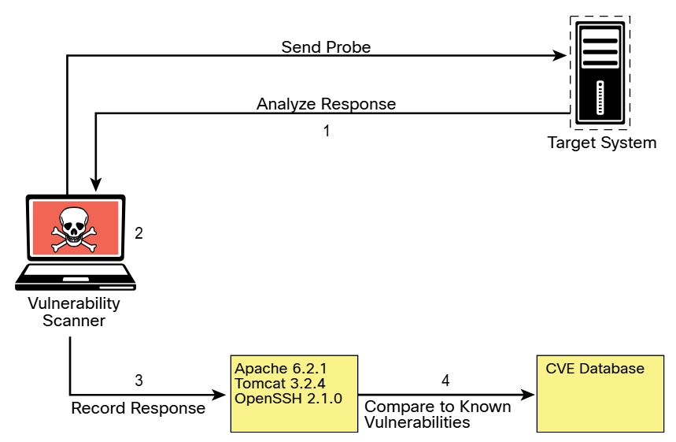

# 3.3.2 - Cómo funciona un típico escáner de vulnerabilidades automatizado
Ahora, echemos un vistazo a cómo funcionan los típicos escáneres de vulnerabilidades: 

 

Todos son diferentes en algunos aspectos, pero la mayoría sigue un proceso similar: 
__Paso 1.__ En la fase de detección, el escáner utiliza una herramienta como Nmap para realizar la enumeración de hosts y puertos. Con los resultados de la enumeración, el escáner comienza a sondear los puertos abiertos para obtener más información. 
__Paso 2.__ Cuando el escáner tiene suficiente información sobre el puerto abierto para determinar qué software y versión se están ejecutando en ese puerto, registra esa información en una base de datos posterior a su análisis. El escáner puede utilizar varios métodos para tomar esta determinación, incluido el uso de información de banners. 
__Paso 3.__ El escáner intenta determinar si el software que escucha en el sistema de destino es susceptible a vulnerabilidades conocidas. Lo hace correlacionando una base de datos de vulnerabilidades conocidas con la información registrada en la base de datos sobre los servicios objetivo. 
__Paso 4.__ El escáner produce un informe sobre lo que sospecha que podría ser vulnerable. Tenga en cuenta que estos resultados suelen ser falsos positivos y deben validarse. Como mínimo, este tipo de herramienta le da una idea de dónde buscar vulnerabilidades que puedan aprovecharse. 