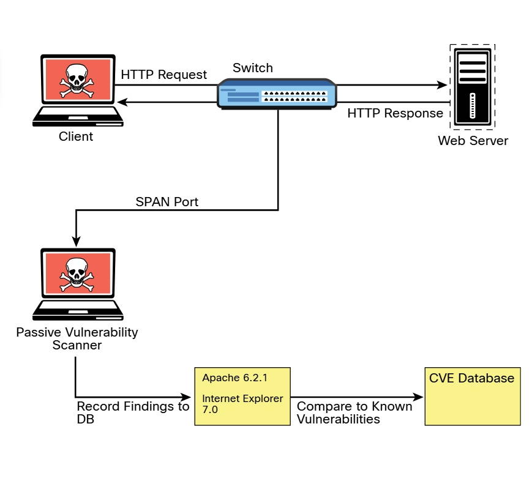

# 3.3.3 Tipos de análisis de vulnerabilidades
El tipo de escaneo de vulnerabilidades que se debe utilizar suele estar determinado por la política de escaneo creada en la herramienta de escaneo de vulnerabilidades automatizada. Cada herramienta tiene muchas opciones disponibles para escanear. A menudo puede optar por realizar un escaneo completo que operará todas las opciones de escaneo, aunque es posible que no pueda utilizar todas las opciones (por ejemplo, si está analizando un entorno de producción o un dispositivo que es propenso a fallar durante el escaneo). En tales situaciones, debe tener cuidado de seleccionar solo las opciones de escaneo que tienen menos probabilidades de causar problemas. Echemos un vistazo más de cerca a los siguientes tipos de escaneo típicos:

- Escaneos no autenticados
- Escaneos autenticados
- Escaneo de descubrimiento
- Escaneos completos
- Escaneos furtivos
- Escaneos de cumplimiento

### Escaneos no autenticados
De manera predeterminada, los escáneres de vulnerabilidades no utilizan credenciales para escanear un objetivo. Si proporciona solo la dirección IP del destino y hace clic en Escanear, la herramienta comenzará a enumerar el host desde la perspectiva de un atacante remoto no autenticado. Un escaneo no autenticado muestra solo los servicios de red que están expuestos a la red. El escáner intenta enumerar los puertos abiertos en el host de destino. Si el servicio no está a la escucha en el segmento de red al que está conectado el escáner, o si tiene un cortafuegos, el escáner informará que el puerto está cerrado y continuará. Sin embargo, esto no significa que no haya una vulnerabilidad. A veces es posible acceder a puertos que no están expuestos a la red a través del reenvío de puertos SSH y otros trucos. Sigue siendo importante ejecutar un escaneo con credenciales (o autenticado) cuando sea posible.<br>
__Nota__: Los escaneos autenticados pueden proporcionar una menor tasa de falsos positivos que los escaneos no autenticados.
<hr>

### Escaneos autenticados
En algunos casos, es mejor ejecutar un escaneo autenticado contra un objetivo para obtener una imagen completa de la superficie de ataque. Un escaneo autenticado requiere que proporcione al analizador un conjunto de credenciales que tengan acceso de nivel raíz al sistema. El escáner realmente inicia sesión en el destino a través de SSH o algún otro mecanismo. Luego ejecuta comandos como *netstat* para recopilar información del interior del host. Muchos de los comandos que ejecuta el escáner requieren acceso de nivel raíz para poder recopilar la información correcta del sistema.

- _Ejemplo de netstat sin acceso root_
<!-- netsat -tunap -->
```bash
    ┌──(kali㉿Kali)-[~]
    └─$ netstat -tunap
    (Not all processes could be identified, non-owned process info
    will not be shown, you would have to be root to see it all.)
    Active Internet connections (servers and established)
    Proto Recv-Q Send-Q Local Address           Foreign Address         State       PID/Program name    
    tcp        0      0 0.0.0.0:22              0.0.0.0:*               LISTEN      -                   
    tcp6       0      0 :::22                   :::*                    LISTEN      -                   
    udp        0      0 10.0.2.15:68            10.0.2.2:67             ESTABLISHED -
```

- _Ejemplo de netstat con acceso root_
<!-- sudo netstat -tunap -->
```bash
    ┌──(kali㉿Kali)-[~]
    └─$ sudo netstat -tunap
    [sudo] password for kali: 
    Active Internet connections (servers and established)
    Proto Recv-Q Send-Q Local Address           Foreign Address         State       PID/Program name    
    tcp        0      0 0.0.0.0:22              0.0.0.0:*               LISTEN      689/sshd: /usr/sbin 
    tcp6       0      0 :::22                   :::*                    LISTEN      689/sshd: /usr/sbin 
    udp        0      0 10.0.2.15:68            10.0.2.2:67             ESTABLISHED 592/NetworkManager
```
<hr>

### Escaneo de descubrimiento
Un escaneo de descubrimiento está destinado principalmente a identificar la superficie de ataque de un objetivo. Un escaneo de puertos es una parte importante de lo que realiza un escaneos de descubrimiento. Un escáner puede usar una herramienta como Nmap para realizar el proceso de escaneo de puertos. Luego, extrae los resultados del escaneo de puertos en su base de datos para usar esa información en un mayor descubrimiento. Por ejemplo, el resultado del escaneo de puertos puede mostrar que los puertos 80, 22 y 443 están abiertos y escuchando. A partir de ahí, la herramienta de escaneo prueba esos puertos para identificar exactamente qué servicio se está ejecutando en cada puerto. Por ejemplo, supongamos que identifica que un servidor web Apache Tomcat 8.5.22 se ejecuta en los puertos 80 y 443. Sabiendo que un servidor web se está ejecutando en los puertos, el escáner puede realizar más tareas de detección que son específicas de los servidores web y las aplicaciones. Ahora digamos que, al mismo tiempo, el escáner identifica que OpenSSH está escuchando en el puerto 22. Desde allí, el escáner puede sondear el servicio SSH para identificar información sobre su configuración y capacidades, como algoritmos criptográficos preferidos y admitidos. Este tipo de información es útil para identificar vulnerabilidades en fases posteriores de pruebas.<br>
<hr>

### Escaneos completos
Como se mencionó anteriormente, un escaneo completo generalmente implica la habilitación de cada opción de escaneo en la política de escaneo. Las opciones varían según el escáner, pero la mayoría de los escáneres de vulnerabilidades tienen sus categorías de opciones definidas de manera similar. Por ejemplo, suelen estar organizadas por sistema operativo, fabricante del dispositivo, tipo de dispositivo, protocolo, cumplimiento y tipo de ataque, y el resto de las opciones pueden incluirse en una categoría miscelánea. El ejemplo 3-44 muestra una lista de muestra de las categorías de complementos del escáner de vulnerabilidades de Nessus. Como puede ver en esta lista, hay muchos complementos disponibles para que los ejecute el escáner. También debería ser obvio, según los nombres de las categorías de complementos, que nunca habrá un solo dispositivo al que se apliquen todos estos complementos. Por ejemplo, los complementos para un dispositivo macOS no se aplicarían a un dispositivo Windows. Es por eso que normalmente necesita personalizar la selección de complementos para reflejar el entorno que está escaneando. Hacerlo reducirá el tráfico innecesario y acelerará el proceso de escaneo.<br>

- _Ejemplos de categorías de complementos de Nessus_
```
    Family                                               Count
    AIX Local Security Checks                            11416
    Amazon Linux Local Security Checks                    1048
    Backdoors                                              114
    Brute force attack                                      26
    CGI abuses                                            3841
    CGI abuses : XS                                        666

    CISCO                                                  918
    CentOS Local Security Checks                          2585
    DNS                                                    172
    Databases                                              577
    Debian Local Security Checks                          5532
    Default Unix Accounts                                  168
    Denial of Service                                      109
    F5 Networks Local Security Checks                      607
    FTP                                                    255
    Fedora Local Security Checks                         12634
    Firewalls                                              240
    FreeBSD Local Security Checks                         3957
    Gain a shell remotely                                  280
    General                                                255
    Gentoo Local Security Checks                          2650
    HP-UX Local Security Checks                           1984
    Huawei Local Security Checks                           563
    Junos Local Security Checks                            212
    macOS Local Security Checks                           1191
    Mandriva Local Security Checks                        3139
    Misc.                                                 1661
    Mobile Devices                                          76
    Netware                                                 14
    Oracle Linux Local Security Checks                    2806
    OracleVM Local Security Checks                         459
    Palo Alto Local Security Checks                         49
    Peer-To-Peer File Sharing                               90
    Policy Compliance                                       49
    Port scanners                                            7
    RPC                                                     38
    Red Hat Local Security Checks                         4864
    SCADA                                                  300
    SMTP problems                                          139
    SNMP                                                    33
    Scientific Linux Local Security Checks                2493
    Service detection                                      431
    Settings                                                85
    Slackware Local Security Checks                       1067
    Solaris Local Security Checks                         4937

    SuSE Local Security Checks                           11377
    Ubuntu Local Security Checks                          4130
    VMware ESX Local Security Checks                       118
    Virtuozzo Local Security Checks                        191
    Web Servers                                           1092
    Windows                                               4053
    Windows : Microsoft Bulletins                         1509
    Windows : User management                               28
```
<hr>

### Escaneos furtivos
A veces hay situaciones en las que debe escanear un entorno que está en un estado de producción. En tales situaciones, generalmente es necesario ejecutar un escaneo sin alertar a la posición defensiva del entorno; dicho escaneo se denomina escaneo furtivo. En este caso, querrá implementar un escáner de vulnerabilidades de manera que sea menos probable que el objetivo detecte la actividad. Los escáneres de vulnerabilidades son bastante ruidosos; sin embargo, hay algunas opciones que puede configurar para realizar un escaneo más silencioso. Por ejemplo, como se mencionó anteriormente en este módulo, existen diferentes tipos de escaneo de Nmap y que pueden detectarse mediante sistemas de prevención de intrusiones en la red (IPS) o cortafuegos de host. Ha aprendido que un escaneo SYN es un tipo de escaneo bastante furtivo. Este mismo concepto se aplica a los escáneres de vulnerabilidades porque todos usan algún tipo de escáner de puertos para enumerar el objetivo. Estas mismas opciones están disponibles en la configuración del escáner de vulnerabilidades. También puede deshabilitar cualquier complemento / ataque que sea especialmente probable que genere tráfico ruidoso, como los que realizan ataques de denegación de servicio, lo que definitivamente despertaría algunas inquietudes en la red objetivo.

_Diagrama de escáner de vulnerabilidades_

<br>

Además de las modificaciones a un escáner de vulnerabilidades tradicional que se acaban de describir, también existe el concepto de un escáner de vulnerabilidades pasivo. Un escáner de vulnerabilidades pasivo supervisa y analiza el tráfico de red. En función del tráfico que ve, puede determinar en qué consiste la topología de la red y en qué servicio escuchan los hosts de la red. A partir de la información detallada sobre el tráfico en la capa de paquetes, un escáner de vulnerabilidades pasivo puede determinar si alguno de esos servicios o incluso los clientes tienen vulnerabilidades. Por ejemplo, si un cliente de Windows con una versión desactualizada de Internet Explorer se conecta a un servidor web Apache que también está desactualizado, el escáner identificará las versiones del cliente y el servidor a partir del tráfico monitoreado. Luego puede comparar esas versiones con su base de datos de vulnerabilidades conocidas e informar los hallazgos basándose solo en el monitoreo pasivo que realizó. La Figura 3-16 ilustra cómo funciona normalmente este tipo de escáner.<br>
<hr>

### Escaneos de cumplimiento
Los escaneos de cumplimiento son pruebas de red y aplicaciones (escaneos) generalmente impulsados por el mercado o la gestión a los que sirve el entorno y el cumplimiento normativo. Un ejemplo de esto sería el entorno de seguridad de la información para una entidad de servicios de salud, que debe cumplir con los requisitos enviados por la Ley de Portabilidad y Responsabilidad de los Seguros de Salud (HIPAA). Aquí es donde entra en juego un escáner de vulnerabilidades. Es posible utilizar un escáner de vulnerabilidades para abordar los requisitos específicos que requiere una política. Los escáneres de vulnerabilidades suelen tener la capacidad de importar un archivo de política de cumplimiento. Este archivo de política generalmente puede asignarse a complementos / ataques específicos que el escáner puede realizar. Una vez que se importa la política, el conjunto específico de verificaciones de cumplimiento se puede ejecutar en un sistema de destino.

El desafío con los requisitos de cumplimiento es que hay muchos tipos diferentes para diferentes industrias y agencias gubernamentales, y todos pueden interpretarse de varias maneras. Algunas de las comprobaciones pueden ser sencillas. Si una verificación de requisitos busca que se ejecute un comando específico y que la salida sea un 1 en lugar de un 0, es muy simple para que lo determine un escáner de vulnerabilidades; sin embargo, muchos requisitos dejan más para ser interpretados. Esto hace que sea muy difícil para una herramienta como un escáner de vulnerabilidades tomar una determinación. La mayoría de los escáneres de vulnerabilidades también tienen la capacidad de crear políticas de cumplimiento personalizadas. Esta es una opción valiosa para los evaluadores de penetración, que generalmente desean ajustar la política del escáner para cada interacción.