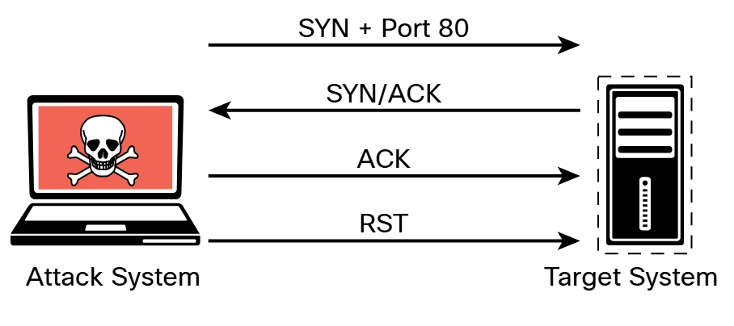

# 3.2.2 - Tipos de Análisis de Nmap
Las siguientes secciones cubren algunas de las opciones de escaneos de Nmap más comunes utilizadas para escenarios específicos, incluidas las siguientes:<br>
- Escaneo de conexión TCP (`-sT`)
- Escaneo de UDP (`-sU`)
- Escaneo FIN de TCP (`-sF`)
- Escaneos de detección de host (`-sn`)
- Opciones de tiempo (`-T 0-5`)<br>
<hr>

### Escaneo de conexión TCP (`-sT`)
Un escaneo de conexión TCP realmente utiliza el mecanismo de red del sistema operativo subyacente para establecer una conexión TCP completa con el dispositivo de destino que se está escaneando. Dado que crea una conexión completa, crea más tráfico (y, por lo tanto, tarda más en ejecutarse). Este es el tipo de escaneo predeterminado que se utiliza si no se especifica ningún tipo de escaneo con el comando `nmap`. Sin embargo, generalmente se debe usar solo cuando un escaneo SYN no es una opción, como cuando un usuario que ejecuta el comando `nmap` no tiene privilegios de paquetes sin procesar en el sistema operativo porque muchos de los tipos de escaneo de Nmap dependen sobre la escritura de paquetes sin procesar.<br>

**_Ilustración de un escaneo de conexión TCP_**<br>

<br>

**_Salida de muestra de escaneo de conexión TCP_**<br>

```bash
    ┌──(root㉿Kali)-[~]
    └─# nmap -sT 192.168.88.251
    Starting Nmap 7.80 ( https://nmap.org ) at 2021-06-21 12:48 EDT
    Nmap scan report for 192.168.88.251
    Host is up (0.00024s latency).
    Not shown: 992 closed ports
    PORT     STATE SERVICE
    22/tcp   open  ssh
    80/tcp   open  http
    139/tcp  open  netbios-ssn
    445/tcp  open  microsoft-ds
    3306/tcp open  mysql
    8888/tcp open  sun-answerbook
    9000/tcp open  cslistener
    9090/tcp open  zeus-admin
    MAC Address: 1E:BD:4F:AA:C6:BA (Unknown)

    Nmap done: 1 IP address (1 host up) scanned in 0.16 seconds 
```

El ejemplo muestra los resultados de un escaneo de conexión TCP. Como puede ver, los resultados indican que varios puertos TCP están escuchando en el dispositivo de destino.<br>
Un escaneo de de conexión TCP completo requiere que el escáner envíe un paquete adicional por escaneo, lo que aumenta la cantidad de ruido en la red y puede activar alarmas que un escaneo medio abierto no activaría. Las herramientas de seguridad y el sistema objetivo subyacente tienen más probabilidades de registrar una conexión TCP completa, y los sistemas de detección de intrusiones (IDS) tienen más probabilidades de activar alarmas en varias conexiones TCP desde el mismo host.<br>
__CONSEJO__: Nmap escanea solo los 1000 puertos más comunes para cada protocolo. Puede especificar puertos adicionales para escanear mediante la opción `-p`. Puede obtener información adicional sobre las especificaciones del puerto y el orden de escaneo en _https://nmap.org/book/man-port-specification.html_. Omar Santos también ha creado una hoja de referencia de Nmap que incluye todas las opciones y está disponible en su repositorio de GitHub en *https://github.com/The-Art-of-Hacking/h4cker/blob/master/cheat_sheets/NMAP_cheat_sheet.md*.<br>
<hr>

### Escaneo UDP (`-sU`)
La mayoría de las veces, buscará puertos TCP, ya que así es como se conecta a la mayoría de los servicios que se ejecutan en los sistemas de destino. Sin embargo, puede encontrar algunos casos en los que deba buscar puertos UDP, por ejemplo, si está intentando enumerar un servidor DNS, SNMP o DHCP. Todos estos servicios utilizan UDP para la comunicación entre el cliente y el servidor. Para escanear puertos UDP, Nmap envía un paquete UDP a todos los puertos especificados en la configuración de la línea de comandos y espera noticias del objetivo. Si recibe un mensaje de puerto ICMP inaccesible de un destino, este puerto se marca como cerrado. Si no recibe respuesta del puerto UDP de destino, Nmap marca el puerto como abierto/filtrado.

### Escaneo TCP FIN (`-sF`)
Hay momentos en los que un filtro de red o cortafuegos puede detectar un escaneo de sincronización. En tal caso, debe emplear un tipo diferente de paquete en un escaneo de puertos. Con el escaneo 