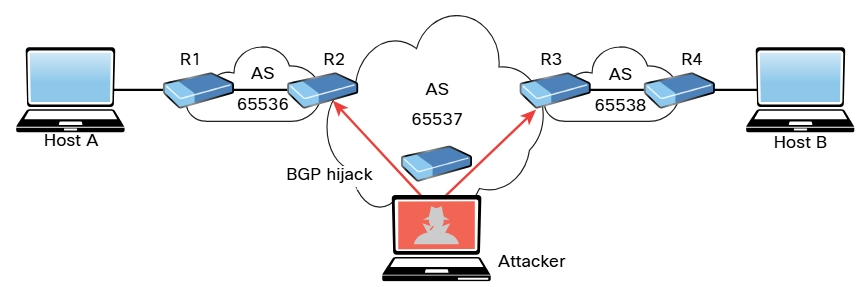

# Ataques de manipulación de rutas
Aunque existen muchos ataques de manipulación de rutas diferentes, uno de los más comunes es el ataque de secuestro BGP. El Border Gateway Protocol (BGP) es un protocolo de enrutamiento dinámico que se utiliza para enrutar el tráfico de Internet. Un atacante puede lanzar un ataque de secuestro de BGP configurando o comprometiendo un enrutador de perímetro para anunciar prefijos que no se han asignado a su organización. Si el anuncio malicioso contiene una ruta más específica que el anuncio legítimo o que presenta una ruta más corta, el tráfico de la víctima podría redirigirse al atacante. En el pasado, los actores de amenazas han aprovechado los prefijos no utilizados para el secuestro de BGP a fin de evitar la atención del usuario u organización legítimos. 
_Ataque de manipulación de rutas_ 

 