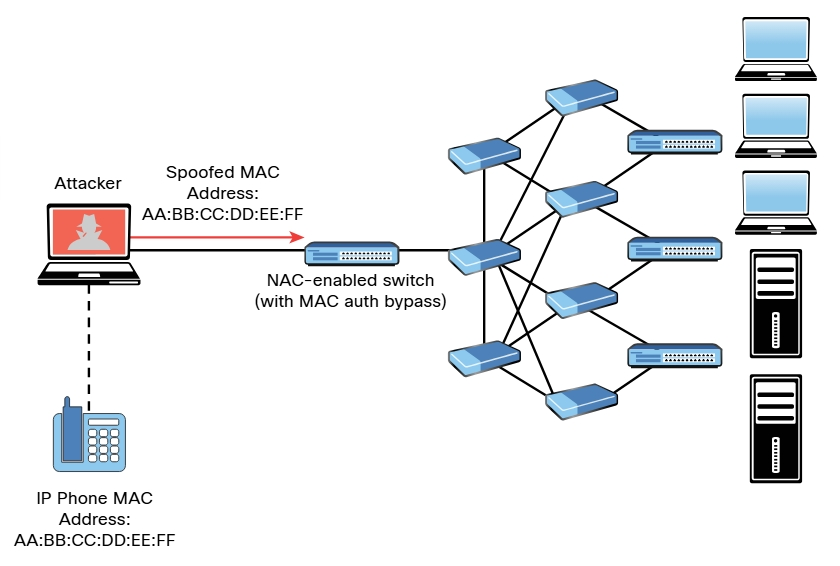

# Omisión del control de acceso a la red (NAC)
NAC es una tecnología diseñada para interrogar a los terminales antes de unirse a una red cableada o inalámbrica. Normalmente se utiliza junto con 802.1X para la gestión y el cumplimiento de identidades. En resumen se puede configurar un conmutador de acceso a la red o un punto de acceso inalámbrico (AP) para autenticar a los usuarios finales y realizar una evaluación de la postura de seguridad del dispositivo terminal para aplicar la política. Por ejemplo, puede verificar si tiene software de seguridad, como __antivirus__, __antimalvare__ y __cortafuegos personales__, antes de permitirle unirse a la red. También puede verificar si tiene una versión específica de un sistema operativo (por ejemplo, Microsoft Windows, Linux o MacOS) y si su sistema ha sido parcheado para vulnerabilidades específicas. 
Además los dispositivos habilitados para NAC (conmutadores, puntos de acceso inalámbricos, etc.) pueden utilizar varias técnicas de detección para detectar el terminal que intenta conectarse a la red. Un dispositivo habilitado para NAC intercepta las solicitudes de DHCP de los terminales. Un agente de escucha de difusión se utiliza para buscar el tráfico de red, como las solicitudes ARP y las solicitudes DHCP generadas por las terminales. 
Varias soluciones de NAC utilizan agentes basados en el cliente para realizar evaluaciones de la postura de seguridad de los terminales para evitar que un terminal se una a la red hasta que se evalúe. Además, algunos conmutadores se pueden configurar para enviar un mensaje de captura de SNMP cuando se registra en una nueva dirección MAC con un determinado puerto de conmutador y para activar el proceso de NAC. 
Las implementaciones de NAC pueden permitir que nodos específicos, como impresoras, teléfonos IP y equipos de videoconferencia, se unan a la red mediante una lista de permitidos (o lista blanca) de direcciones MAC correspondientes a dichos dispositivos. Este proceso se conoce como _omisión de autenticación (auth) MAC_. La omisión de autenticación de MAC es una función de NAC. El administrador de la red puede preconfigurar o cambiar manualmente estos niveles de acceso. Por ejemplo, un dispositivo que accede a una VLAN específica (por ejemplo, VLAN 88) debe ser predefinido manualmente para un puerto específico por un administrador, lo que hace que la implementación de una política de red dinámica en varios puertos mediante la seguridad de puertos sea extremadamente difícil de mantener. 
Un atacante podría falsificar fácilmente una dirección MAC autorizada (en un proceso denominado _suplantación de dirección MAC_) y omitir una configuración de NAC. Por ejemplo, es posible falsificar la dirección MAC de un teléfono IP y utilizarla para conectarse a una red. Esto se debe a que un puerto para el que está habilitada la omisión de autenticación de MAC puede habilitarse o deshabilitarse dinámicamente según la dirección MAC del dispositivo que se conecta a él 
_Abuso de las implementaciones de omisión de autenticación de MAC_ 

