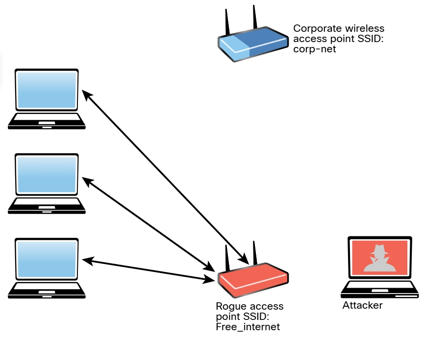

# 5.2.2 - Puntos de Acceso no Autorizados
Uno de los ataques inalámbricos mas simplistas implica que un atacante instale un AP falso en una red para engañar a los usuarios para que se conecten a ese AP. Básicamente, el atacante puede usar ese AP dudoso para crear una puerta trasera y obtener acceso a la red y sus sistemas. 

_Punto de acceso inalámbrico falso_ 
 