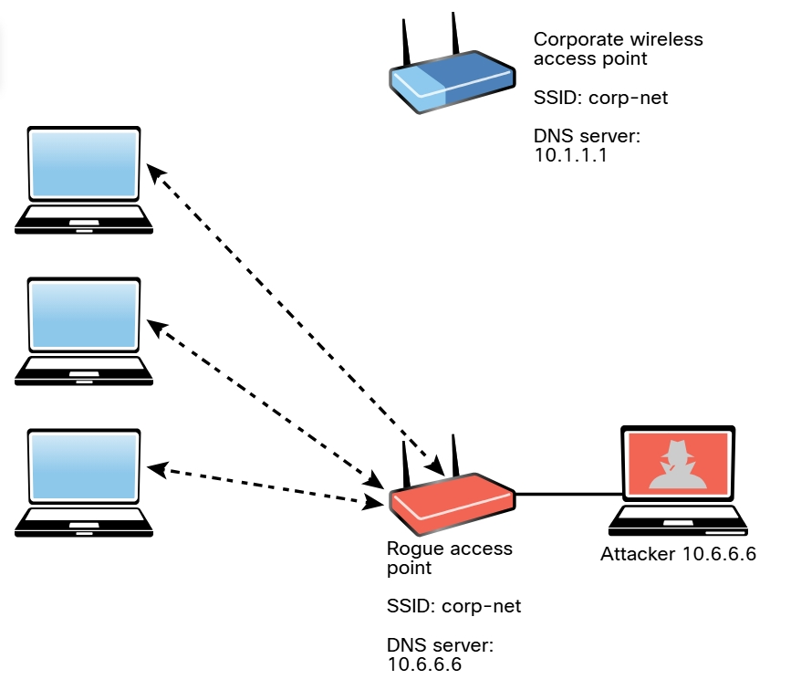

# 5.2.3 - Ataques de Gemelos Malvados
En un ataque de __gemelo malvado__, el atacante crea un punto de acceso dudoso y lo configura exactamente igual que la red corporativa existente. 

_Ataque de gemelos malvados_ 
 

Por lo general, el atacante utiliza la suplantación de DNS para redirigir a la víctima a un portal cuativo clonado o un sitio web. Cuando los usuarios inician sesión en el gemelo malvado, un hacker puede inyectar fácilmente un registro DNS falsificado en la caché del DNS, cambiando el registro DNS de todos los usuarios en la red falsa. Cualquier usuario que inicie sesión en el gemelo malvado será redirigido por el registro DNS falsificado inyectado en la caché. Un atacante que realiza un ataque de envenenamiento de la caché del DNS desea que la caché del DNS acepte un registro falsificado. Algunas formas de defenderse contra la suplantación de DNS son el uso filtrado de paquetes, protocolos criptográficos y funciones de detección de suplantación proporcionadas por las implementaciones inalámbricas modernas. 

__Consejo__: Los portales cautivos son portales web que se utilizan normalmente en redes inalámbricas en lugares públicos, como aeropuertos y cafeterías. Por lo general, se usan para autenticar usuarios o simplemente para mostrar los términos y condiciones que se aplican a los usuarios cuando utilizan la red inalámbrica. El usuario puede simplemente clic en Aceptar para aceptar los términos y condiciones. En algunos casos, se le pide al usuario que vea un anuncio, proporcione una dirección de correo electrónico o realice alguna otra acción requerida. Los atacantes pueden hacerse pasar por portales cautivos para realizar ataques de ingeniería social o robar información confidencial de los usuarios. 