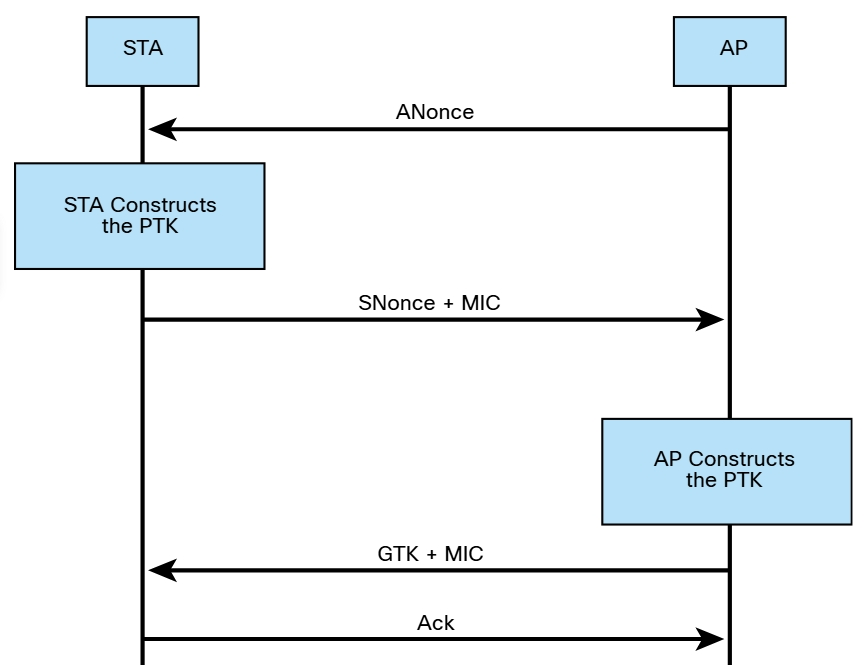
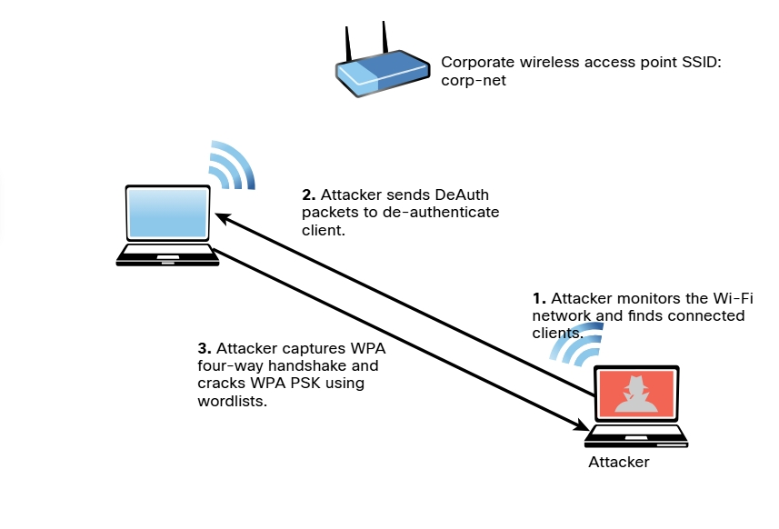
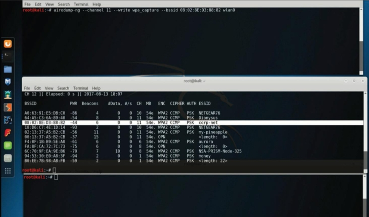
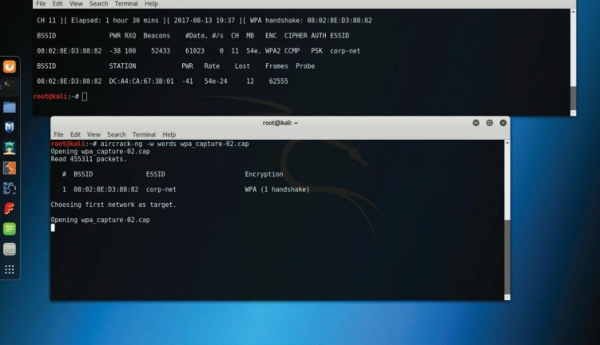
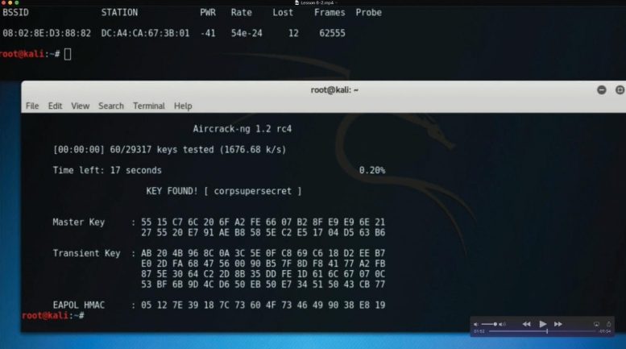

# 5.2.8 - Ataques por vector de inicialización (IV) y protocolos inalámbricos no seguros
Un atacante puede causar alguna modificación en el vector de inicialización (IV) de un paquete inalámbrico que se cifra durante la transmisión. El objetivo del atacante es obtener mucha información sobre el texto sin formato de un solo paquete y generar otra clave de cifrado que luego se puede usar para descifrar otros paquetes con el mismo IV. WEP es susceptible a muchos ataques diferentes, incluidos los ataques IV.<br>
### Ataques contra WEP
Dado que WEP es susceptible a muchos ataques diferentes, se considera un protocolo inalámbrico obsoleto. Se debe evitar WEP y muchos dispositivos de red inalámbrica ya no lo admiten. Las claves WEP existen en dos tamaños: claves de 40 bits (5 bytes) y de 104 bits (13 bytes). Además, WEP utiliza un IV de 24 bits, que se antepone a la clave previamente compartida (PSK). Cuando configura un dispositivo de infraestructura inalámbrica con WEP, los IV se envían en texto sin formato.<br>
WEP ha sido derrotado durante décadas. WEP usa RC4 de una manera que permite a un atacante descifrar la PSK con poco esfuerzo. El problema está relacionado con como WEP utiliza los IV en cada paquete. Cuando WEP usa RC4 para cifrar un paquete, antepone el IV a la clave secreta antes de incluir la clave en RC4. Posteriormente, un atacante tiene los primeros 3 bytes de una clave supuestamente "secreta" utilizada en cada paquete. Para recuperar el PSK, el atacante solo necesita recopilar suficientes datos del aire. Un atacante puede acelerar este tipo de ataque inyectando paquetes ARP (porque la longitud es predecible), lo que permite que el atacante recupere el PSK mucho más rápido. Después de recuperar la clave WEP, el atacante puede usarla para acceder a la red inalámbrica.<br>
Un atacante también puede usar el conjunto de herramientas Aircrack-ng para descifrar (recuperar) la WEP PSK. Para realizar este ataque con el paquete Aircrack-ng, un atacante primero inicia Airmon-ng.<br>

_Uso de Airmon-ng para monitorear una red inalámbrica_<br>
```bash
root@kali# airmon-ng start wlan0 11
```
La interfaz inalámbrica es __wlan0__ y el canal inalámbrico seleccionado es __11__. Ahora, el atacante quiere escuchar todas las comunicaciones dirigidas al BSSID __08:02:8E:D3:88:82__. El siguiente comando escribe todo el tráfico en un archivo de captura denominado **wlan_capture.cap**. El atacante solo tiene que especificar el prefijo para el archivo de captura.<br>

_Uso de **Airodump-ng** para escuchar todo el tráfico al BSSIO **08:02:8E:D3:88:82**_<br>
```bash
root@kali# airodump-ng -c 11 --bssid 08:02:8E:D3:88:82 -w wlan_capture wlan0
```
El atacante puede usar Aireplay-ng para escuchar las solicitudes ARP y luego reproducirlas o inyectarlas en la red inalámbrica.<br>


_Uso de Aireplay-ng para inyectar paquetes ARP_<br>
```bash
root@kali# aireplay-ng -3 -b 08:02:8E:D3:88:82 -h 00:0F:B5:88:AC:82 wlan0
```
El atacante puede usar Aircrack-ng para descifrar WEP PSK.<br>

_Uso de **Aircrack-ng** para descifrar la WEP PSK_
```bash
root@kali# aircrack-ng -b 08:02:8E:D3:88:82 wlan_capture.cap
```
Después de que Aircrack-ng descifre (recupere) la WEP PSK, se muestra el resultado.
```bash
    Aircrack-ng 0.9


                                 [00:02:12] Tested 924346 keys (got
99821 IVs)

 KB  depth byte(vote)
 0   0/ 9 12( 15) A9( 25) 47( 22) F7( 12) FE( 22) 1B( 5) 77( 3)
A5( 5) F6( 3) 02( 20)
 1     0/ 8 22( 11) A8( 27) E0( 24) 06( 18) 3B( 26) 4E( 15) E1( 13)
25( 15) 89( 12) E2( 12)
 2     0/ 2 32( 17) A6( 23) 15( 27) 02( 15) 6B( 25) E0( 15) AB( 13)
05( 14) 17( 11) 22( 10)
 3     1/ 5 46( 13) AA( 20) 9B( 20) 4B( 17) 4A( 26) 2B( 15) 4D( 13)
55( 15) 6A( 15) 7A( 15)


                        KEY FOUND! [ 56:7A:15:9E:A8 ]
      Decrypted correctly: 100%
```
### Ataques contra WPA
WPA y WPA2 son susceptibles a diferentes vulnerabilidades. La verssión 3 de WPA (WPA3) aborda todas las vulnerabilidades a las que son susceptibles WPA y WPA2, y muchos profesionales de redes inalámbricas recomiendan WPA3 a organizaciones e individuos.<br>
Todas las versiones de WPA admiten diferentes métodos de autenticación, incluido PSK. WPA no es suscpetible a los ataques IV que afectan a WEP; sin embargo, es posible capturar el protocolo de enlace de cuatro vías WPA entre un cliente y un dispositivo de infraestructura inalámbrica y luego aplicar la fuerza bruta a la PSK de WPA.<br>

_Protocolo de enlace de cuatro direcciones de WPA_<br>

<br>

_Captura del protocolo de enlace de cuatro direcciones de WPA y descifrado de PSK_<br>

<br>

__Paso 1__: Un atacante monitorea la red Wi-Fi y encuentra cliente inalámbricos conectados al SSID de la red corporativa.<br>
__Paso 2__: El atacante envía paquetes DeAuth para desautenticar al cliente inalámbrico.
__Paso 3__: El atacante captura el protocolo de enlace de cuatro vías WPA y descifta la PSK de WPA. (Es posible usar listas de palabras y herramientas como Aircrack-ng para realizar este ataque).

### Ataque con herramientas Aircrack-ng
__Paso 1.__ El atacante usa Airmon-ng para iniciar la interfaz inalámbrica en modo de monitoreo, mediante el comando __airmong-ng start wlan0__. (Este es el mismo proceso que se muestra para descifrar WEP en la sección anterior). La imagen muestra tres ventanas de terminal. La segunda ventana de la terminal desde la parte superior muestra la salida del comando __airodump-ng wlan0__, que muestra todas las redes inalámbricas adyacentes.<br>
__Paso 2.__ Después de localizar la red corp-net, el atacante usa el comando __airodump-ng__, como se muestra en la primera ventana de terminal, para capturar todo el tráfico en un archivo de captura llamado **wpa_capture**, especificando el canal inalámbrico (__11__, en este ejemplo), el BSSID y la interfaz inalámbrica (__wlan0__).<br>

_Uso de Airodump-ng para ver las redes inalámbricas disponibles y luego capturar el tráfico al BSSID de la víctima_<br>

<br>

__Paso 3.__ El atacante utiliza el comando __aireplay-ng__ para realizar un ataque de desautenticación contra la red inalámbrica. El terminal que se muestra en la parte superior, puede ver que el atacante ha recopilado el protocolo de enlace WPA.<br>

_Uso de Aireplay-ng para desconectar a los clientes inalámbricos_<br>

<br>

__Paso 4.__ El atacante utiliza el comando __aircrack-ng__ para descifrar la PSK de WPA mediante una lista de palabras (El nombre del archivo es __words__ en este ejemplo).<br>

_Recopilación del protocolo de enlace WPA con Airodump-ng_<br>



__Paso 5.__ La herramienta tarda un poco en procesarse, según la potencia de la computadora y la complejidad de la PSK. Después de descifrar el WPA PSK, se muestra en la ventana de terminal.<br>

_WPA PSK descifrado con Aircrack-ng_<br>

<br>

### Ataques de KRACK
Mathy Vanhoef y Frank Piessens, de la Universidad de Lovaina, encontraron y revelaron una serie de vulnerabilidades que afectan a WPA y WPA2. Estas vulnerabilidades también denominadas KRACK (_Ataque de reinstalación de claves_), y los detalles sobre ellas se publican en [KRACK Attacks](https://www.krackattacks.com).<br>
El aprovechamiento de estas vulnerabilidades depende de la configuración específica del dispositivo. Una explotación exitosa podría permitir que atacantes no autenticados reinstalen una clave de cifrado o integridad utilizada anteriormente (ya sea a través del cliente o del punto de acceso, según la vulnerabilidad específica).
Cuando una clave utilizada anteriormente se ha reinstalado correctamente (aprovechando las vulnerabilidades divulgadas), un atacante puede proceder a capturar el tráfico con la clave reinstalada e intentar descifrar dicho tráfico. Además, el atacante puede realizr estas actividades manipulando las retransmisiones de mensajes de protocolo de enlace.<br>
__Nota__: Para obtener detalles sobre los ataques KRACK, consulte _https://blogs.cisco.com/security/wpa-vulns_.<br>
La mayoría de los proveedores de redes inalámbricas han proporcionado parches que abordan las vulnerabilidades de KRACK, y WPA3 también aborda estas vulnerabilidades.<br>

### Vulnerabilidades de WPA3
Ninguna tecnología o protocolo es perfecto. En los últimos años se han descubierto varias vulnerabilidades en WPA3. El protocolo WPA3 introdujo un nuevo protocolo de enlace denominado "__protocolo de enlace libélula__" que utiliza el Protocolo de autenticación extensible (EAP) para la autenticación. Varias vulnerabilidades pueden permitir que un atacante realice diferentes ataques de canal lateral, ataques de degradación y condiciones de DoS. Varias de estas vulnerabilidades fueron encontradas por el investigador de seguridad Mathy Vanhoef. (Para obtener más información sobre estos ataques, consulte _https://wpa3.mathyvanhoef.com_).<br>
FragAttacks (_Ataques de fragmentación y agregación_) es otro tipo de vulnerabilidad que puede permitir que un atacante aproveche WPA3. Para obtener detalles y una demostración, consulte [FragAttacks](https://www.fragattacks.com).<br>

# Ataques de PIN de configuración protegida Wi-Fi (WPS)
La configuración protegida de Wi-Fi (WPS) es un protocolo que simplifica la implementación de redes inalámbricas. Está implementado para que los usuarios simplemente puedan generar un WPA PSK con poca interacción con un dispositivo inalámbrico. Por lo general, para aprovisionar el dispositivo inalámbrico se utiliza un PIN impreso en el exterior del dispositivo inalámbrico o en la caja. A la mayoría de las implementaciones no les importa si intenta correctamente millones de combinaciones de PIN seguidas, lo que significa que estos dispositivos son susceptibles a ataques de fuerza bruta.<br>
Una herramienta llamada __Reaver__ hace que los ataques WPS sean muy simples y fáciles de ejecutar. Puede descargar Reaver desde _https://github.com/t6x/reaver-wps-fork-t6x_.