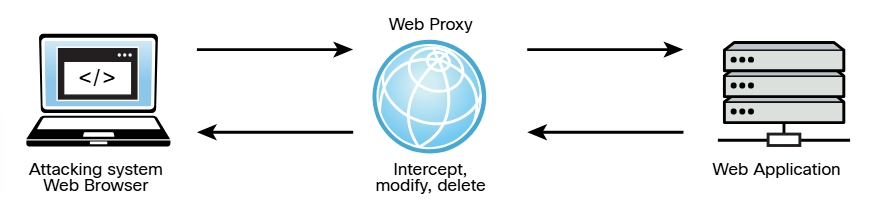
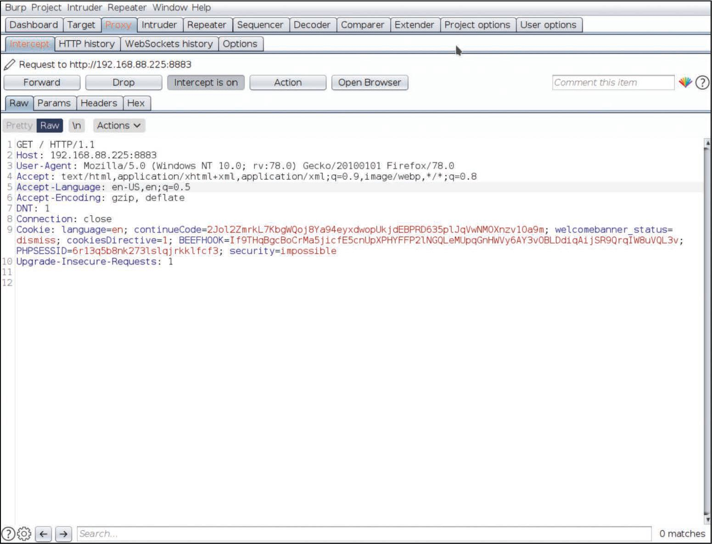
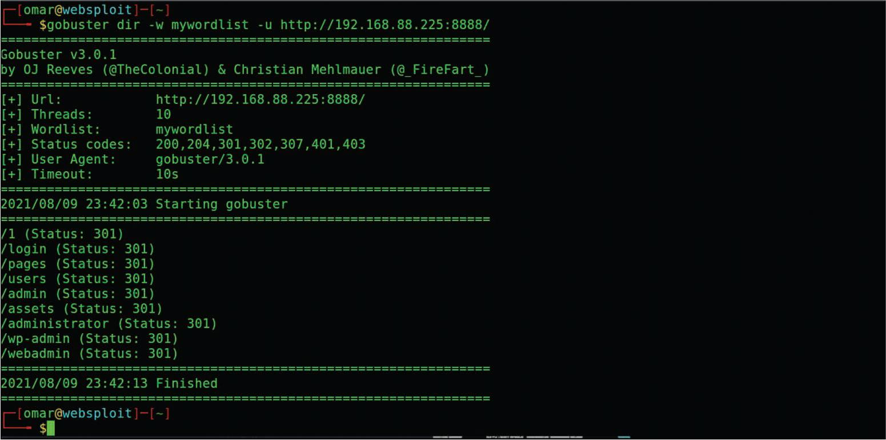

# 6.12.10 - Herramientas Adicionales de Hacking de Aplicaciones Web
Muchos hackers éticos y maliciosos utilizan proxies web para explotar las vulnerabilidades en las aplicaciones web. Un **_proxy web_**, en este contexto, es un software que generalmente se instala en el sistema del atacante para interceptar, modificar o eliminar transacciones entre un navegador web y una aplicación web. 

**_Funcionamiento de un Proxy Web_** 

 

Dos de los proxies web más populares utilizados para hackear aplicaciones web son BurpSuite y ZAP. BurpSuite es un conjunto de herramientas y funcionalidades, una de las cuales es un proxy web. 
BurpSuite también conocido simplemente como Burp, viene en dos versiones diferentes: la gratuita BurpSuite Edición Comunitaria y BurpSuite Edición Profesional que es de pago. En la imagen se muestra el uso de BurpSuite para interceptar transacciones desde el navegador web del atacante y una aplicación web. Puede ver cómo las cookies de sesión y otra información se pueden interceptar y capturar en el proxy. 

 

OWASP ZAP es un conjunto de herramientas que incluye proxy, escaneo automatizado, fuzzing y otras funcionalidades que pueden utilizarse para encontrar vulnerabilidades en aplicaciones web. Puede descargar OWASP ZAP de _https://www.zaproxy.org_. La imagen muestra cómo se utiliza OWASP ZAP para realizar un análisis automatizado de una aplicación web vulnerable. En este ejemplo, OWASP ZAP encontró dos bibliotecas de JavaScript vulnerables que un atacante podría aprovechar para comprometer la aplicación web. 

 

Existen herramientas modernas disponibles para realizar un reconocimiento. Los siguientes son algunos de los más populares: 

- __gobuster__: [Gobuster](https://github.com/OJ/gobuster) es una herramienta similar a DirBuster, está escrita en Go.
- __ffuf__: [ffuf](https://github.com/ffuf/ffuf) es un fuzzer web muy rápido que también está escrito en Go.
- __feroxbuster__: [feroxbuster](https://github.com/epi052/feroxbuster) es un fuzzer de reconocimiento de aplicaciones web escrito en Rust. 

Todas estas herramientas utilizan listas de palabras, es decir, archivos que contienen numerosas palabras que se utilizan para enumerar archivos y directorios y también descifrar contraseñas. La imagen muestra como gobuster puede enumerar diferentes directorios en una aplicación web que se ejecuta en el puerto 8888 en un sistema con la dirección IP 192.168.88.225. El atacante en este caso está usando una lista de palabras llamada "mywordlist". 

**_Uso de gobuster para enumerar directorios en una Aplicación Web_** 

 
