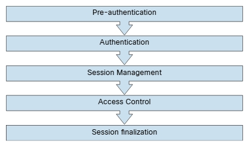

# 6.5.2 - Secuestro de Sesión
Una sesión web es una secuencia de transacciones de solicitud y respuesta HTTP entre un cliente web y un servidor. 

_Proceso de Alto Nivel de una Sesión Web_ 

 

Una gran cantidad de aplicaciones web realizan un seguimiento de la información sobre cada usuario durante las transacciones web. Varias aplicaciones web tienen la capacidad de establecer variables como derechos de acceso y configuraciones de localización. Estas variables se aplican a todas y cada una de las interacciones que tiene un usuario con la aplicación web durante la sesión. Por ejemplo, la imagen muestra que Wireshark se utiliza para recopilar una captura de paquetes de una sesión web en cnn.com. Puede ver los diferentes elementos de una solicitud web (como __GET__) y la respuesta. También puede ver información de localización (en este caso, Raleigh, NC) en una cookie. 

_Captura de paquetes de una Sesión Web_ 

 

Una vez que se ha establecido una sesión autenticada, el ID de la sesión (o token) es temporalmente equivalente al método de autenticación más seguro utilizado por la aplicación, como el nombre de usuario y la contraseña, la contraseña de un solo uso, el certificado digital basado en el cliente, etc. 
Para mantener el estado autenticao y realizar un seguimiento del progreso de los usuarios, las aplicaciones proporcionan a los usuarios una ID de sesión o token. Este token se asigna en el momento de la creación de la sesión y el usuario y la aplicación web lo comparten e intercambian durante la sesión. El ID de sesión es un par nombre/valor. 
Hay varios mecanismos disponibles en HTTP para mantener el estado de la sesión dentro de las aplicaciones web, como usar cookies (en el encabezado HTTP estándar), parámetros y reescritura de URL (definidos en RFC 3986) y argumentos de URL en solicitudes __GET__. Los desarrolladores de aplicaciones también usan argumentos del cuerpo en las solicitudes __POST__. Por ejemplo, pueden utilizar campos de formulario ocultos (formularios HTML) o encabezados HTTP exclusivos. 
Uno de los mecanismos de intercambio de ID de sesión más utilizados son las cookies. Las cookies ofrecen funcionalidades avanzadas que no están disponibles en otros métodos. 

Los nombres de ID de sesión utilizados por los marcos de desarrollo de aplicaciones web más comunes pueden identificarse fácilmmente mediante huella digital. Por ejemplo, es posible identificar la huella digital fácilmente de estos marcos de desarrollo y lenguajes con los siguientes nombres de ID de sesión: 
- __PHP__: PHPSESSID
- __J2EE__: JSESSIONID
- __ColdFusion__: CFID y CFTOKEN
- __ASP.NET__: ASP.NET_SessionId 

__CONSEJO__: Se recomienda cambiar el nombre de ID de sesión predeterminado del marco de desarrollo web a un nombre genérico, como __id__. La ID de la sesión debe ser lo suficientemente larga para evitar ataques de fuerza bruta. A veces, los desarrolladores lo establecen en unos pocos bits, pero el ID de la sesión debe ser de al menos 128 bits (16 bytes). Además, la ID de la sesión debe ser única e impredecible. Es una buena idea utilizar un generador de números pseudoaleatorios criptográficamente seguro (PRNG) porque el valor de ID de sesión debe proporcionar al menos 256 bits de entropía. 

A veces, el ID de la sesión se incluye en la URL. Esta práctica peligrosa puede conducir a la manipulación del ID o ataques de fijación de sesión. 
Los marcos de desarrollo web como ASP.NET, PHP y Ruby on Rails, proporcionan sus propias funciones de administración de sesiones y la implementación asociada. 

__NOTA__: Se recomienda utilizar estos marcos integrados en lugar de crear uno propio desde cero, ya que han sido probados por muchas personas. Desafortunadamente, cuando realiza pruebas de penetración, es probable que encuentre personas que intentan crear sus propios marcos. 

Esto es bastante obvio, pero debe recordar cifrar una sesión web completa con HTTPS, no solo para el proceso de autenticación donde se intercambian las credenciales de usuario, sino también para garantizar que la ID de sesión se intercambie solo a través de un canal cifrado. El uso de un canal de comunicación cifrado también protege la sesión contra algunos ataques de fijación de sesión, en los que el atacante puede interceptar y manipular el tráfico web para inyectar (o fijar) la ID de la sesión en el navegador web de la víctima. 
Hay dos tipos de cookies: cookies no persistentes (o de sesión) y cookies persistentes. Si una cookie tiene un atributo __Max-Age__ o __Expires__, se considera una cookie persistente y el navegador web la almacena en el disco hasta la fecha de vencimiento. 
La configuración de una cookie con el indicador __HTTPOnly__ obliga al navegador web a que esta cookie sea procesada solo por el servidor, y cualquier intento de acceder a la cookie desde código o scripts basados en el cliente está estrictamente prohibido. Esto protege contra varios tipos de ataques, incluido CSRF. 

__CONSEJO__: Las aplicaciones modernas suelen realizar un seguimiento de los usuarios después de la autenticación mediante cookies no persistentes. Esto fuerza la eliminación de la información de la sesión del cliente si se cierra la instancia del navegador web actual. Es importante utilizar cookies no persistentes para que el ID de la sesión no permanezca en la caché del cliente web durante largos periodos de tiempo. Además, esta es la razón por la que es importante validar y verificar los ID de sesión. 

Hay varias formas en que un atacante puede realizar el secuestro de la sesión y varias formas en que un token de sesión puede verse comprometido: 
- __Predicción de tokens de sesión__: Por eso es importante utilizar tokens no predecibles.
- __Detección de sesiones__: Esto puede ocurrir al recopilar paquetes de sesiones web sin cifrar.
- __Ataques en ruta (MITM)__: Con este tipo de ataque, el atacante se encuentra en la ruta entre el cliente y el servidor web. Además, un navegador (o una extensión o complemento) puede verse comprometido y utilizarse para interceptar y manipular sesiones web entre el usuario y el servidor web. Este ataque basado en el navegador se conocía anteriormente como _man-in-the-browser_. 

Si las aplicaciones web no validan y filtran los valores de ID de sesión no válidos, pueden utilizarse para explotar otras vulnerabilidades web, como la inyección SQL (si los ID se almacenan en una base de datos relacional) o XSS persistente (si los ID de sesión son almacenados y reflejados posteriormente por la aplicación web). 

