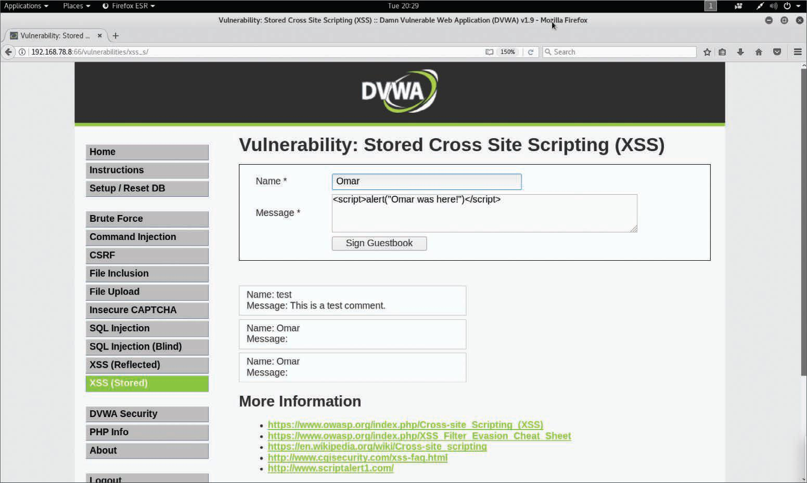

# 6.7.3 - Ataques XSS Almacenados
Los ataques XSS almacenados o persistentes se producen cuando un código malicioso o un script se almacenan permanentemente en un servidor vulnerable o malicioso mediante una base de datos. Estos ataques generalmente se llevan a cabo en sitios web que alojan publicaciones en blogs, foros web y otros métodos de almacenamiento permanente. Un ejemplo de un ataque XSS almacenado es un usuario que solicita la información almacenada del servidor vulnerable o malicioso, lo que provoca la inyección del script malicioso solicitado en el navegador de la víctima. En este tipo de ataque, el servidor vulnerable suele ser un sitio conocido o de confianza. 

_Ataque XSS Almacenado en un Formulario Web_ 

 

Despues de que el usuario hagta clic en _Sign Guestbook_, aparecerá el cuadro de diálogo que se muestra en la imagen. El ataque persiste porque incluso si el usuario navega fuera de la página y regresa a esa misma página, el cuadro de diálogo sigue apareciendo. 

_Ataque XSS Persistente_ 

En este ejemplo, el mensaje del cuadro de diálogo es "Omar was here!" Sin embargo, en un ataque real, un atacante puede presentar a los usuarios un texto que los convenza de realizar una acción específica, como "su contraseña ha vencido" o "vuelva a iniciar sesión". El objetivo del atacante sería redirigir al usuario a otro sitio para robar sus credenciales cuando el usuario intenta cambiar la contraseña o iniciar sesión una vez más en la aplicación falsa. 

El Modelo de Objeto de Documento (DOM) es una interfaz de programación de aplicaciones multiplataforma e independiente del lenguaje que trata un documento HTML, XHTML o XML como una estructura en forma de árbol. Los ataques basados en DOM suelen ser ataques XSS reflejados que se activan mediante el envío de un enlace con entradas que se reflejan en el navegador web. En los ataques XSS basados en DOM la carga útil nunca se envía al servidor. En cambio, la carga útil solo la procesa el cliente web (navegador). 

En un ataque XSS basado en DOM, el atacante envía una URL maliciosa a la víctima, y, después de que la víctima haga clic en el enlace, el atacante puede cargar un sitio web malicioso o un sitio que tenga un controlador de ruta DOM vulnerable. Una vez que el navegador representa el sitio vulnerable, la carga útil ejecuta el ataque en el contexto del usuario en este sitio. 

Uno de los efectos de cualquier tipo de ataque XSS es que la víctima generalmente no se da cuenta de que se ha producido un ataque. 