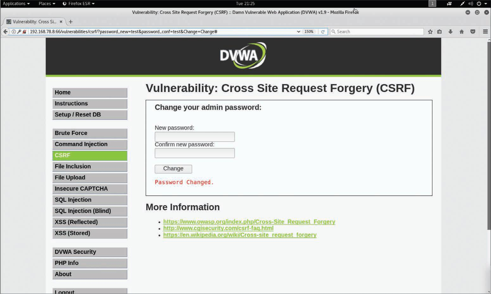

# 6.8.1 - Descripción General
La falsificación de solicitud entre sitios (CSRF) es una forma en que los atacantes pueden aprovechar la confianza otorgada a un usuario que inició sesión en un sitio para ejecutar código malicioso. Suena complicado, pero desafortunadamente, este tipo de ataque puede usarse contra usuarios de sitios web financieros, por ejemplo, para transferir dinero a la cuenta de un hacker sin el conocimiento del usuario. También se puede utilizar para realizar compras no autorizadas en sitios de comercio electrónico. Debido a la posibilidad de pérdida de dinero, es esencial probar esta vulnerabilidad. Muchos escáneres de vulnerabilidad y código tienen pruebas automatizadas que son efectivas.<br>
Las vulnerabilidades de CSRF pueden ser difíciles de mitigar. Algunas estrategias de protección contra ataques de CSRF se han compartido en toda la web; sin embargo muchas de ellas no funcionan bien. Es posible que los desarrolladores, sin saberlo, hayan utilizado estas técnicas de mitigación ineficaces en sus aplicaciones y piensen que han mitigado la vulnerabilidad cuando en realidad no lo han hecho. Por lo general, utilizamos un análisis automatizado para probarlo y luego investigarlo manualmente si recibimos alertas de que existe la vulnerabilidad.<br>

**_Los ataques de falsificación de solicitudes entre sitios (CSRF/XSRF)_** se producen cuando se transmiten comandos no autorizados de un usuario en el que confía una aplicación. Los ataques CSRF son diferentes de los ataques XSS porque explotan la confianza que una aplicación tiene en el navegador del usuario.<br>

__NOTA__: Las vulnerabilidades de CSRF también se denominan **_One-click Attacks_** o **_Session Riding_**<br>

Los ataques CSRF suelen afectar a las aplicaciones (o sitios web) que dependen de la identidad del usuario. Los atacantes pueden engañar al navegador del usuario para que envíe solicitudes HTTP a un sitio web objetivo. Un ejemplo de ataque CSRF es un usuario autenticado por la aplicación a través de una cookie guardada en el navegador que envía sin saberlo una solicitud HTTP a un sitio que confía en el usuario, lo que posteriormente activa una acción no deseada.<br>

**_Ejemplo de Ataque CSRF mediante DVWA_**<br>

<br>

En la imagen, el formulario web le pide al usuario que cambie la contraseña. La URL contiene los parámetros `password_new=test&password_conf=test&Change=Change#`. La contraseña no solo se muestra en la URL después de que el usuario la haya ingresado en el formulario web, sino que, dado que la aplicación lo permite, un atacante puede enviar fácilmente un enlace diseñado a cualquier usuario para cambiar su contraseña, como se muestra aquí:<br>

```
    http://192.168.78.8:66/vulnerabilities/csrf/?password_new=newpasswd&password_conf=newpasswd &Change=Change#
```

Si el usuario sigue este enlace, su contraseña se cambiará a __newpasswd__.<br>

__NOTA__: Las mitigaciones y defensas de CSRF se implementan en el lado del servidor. El documento que se encuentra en _https://seclab.stanford.edu/websec/csrf/csrf.pdf_ describe varias técnicas para prevenir o mitigar las vulnerabilidades de CSRF.<br>
