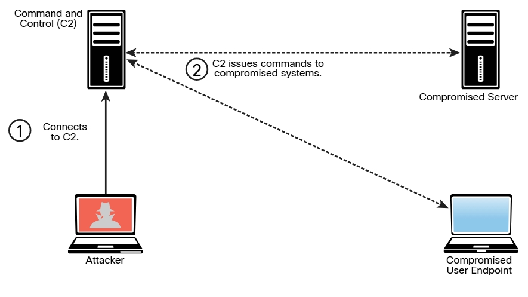

# 8.1.3 - Utilidades de Comando y Control (C2)
Los atacantes suelen usar sistemas de comando y control (a menudo denominados C2 o CnC) para enviar comandos e instrucciones a los sistemas comprometidos. El C2 puede ser el sistema del atacante (por ejemplo, una computadora de escritorio, una computadora portátil) o un servidor virtual o físico dedicado. Un C2 crea un canal encubierto con el sistema comprometido. Un **_canal encubierto_** es una técnica adversarial que permite al atacante transferir objetos de información entre procesos o sistemas que, según una política de seguridad, no deberían poder comunicarse. 
Los atacantes suelen usar máquinas virtuales en un servicio en la nube o incluso utilizan otros sistemas comprometidos como servidores C2. Incluso se han utilizado servicios como Twitter, Dropbox y Photobucker para las tareas de C2. La comunicación C2 puede ser tan simple como mantener una baliza programada, o "latido", para lanzar ataques adicionales o para la exfiltración de datos. La imagen muestra cómo un atacante utiliza C2 para enviar instrucciones a dos sistemas comprometidos. 

 

Se pueden utilizar muchas técnicas y utilidades diferentes para crear un C2. Estos son algunos ejemplos: 

+ __[socat](http://www.dest-unreach.org/socat)__ es una utilidad de C2 que se puede utilizar para crear varios shells inversos.
+ __[wsc2](https://github.com/Arno0x/WSC2)__ es una utilidad de C2 basada en Python que usa WebSockets.
+ __[WMImplant](https://github.com/ChrisTruncer/WMImplant)__ es una herramienta basada en PowerShell que aprovecha WMI para crear un canal C2.
+ __[DropboxC2 (DBC2)](https://github.com/Arno0x/DBC2)__ es una utilidad C2 que usa Dropbox.
+ __[TrevorC2](https://github.com/trustedsec/trevorc2)__ es una utilidad de C2 basada en Python creada por Dave Kennedy de TrustedSec.
+ __[Twittor](https://github.com/PaulSec/twittor)__ es una utilidad de C2 que usa mensajes directos de Twitter para comando y control.
+ __[DNSCat2](https://github.com/iagox86/dnscat2)__ es una utilidad C2 basada en DNS que admite el cifrado y que ha sido utilizada por malware, agentes de amenazas y evaluadores de accesos directos. 

