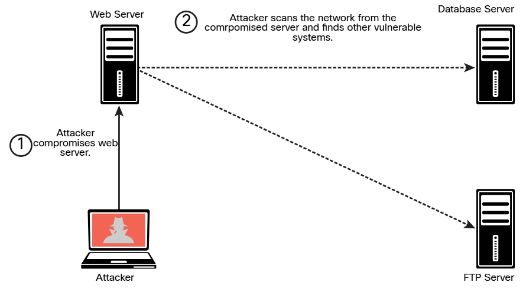

# 8.2.2 - Análisis Posterior a la Explotación
El movimiento lateral implica escanear una red en busca de otros sistemas, aprovechar las vulnerabilidades en otros sistemas, comprometer las credenciales y recopilar información confidencial para la exfiltración. El movimiento lateral es posible si una organización no segmenta su red correctamente. La _segmentación de la red_ es, por lo tanto, muy importante.<br>
__NOTA__: Probar la eficacia de su estrategia de segmentación de red es muy importante. Su organización puede haber implementado cortafuegos virtuales o físicos, redes de área local virtual (VLAN) o políticas de control de acceso para la segmentación, o puede usar la microsegmentación en entornos virtualizados y en contenedores. Debe realizar pruebas de segmentación de la red con frecuencia para verificar que su estrategia de segmentación sea adecuada para proteger su red contra el movimiento lateral y otros ataques posteriores a la explotación.<br>

Después de poner en riesgo un sistema, puede utilizar escaneos de puertos básicos para identificar sistemas o servicios de interés que pueda atacar aún más en un intento de comprometer información valiosa.<br>
Puede utilizar algunas herramientas de reconocimiento activo (como Nmap) para realizar el análisis después de la explotación, y es posible que también desee crear las suyas propias. Alternativamente, hay muchas herramientas, como Metasploit, que tienen capacidades de análisis integradas para su posterior explotación (a través de Meterpreter).<br>
__CONSEJO__: Un atacante debe evitar generar alarmas en esta etapa. Si los defensores de seguridad detectan que hay una amenaza en la red, la analizarán a fondo y frustrarán cualquier progreso que haya realizado. En algunos casos de pruebas de penetración, puede comenzar de manera muy sigilosa y aumentar gradualmente la cantidad de tráfico y las herramientas automatizadas utilizadas para probar la eficacia de los defensores de seguridad (incluido el centro de operaciones de seguridad [SOC]).<br>

#### _Búsqueda de otros sistemas después de un ataque al sistema_

<br>

Puede buscar recursos compartidos de SMB a los que pueda iniciar sesión con credenciales comprometidas o a las que el usuario conectado del sistema comprometido pueda tener acceso. Puede mover archivos hacia o desde otros sistemas. Alternativamente, puede crear una instancia de un recurso compartido de SMB (a través de Samba o mecanismos similares) y copiar archivos de un sistema comprometido.<br>
Puede utilizar protocolos de acceso remoto, incluidos los siguientes, para comunicarse con un sistema comprometido:<br>

+ Protocolo de escritorio remoto (RDP) de Microsoft
+ Escritorio remoto de Apple
+ VNC
+ Reenvío del servidor X

El siguiente ejemplo muestra el uso de Metasploit para crear una conexión RDP. Este módulo de Metasploit habilita RDP y proporciona opciones para crear una cuenta y configurarla para ser miembro del grupo de administradores locales y usuarios de escritorio remoto. Este módulo también se puede usar para reenviar el puerto TCP 3389 del destino.<br>

```bash
    msf > use post/windows/manage/enable_rdp
    msf post(windows/manage/enable_rdp) > show options
    Module options (post/windows/manage/enable_rdp):
       Name    Current Setting Required Description
       ----    --------------- -------- -----------
       ENABLE  true              no       Enable the RDP Service and
                                        Firewall Exception.
       FORWARD false            no       Forward remote port 3389 to local
                                        Port.
       LPORT    3389             no       Local port to forward remote
                                        connection.
       PASSWORD                  no       Password for the user created.
       SESSION                   yes      The session to run this module
                                        on.
       USERNAME                   no       The username of the user to
                                        create.
    meterpreter > run
```
La principal ventaja del escritorio remoto sobre otras herramientas, como Sysinternals, es que le brinda una interfaz gráfica de usuario /(GUI) completa e interactiva de la computadora remota comprometida. Desde la conexión remota, es posible robar datos o recopilar capturas de pantalla, deshabilitar el software de seguridad o instalar malware. Las conexiones de escritorio remoto están completamente cifradas y los sistemas de monitoreo no pueden ver lo que está haciendo en el sistema remoto. La principal desventaja del escritorio remoto es que un usuario que trabaja en el sistema remoto comprometido puede detectar que ha iniciado sesión en el sistema. Una práctica común es utilizar el escritorio remoto cuando no hay usuarios en el sistema comprometido o cuando se compromete un servidor.<br>
