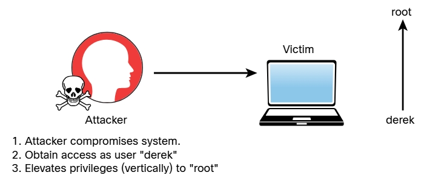
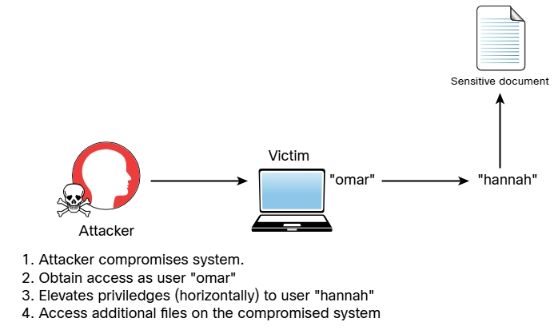

# 8.2.4 - Escalamiento de Privilegios Posterior a la Explotación
En el Módulo 7 - Seguridad en la nube, dispositivos móviles e IoT, aprendió que el escalamiento de privilegios es el acto de obtener acceso a recursos que normalmente estarían protegiodos de una aplicación o un usuario. Esto da como resultado que un usuario obtenga privilegios adicionales más allá de los originalmente previstos por el desarrollador de la aplicación. También aprendió que hay dos tipos generales de escalamiento de privilegios. 

### Escalamiento de privilegios vertical
Con el escalamiento de privilegios vertical, un usuario con menos privilegios accede a funciones reservadas para usuarios con más privilegios (como el acceso de administrador o acceso root). 

 

### Escalamiento de privilegios horizontal
Con el escalamiento de privilegios horizontal, un usuario normal accede a funciones o contenido reservado para otros usuarios que no son root o administradores. Por ejemplo, supongamos que después de explotar un sistema, puede tener acceso al shell como usuario omar. Sin embargo, ese usuario no tiene permisos para leer algunos archivos del sistema. Luego descubre que otro usuario, Hannah, tiene acceso a esos archivos. Luego, encuentra una forma de aumentar sus privilegios como el usuario Hannah para acceder a esos archivos. 

 

