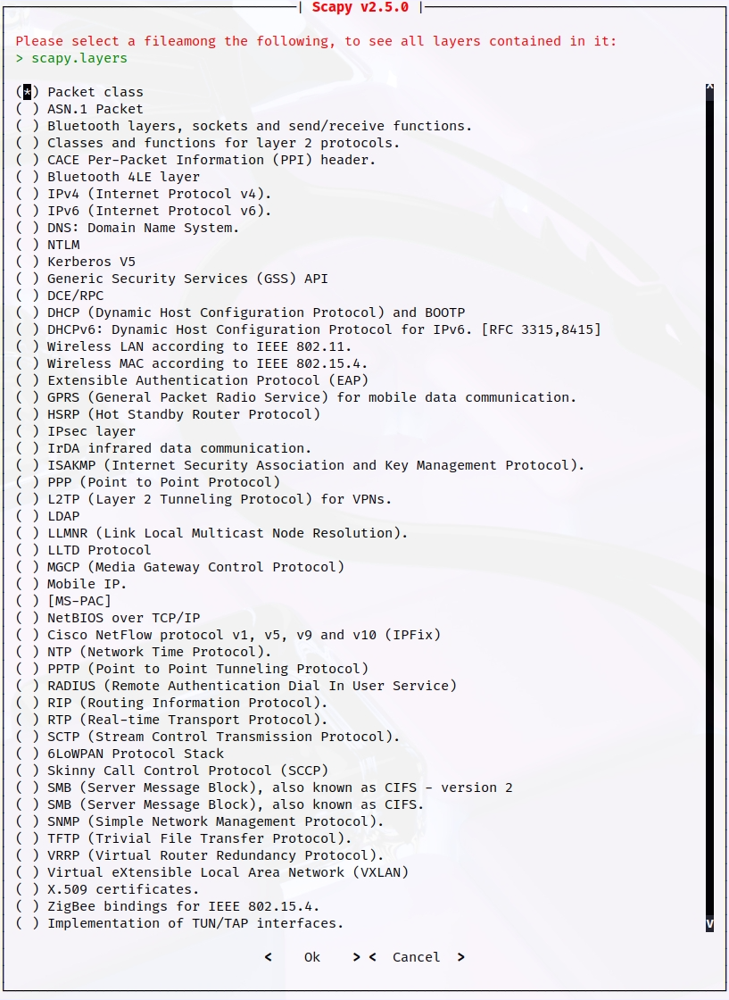

# Scapy

## Exploración de la enumeración a través de la elaboración de paquetes
Cuando se trata de la enumeración a través de la elaboración y la generación de paquetes, Scapy es una de las herramientas y marcos favoritos de los evaluador de penetraciones. Scapy es un ecosistema o marco muy completo basado en Python para la generación de paquetes. En esta sección, se analizan algunas de las formas simples en que puede utilizar esta herramienta para realizar un reconocimiento básico de la red.

**Nota**: Scapy debe ejecutarse con permisos de root para poder modificar paquetes

Iniciar el shell interactivo de Scapy con *sudo scapy* desde una ventana de terminal.
```bash
┌──(kali㉿Kali)-[~]
└─$ sudo scapy
[sudo] password for kali: 
INFO: Can't import PyX. Won't be able to use psdump() or pdfdump().
      .SYPACCCSASYY  
P /SCS/CCS        ACS | Welcome to Scapy
       /A          AC | Version 2.5.0
     A/PS       /SPPS |
        YP        (SC | https://github.com/secdev/scapy
       SPS/A.      SC |
   Y/PACC          PP | Have fun!
    PY*AYC        CAA
         YYCY//SCYP   using IPython 8.14.0
>>> 

```
__Creación de un paquete ICMP simple con Scapy__
Ahora, se crea un paquete ICMP simple con *malicious_payload* como carga útil que se envía al host de destino *192.168.88.251*
``` Python
>>> send(IP(dst="192.168.88.251")/ICMP()/"malicious_payload")
.
Sent 1 packets.
```
__Recopilación de un paquete creado con *tshark*__
Aquí se muestra el paquete ICMP recibido por el sistema de destino. La herramienta de captura de paquetes *tshark* se utiliza para capturar el paquete ICMP diseñado
<!-- sudo tshark host 192.168.78.142 -->
``` bash
┌──(kali㉿Kali)-[~]
└─$ sudo tshark host 192.168.78.142
Running as user "root" and group "root". This could be dangerous.
Capturing on 'eth0'
 ** (tshark:12273) 04:06:26.891304 [Main MESSAGE] -- Capture started.
 ** (tshark:12273) 04:06:26.891452 [Main MESSAGE] -- File: "/tmp/wireshark_eth05LEUF3.pcapng"
```
Scapy admite una gran cantidad de protocolos. Puede usar la función *ls()* para enumerar todos los formatos y protocolos disponibles.
<!-- ls() -->
```Python
>>> ls()
AD_AND_OR  : None
AD_KDCIssued : None
AH         : AH
AKMSuite   : AKM suite
ARP        : ARP
ASN1P_INTEGER : None
ASN1P_OID  : None
ASN1P_PRIVSEQ : None
ASN1_Packet : None
ASN1_Packet : None
ATT_Error_Response : Error Response
ATT_Exchange_MTU_Request : Exchange MTU Request
ATT_Exchange_MTU_Response : Exchange MTU Response
ATT_Execute_Write_Request : Execute Write Request
ATT_Execute_Write_Response : Execute Write Response
ATT_Find_By_Type_Value_Request : Find By Type Value Request
ATT_Find_By_Type_Value_Response : Find By Type Value Response
ATT_Find_Information_Request : Find Information Request
ATT_Find_Information_Response : Find Information Response
ATT_Handle : ATT Short Handle
<salida acortada solo para demostrar el ejemplo>
```
Puede usar la función *ls()* para mostrar todas las opciones y campos de un protocolo o formato de paquete específico soportado por Scapy. <br>
*Listado de los campos de la capa 4 de TCP en Scapy*
<!-- ls(TCP) -->
```Python
>>> ls(TCP)
sport      : ShortEnumField                      = ('20')
dport      : ShortEnumField                      = ('80')
seq        : IntField                            = ('0')
ack        : IntField                            = ('0')
dataofs    : BitField  (4 bits)                  = ('None')
reserved   : BitField  (3 bits)                  = ('0')
flags      : FlagsField                          = ('<Flag 2 (S)>')
window     : ShortField                          = ('8192')
chksum     : XShortField                         = ('None')
urgptr     : ShortField                          = ('0')
options    : TCPOptionsField                     = ("b''")
>>>
```
*Lista de los campos de paquetes DNS disponibles en Scapy*
<!-- ls(DNS) -->
```Python
>>> ls(DNS)
length     : ShortField (Cond)                   = ('None')
id         : ShortField                          = ('0')
qr         : BitField  (1 bit)                   = ('0')
opcode     : BitEnumField                        = ('0')
aa         : BitField  (1 bit)                   = ('0')
tc         : BitField  (1 bit)                   = ('0')
rd         : BitField  (1 bit)                   = ('1')
ra         : BitField  (1 bit)                   = ('0')
z          : BitField  (1 bit)                   = ('0')
ad         : BitField  (1 bit)                   = ('0')
cd         : BitField  (1 bit)                   = ('0')
rcode      : BitEnumField                        = ('0')
qdcount    : DNSRRCountField                     = ('None')
ancount    : DNSRRCountField                     = ('None')
nscount    : DNSRRCountField                     = ('None')
arcount    : DNSRRCountField                     = ('None')
qd         : DNSQRField                          = ('\x1b[0m<\x1b[0m\x1b[31m\x1b[1mDNSQR\x1b[0m  \x1b[0m|\x1b[0m\x1b[0m>\x1b[0m')
an         : DNSRRField                          = ('None')
ns         : DNSRRField                          = ('None')
ar         : DNSRRField                          = ('None')
>>>
```
Puede utilizar la función *explore()* para desplazarse por las capas y los protocolos de Scapy <br>
*Uso de la función __explore()__ en Scapy*
<!-- >scapy.layers -->
<br>

Puedes utilizar la función *explore()* con cualquier formato de paquete o protocolo. <br>
*Uso de la función __explore("dns")__ para mostrar los tipos de paquetes en __scapy.layers.dns__*
```Python
>>> explore("dns")
Packets contained in scapy.layers.dns: 
-------------------------|------------------------------
DNS                      |DNS                           
DNSQR                    |DNS Question Record           
DNSRR                    |DNS Resource Record           
DNSRRDLV                 |DNS DLV Resource Record       
DNSRRDNSKEY              |DNS DNSKEY Resource Record    
DNSRRDS                  |DNS DS Resource Record        
DNSRRMX                  |DNS MX Resource Record        
DNSRRNSEC                |DNS NSEC Resource Record      
DNSRRNSEC3               |DNS NSEC3 Resource Record     
DNSRRNSEC3PARAM          |DNS NSEC3PARAM Resource Record
DNSRROPT                 |DNS OPT Resource Record       
DNSRRRSIG                |DNS RRSIG Resource Record     
DNSRRSOA                 |DNS SOA Resource Record       
DNSRRSRV                 |DNS SRV Resource Record       
DNSRRTSIG                |DNS TSIG Resource Record      
EDNS0ClientSubnet        |DNS EDNS0 Client Subnet       
EDNS0TLV                 |DNS EDNS0 TLV                 
InheritOriginDNSStrPacket|                              
>>>
```
Puede utilizar Scapy como escáner de muchas maneras diferentes. <br>
*Envío de un paquete TCP SYN con Scapy*
```Python
>>> ans, unans = sr(IP(dst='192.168.88.251')/TCP(dport=445,flags='S'))
Begin emission:
Finished sending 1 packets.
.*
Received 2 packets, got 1 answers, remaining 0 packets
>>>
```
*Captura de paquetes de TCP en el host de destino*
<!-- sudo tshark host 192.168.78.142 -->
```bash
┌──(kali㉿Kali)-[~]
└─$ sudo tshark host 192.168.78.142
[sudo] password for kali: 
Running as user "root" and group "root". This could be dangerous.
Capturing on 'eth0'
 ** (tshark:25699) 04:25:55.585525 [Main MESSAGE] -- Capture started.
 ** (tshark:25699) 04:25:55.585989 [Main MESSAGE] -- File: "/tmp/wireshark_eth0EL6YF3.pcapng"
```


