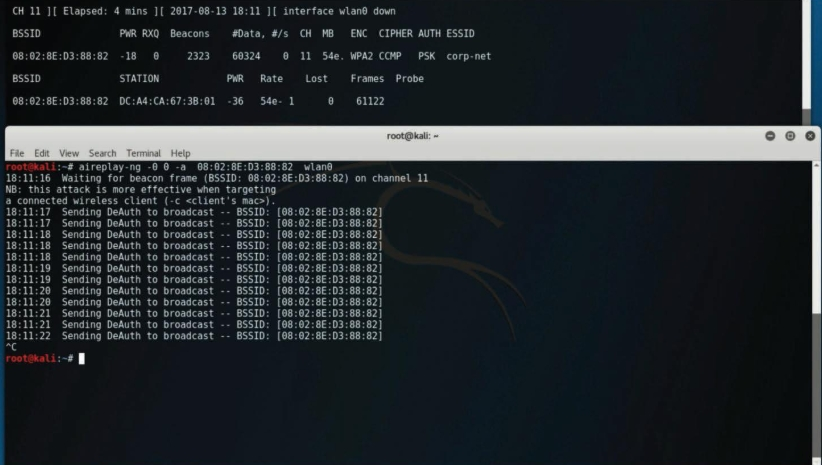

# Puntos de acceso no autorizados
Uno de los ataques inalámbricos mas simplistas implica que un atacante instale un AP falso en una red para engañar a los usuarios para que se conecten a ese AP. Básicamente, el atacante puede usar ese AP dudoso para crear una puerta trasera y obtener acceso a la red y sus sistemas.<br>

_Punto de acceso inalámbrico falso_<br>

<br>

# Ataques de gemelos malvados
En un ataque de __gemelo malvado__, el atacante crea un punto de acceso dudoso y lo configura exactamente igual que la red corporativa existente.<br>

_Ataque de gemelos malvados_<br>

<br>

Por lo general, el atacante utiliza la suplantación de DNS para redirigir a la víctima a un portal cuativo clonado o un sitio web. Cuando los usuarios inician sesión en el gemelo malvado, un hacker puede inyectar fácilmente un registro DNS falsificado en la caché del DNS, cambiando el registro DNS de todos los usuarios en la red falsa. Cualquier usuario que inicie sesión en el gemelo malvado será redirigido por el registro DNS falsificado inyectado en la caché. Un atacante que realiza un ataque de envenenamiento de la caché del DNS desea que la caché del DNS acepte un registro falsificado. Algunas formas de defenderse contra la suplantación de DNS son el uso filtrado de paquetes, protocolos criptográficos y funciones de detección de suplantación proporcionadas por las implementaciones inalámbricas modernas.<br>

__Consejo__: Los portales cautivos son portales web que se utilizan normalmente en redes inalámbricas en lugares públicos, como aeropuertos y cafeterías. Por lo general, se usan para autenticar usuarios o simplemente para mostrar los términos y condiciones que se aplican a los usuarios cuando utilizan la red inalámbrica. El usuario puede simplemente clic en Aceptar para aceptar los términos y condiciones. En algunos casos, se le pide al usuario que vea un anuncio, proporcione una dirección de correo electrónico o realice alguna otra acción requerida. Los atacantes pueden hacerse pasar por portales cautivos para realizar ataques de ingeniería social o robar información confidencial de los usuarios.<br>

# Ataques de disociación (o desautenticación)
Un atacante puede hacer que clientes inalámbricos legítimos se desautentiquen de puntos de acceso inalámbricos legítimos o enrutadores inalámbricos para realizar una condición de denegación de servicio (DoS) o para hacer que esos clientes se conecten a un gemelo malvado. Este tipo de ataque también se conoce como __ataque de disociación__ porque el atacante disocia (intenta desconectar) al usuario del AP inalámbrico de autenticación y luego realizar otro ataque para obtener las credenciales válidas del usuario.<br>
Un identificador de conjunto de servicios (SSID) es el nombre o identificador asociado con una red de área local inalámbrica (WLAN) 802.11. Los nombres de SSID se incluyen en texto sin formato en muchos paquetes inalámbricos y balizas. Un cliente inalámbrico necesita conocer el SSID para asociarse con un AP inalámbrico. Es posible configurar herramientas pasivas inalámbricas como Kismet o KisMAC para escuchar y capturar SSID y cualquier otro tráfico de red inalámbrica. Además, herramientas como _Airmon-ng_ pueden realizar este reconocimiento. El sistema de este ejemplo tiene cinco adaptadores de red inalámbrica diferentes y el adaptador wlan1 se utiliza para el monitoreo.<br>

_Inicio de Airmon-ng_<br>
```bash
|---[root@websploit]--[~]
|--- #airmon-ng start wlan1
PHY      Interface    Driver            Chipset
phy0     wlan0        mac80211_hwsim   Software simulator of 802.11
                                            radio(s) for mac80211
phy1     wlan1        mac80211_hwsim   Software simulator of 802.11
                                            radio(s) for mac80211
                  (mac80211 monitor mode vif enabled for [phy1]wlan1
on [phy1]wlan1mon)
                  (mac80211 station mode vif disabled for [phy1]wlan1)
phy2     wlan2        mac80211_hwsim   Software simulator of 802.11
                                            radio(s) for mac80211
phy3     wlan3        mac80211_hwsim   Software simulator of 802.11
                                            radio(s) for mac80211
phy4     wlan4        mac80211_hwsim   Software simulator of 802.11
                                            radio(s) for mac80211 
```
La salida del comando __airmon-ng__ muestra que la interfaz wlan1 está presente y se usa para monitorear la red. El comando __ip -s -h -c link show wlan1__ se puede utilizar para verificar el estado y la configuración de la interfaz inalámbrica. Cuando pones una interfaz de red inalámbrica en modo de monitoreo, Airmon-ng verifica automáticamente si hay procesos que interfieran. Para detener cualquier proceso que interfiera, puede utilizar el comando __airmon-ng check kill__.<br>
La herramienta _Airodump-ng_ se puede utilizar para detectar y analizar el tráfico de red inalámbrica.<br>

_Uso de la herramienta Airodump-ng_<br>
```bash
|--[root@websploit]--[~]
|--- #airodump-ng wlan1mon
[CH  11 ][ Elapsed: 42 s ][ 2021-06-25 12:57
BSSID         PWR  Beacons     #Data, #/s  CH   MB   ENC CIPHER  AUTH ESSID
06:FD:57:76:39:AE  -28  30           0    0  11   54   WPA  TKIP   PSK
FREE-INTERNET
BSSID              STATION                 PWR   Rate      Lost    Frames
Notes  Probes
(not associated)   02:00:00:00:02:00  -29    0 - 1      19         3
FREE-INTERNET
 (not associated)  F2:E7:9A:BB:8F:F4  -49    0 - 1       0         2
 (not associated)  EA:C8:35:5F:40:52  -49    0 - 1       0         2
 (not associated)  E6:A7:76:32:52:16  -49    0 - 1       0
 ```
 Puede usar la herramienta Airodump-ng para rastrear redes inalámbricas y obtener sus SSID, junto con los canales que operan.<br>
 Muchas corporaciones e individuos configuran sus AP inalámbricos para no anunciar (difundir) sus SSID y para no responder a las solicitudes de sondeo de difusión. Sin embargo, si espías una red inalámbrica durante suficiente tiempo, eventualmente atraparás a un cliente intentando asociarse con el AP y luego podrás obtener el SSID. En el ejemplo se puede ver el identificador de conjunto de servicios básicos (BSSID) y el identificador de conjunto de servicios básicos extendido (ESSID) para cada red inalámbrica disponible. Básicamente, el ESSID identifica la misma red que el SSID. También puede ver el protocolo de cifrado ENC. Los protocolos de cifrado pueden ser Acceso protegido por Wi-Fi (WPA) versión 1, WPA versión 2, WPA versión 3 (WPA3), Privacidad equivalente por cable (WEP) o abierto (OPN).<br>
 Veamos como realizar un ataque de desautenticación. En la imagen puede ver dos ventanas de terminal. La ventana de terminal superior muestra la salida de la utilidad Airodump-ng en un canal específico (__11__) y un ESSID (__corp.net__). En esa misma ventana de terminal, puede ver un cliente inalámbrico (__station__) en la parte inferior, junto con el BSSID al que está conectado (__08:02:8E:D3:88:82__ en este ejemplo).<br>

 _Realización de un ataque de desautenticación con Aireplay-ng_<br>

 <br>

La ventana inferior de la terminal muestra el lanzamiento de un ataque de desautenticación mediante la utilidad Aireplay-ng. La estación víctima tiene la dirección MAC __DC:A4:CA:67:3B:01__ y actualmente está asociada con la red en el canal 11 con el BSSID __08:02:8E:D3:88:82__. Después de usar el comando _aireplay-ng_, el mensaje de desautenticación (DeAuth) se envía al BSSID __08:02:8E:D3:88:82__. El ataque se puede acelerar enviando los paquete de desautenticación al cliente mediante la opción __-c__.